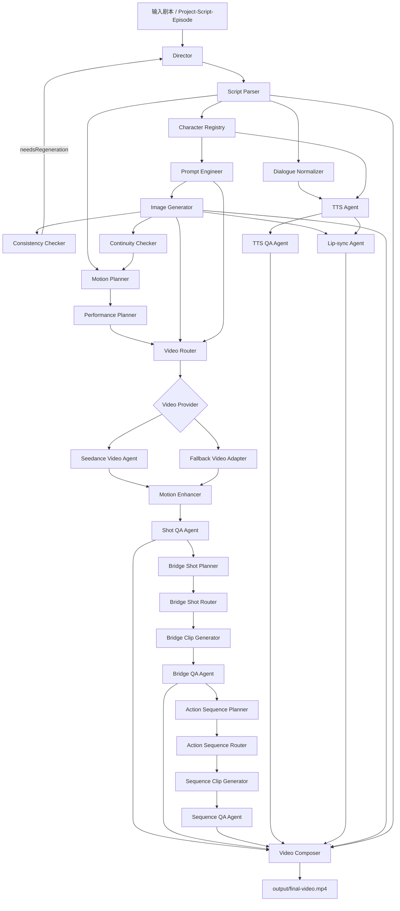

# AI漫剧自动化生成系统

输入剧本文件，或按 `project / script / episode` 定位已有项目数据，自动生成可发布到抖音、视频号、快手、小红书的竖屏漫剧短视频。

当前主链已经升级为“静态分镜 + 动态视频镜头 + bridge shot 补桥 + action sequence 连续动作段 + 音频表演 + 时间线合成”的单 Orchestrator 架构，`Director` 仍是唯一调度中心。

当前代码已经支持单镜头视频 provider 双路：

- `Fallback Video`
- `Seedance 2.0`（火山方舟视频生成 API）

默认主视频 provider 已切到 `Seedance`，`fallback video` 作为兼容与 fallback 路径保留，当前内部仍映射到 `sora2` runtime branch。

## README 现在看什么

这个 README 只保留入口信息：

- 项目是干什么的
- 怎么安装、怎么跑
- 最常用命令
- 文档该去哪里看

更细的内容已经拆到：

- Agent 设计与输入输出：[docs/agents/README.md](docs/agents/README.md)
- 运行目录、成果物、断点续跑：[docs/runtime/README.md](docs/runtime/README.md)
- 排障、验收、接手流程：[docs/sop/README.md](docs/sop/README.md)

## 运行模式

- 兼容模式：直接传入单个 `.txt` 剧本，CLI 会自动桥接成临时 `project / script / episode`
- 项目模式：显式指定 `projectId + scriptId + episodeId`，适合多项目、多剧集并行管理

当前核心层级：

```text
project
└── script
    └── episode
        └── shot plan
```

## 当前系统主流程

当前主流程可以按模块分成 7 层：

- 编排层：
  - `Director`
- 文本与视觉预生产层：
  - `Script Parser`
  - `Character Registry`
  - `Prompt Engineer`
  - `Image Generator`
  - `Consistency Checker`
  - `Continuity Checker`
- 单镜头视频主链：
  - `Motion Planner`
  - `Performance Planner`
  - `Video Router`
  - `Seedance Video Agent`
  - `Fallback Video Adapter`
  - `Motion Enhancer`
  - `Shot QA Agent`
- 高风险 cut 补桥子链：
  - `Bridge Shot Planner`
  - `Bridge Shot Router`
  - `Bridge Clip Generator`
  - `Bridge QA Agent`
- 连续动作段子链：
  - `Action Sequence Planner`
  - `Action Sequence Router`
  - `Sequence Clip Generator`
  - `Sequence QA Agent`

连续动作段子链当前与单镜头视频主链统一跟随 `VIDEO_PROVIDER`；当 `VIDEO_PROVIDER=fallback_video` 时，sequence 也会一起走 `fallback video`，内部仍映射到 `sora2` runtime branch。

- 音频与口型子链：
  - `Dialogue Normalizer`
  - `TTS Agent`
  - `TTS QA Agent`
  - `Lip-sync Agent`
- 总装交付层：
  - `Video Composer`



当前 compose 视觉优先级：

1. `sequenceClips`
2. `videoResults`
3. `bridgeClips`
4. `lipsyncResults`
5. `animationClips`
6. `imageResults`

Phase 4 的最小增量位置固定为：

- `Shot QA Agent`
- `Bridge Shot Planner -> Bridge Shot Router -> Bridge Clip Generator -> Bridge QA Agent`
- `Action Sequence Planner -> Action Sequence Router -> Sequence Clip Generator -> Sequence QA Agent`
- `Video Composer`

当前 MVP 只解决“连续动作段优先吃整段 sequence clip”这件事，还不包含：

- 多人群战自动编排闭环
- 语音驱动动作节拍闭环
- 商用品质级复杂表演保证

关于视频模型路线：

- 当前实现：`Fallback Video Adapter` + `Seedance Video Agent`
- 当前默认：`Seedance`
- 可切换兼容：`VIDEO_PROVIDER=fallback_video`
- 当前口径：`Seedance` 走主视频路径，`fallback video` 承担原先兼容与回退位置，用户侧通过 `VIDEO_PROVIDER=fallback_video` 选择；内部当前仍映射到 `sora2` runtime branch，可接 `laozhang` 或兼容 OpenAI 视频格式的其他供应商

## 快速开始

### 1. 安装依赖

```bash
npm install
```

### 2. 配置环境变量

复制：

```bash
cp .env.example .env
```

当前默认主链路至少需要：

- `QWEN_API_KEY`
- `LAOZHANG_API_KEY`
- `XFYUN_TTS_APP_ID`
- `XFYUN_TTS_API_KEY`
- `XFYUN_TTS_API_SECRET`

如果要启用动态镜头主路径，还需要：

- `LAOZHANG_API_KEY`

跑默认 `Seedance 2.0` 主路径时，还需要：

- `ARK_API_KEY` 或 `SEEDANCE_API_KEY`

说明：

- `ARK_API_KEY / SEEDANCE_API_KEY` 对应当前默认的火山方舟 `Seedance` provider
- `VIDEO_FALLBACK_API_KEY + VIDEO_FALLBACK_*` 对应当前兼容视频 provider；若 `VIDEO_FALLBACK_BASE_URL` 指向 `laozhang`，也可继续复用 `LAOZHANG_API_KEY`
- `VIDEO_FALLBACK_SEQUENCE_*` 只作用于连续动作段 sequence 子链，不影响普通单镜头视频请求
- 推荐配置项见 [`.env.example`](.env.example)

推荐默认值见 [`.env.example`](.env.example)。

### 3. 安装 FFmpeg

```bash
winget install Gyan.FFmpeg
```

校验：

```bash
ffmpeg -version
ffprobe -version
```

### 4. 运行

兼容模式：

```bash
node scripts/run.js samples/寒烬宫变-pro.txt --style=realistic
```

项目模式：

```bash
node scripts/run.js --project=project-example --script=pilot --episode=episode-1 --style=realistic
```

跳过一致性检查：

```bash
node scripts/run.js samples/寒烬宫变-pro.txt --skip-consistency
```

## 常用命令

完整 production pipeline：

```bash
node scripts/run.js samples/寒烬宫变-pro.txt --style=realistic
```

默认 Seedance 主视频 provider：

```bash
$env:ARK_API_KEY="你的火山方舟Key"
node scripts/run.js samples/寒烬宫变-pro.txt --style=realistic
```

切到通用备选视频 provider：

```bash
$env:VIDEO_PROVIDER="fallback_video"
$env:VIDEO_FALLBACK_API_KEY="你的视频Key"
$env:VIDEO_FALLBACK_BASE_URL="https://api.laozhang.ai/v1"
$env:VIDEO_FALLBACK_MODEL="veo-3.0-fast-generate-001"
node scripts/run.js samples/寒烬宫变-pro.txt --style=realistic
```

如果是 sequence 真实样本调优，推荐再补这两个可选项：

```bash
$env:VIDEO_FALLBACK_SEQUENCE_MODEL_CANDIDATES="grok-video-3"
$env:VIDEO_FALLBACK_SEQUENCE_RETRY_ATTEMPTS="2"
```

说明：

- `VIDEO_FALLBACK_SEQUENCE_MODEL_CANDIDATES`
  只给 sequence 子链追加候选模型，按逗号分隔；主模型仍以 `VIDEO_FALLBACK_MODEL` 为首选
- `VIDEO_FALLBACK_SEQUENCE_RETRY_ATTEMPTS`
  只控制 sequence 子链对同一请求的有限重试次数，默认 `2`
- `VIDEO_FALLBACK_SEQUENCE_SECONDS`
  可选；只在你想强制 sequence 固定请求秒数时填写。不填时，sequence 默认按自身 `durationTargetSec` 申请，不继承 `VIDEO_FALLBACK_SECONDS=4`

统一断点续跑：

```bash
node scripts/resume-from-step.js --step=lipsync samples/寒烬宫变-pro.txt --dry-run --style=realistic
node scripts/resume-from-step.js --step=lipsync samples/寒烬宫变-pro.txt --style=realistic
node scripts/resume-from-step.js --step=video samples/寒烬宫变-pro.txt --style=realistic
```

按指定历史 run 严格绑定续跑：

```bash
node scripts/resume-from-step.js --step=video samples/寒烬宫变-pro.txt --run-id=run_xxx --dry-run --style=realistic
node scripts/resume-from-step.js --step=video samples/寒烬宫变-pro.txt --run-id=run_xxx --style=realistic
```

`--run-id` 当前不是“尽量参考这次 run”，而是“严格绑定这次 run”：

- 前置状态以该 run 的 `state.snapshot.json` 为准
- 从 `video` 及后续步骤恢复时，参考图必须来自该 run
- 缺图、缺前置状态、或图片路径越界时会直接失败，不再静默回退到别的 run 或当前最新缓存
- `--dry-run` 会额外打印恢复模式、绑定 `run-id` 和复用参考图数，先看一眼再正式执行更稳

如果你是在做真实样本复盘，想验证 `run_id1` 的图生视频，就一定带上 `--run-id=run_id1`，否则默认仍是“继续当前最新可恢复状态”。

项目模式下交互选择 `project / script / episode`：

```bash
node scripts/resume-from-step.js --step=audio --style=realistic
```

单 Agent 生产向测试：

```bash
npm run test:lipsync-agent:prod
npm run test:video-composer:prod
npm run test:director:prod
```

保留测试成果物：

```bash
npm run test:video-composer:prod:keep-artifacts
npm run test:director:prod:keep-artifacts
```

串行验证全部主要 Agent：

```bash
npm run test:agents:prod
```

动态镜头与 bridge shot 回归：

```bash
node --test tests/bridgeShotPlanner.test.js tests/bridgeShotRouter.test.js tests/bridgeClipGenerator.test.js tests/bridgeQaAgent.test.js tests/director.bridge.integration.test.js tests/videoComposer.bridge.test.js tests/resumeFromStep.test.js tests/runArtifacts.test.js tests/pipeline.acceptance.test.js
```

Phase 4 action sequence 收口验收：

```bash
node --test tests/actionSequencePlanner.test.js tests/actionSequenceRouter.test.js tests/sequenceClipGenerator.test.js tests/sequenceQaAgent.test.js tests/videoComposer.sequence.test.js tests/director.sequence.integration.test.js tests/resumeFromStep.test.js tests/runArtifacts.test.js tests/pipeline.acceptance.test.js
```

Phase 4 可解释性与覆盖摘要回归：

```bash
node --test tests/actionSequenceRouter.test.js tests/seedanceVideoApi.test.js tests/sequenceQaAgent.test.js tests/director.sequence.integration.test.js tests/pipeline.acceptance.test.js
```

Seedance 替换旧兼容视频路径的后续实现计划：

- [docs/superpowers/plans/2026-04-05-seedance-primary-video-engine-replacement-implementation.md](docs/superpowers/plans/2026-04-05-seedance-primary-video-engine-replacement-implementation.md)

## 目录总览

```text
src/
  agents/      Agent 主链路
  apis/        Provider Router 与外部服务接入
  domain/      Project / Asset / Character 等模型
  utils/       state、run-job、qa-summary、artifact 工具
scripts/
  run.js
  resume-from-step.js
docs/
  agents/
  runtime/
  sop/
temp/
  运行缓存、状态、run 包、单 agent 测试成果物
output/
  最终成片与 delivery summary
```

## 文档导航

### Agent

- [Agent 总览](docs/agents/README.md)
- [Agent 输入输出地图](docs/agents/agent-io-map.md)
- [运行包目录示例](docs/agents/run-package-example.md)

### Runtime

- [运行时目录总览](docs/runtime/README.md)
- [temp 目录说明](docs/runtime/temp-structure.md)
- [output 目录说明](docs/runtime/output-structure.md)
- [断点续跑说明](docs/runtime/resume-from-step.md)
- [Phase 1 验收报告](docs/superpowers/plans/2026-04-04-dynamic-shortdrama-phase1-acceptance.md)
- [Phase 2 设计文档](docs/superpowers/specs/2026-04-04-dynamic-shortdrama-phase2-design.md)
- [Phase 2 实施计划](docs/superpowers/plans/2026-04-04-dynamic-shortdrama-phase2-implementation.md)
- [Phase 3 Bridge Shot 设计文档](docs/superpowers/specs/2026-04-05-dynamic-shortdrama-phase3-bridge-shot-design.md)
- [Phase 3 Bridge Shot 实施计划](docs/superpowers/plans/2026-04-05-dynamic-shortdrama-phase3-bridge-shot-implementation.md)
- [Phase 4 Action Sequence 设计文档](docs/superpowers/specs/2026-04-05-dynamic-shortdrama-phase4-action-sequence-design.md)
- [Phase 4 Action Sequence 实施计划](docs/superpowers/plans/2026-04-05-dynamic-shortdrama-phase4-action-sequence-implementation.md)
- [Phase 4 收口后高价值任务计划](docs/superpowers/plans/2026-04-06-dynamic-shortdrama-phase4-high-value-followups-implementation.md)

### SOP

- [SOP 总览](docs/sop/README.md)
- [运行排障 Runbook](docs/sop/runbook.md)
- [QA 验收 SOP](docs/sop/qa-acceptance.md)
- [变更检查清单](docs/sop/change-checklist.md)

## 成果物规则

- 整体 production pipeline：落到 `temp/projects/<project>/scripts/<script>/episodes/<episode>/runs/...`
- 单独跑某个 Agent 并保留成果物：落到 `temp/<agentName>/...`
- 最终交付：落到 `output/<projectName>__<projectId>/第xx集__<episodeId>/`

如果你只想先判断“这一轮过没过、卡在哪”，优先看 run 根目录的 `qa-overview.md`。

## 动态镜头 / Bridge Shot 主链

当前成片主视觉优先级保持为：

1. `videoResults`
2. `bridgeClips`
3. `lipsyncResults`
4. `animationClips`
5. `imageResults`

但 `videoResults` 的内部生成链路已经升级为：

```text
motionPlan
-> performancePlan
-> shotPackages
-> rawVideoResults
-> enhancedVideoResults
-> shotQaReportV2
-> videoResults
-> composer
```

也就是说：

- 配了 `VIDEO_FALLBACK_API_KEY` 且 `VIDEO_PROVIDER=fallback_video` 时，视频镜头通过 `Shot QA v2` 后会优先使用增强后的真实视频镜头
- `videoComposer` 不直接理解 `rawVideoResults / enhancedVideoResults`，而是消费 `Director` 桥接后的 `videoResults + bridgeClips`
- 没有视频结果或 QA 不通过时，系统会显式回退到旧的静图/口型/动画路径

对应 run package 目录：

- `09a-motion-planner`
- `09b-performance-planner`
- `09c-video-router`
- `09d-sora2-video-agent`
- `09e-motion-enhancer`
- `09f-shot-qa`
- `10-video-composer`

在此基础上，系统还会按需触发一条 bridge shot 子链：

```text
continuityFlaggedTransitions
-> bridgeShotPlan
-> bridgeShotPackages
-> bridgeClipResults
-> bridgeQaReport
-> bridgeClips
-> composer timeline
```

对应 Phase 3 run package 目录：

- `09g-bridge-shot-planner`
- `09h-bridge-shot-router`
- `09i-bridge-clip-generator`
- `09j-bridge-qa`

当前 bridge shot 规则是：

- 只对高风险 cut 点触发，不会给所有镜头默认插桥
- 只有 `bridgeQaReport.entries[].finalDecision === "pass"` 的 bridge clip 才会进入 compose timeline
- `fallback_to_direct_cut / fallback_to_transition_stub / manual_review` 都不会破坏主链成片

当前 sequence 子链新增了 4 个最常用排查口：

- `09l-action-sequence-router/2-metrics/action-sequence-routing-metrics.json`
  看 `skipReasonBreakdown`，判断是缺图、缺视频、缺 bridge，还是素材混合不足
- `09n-sequence-qa/2-metrics/sequence-qa-metrics.json`
  看 `topFailureCategory / topRecommendedAction / fallbackSequenceIds / manualReviewSequenceIds`
- `10-video-composer/2-metrics/video-metrics.json`
  看 `sequence_coverage_shot_count / applied_sequence_ids / fallback_shot_ids`
- 最终 `delivery-summary.md`
  看整轮 `sequence_coverage_sequence_count / applied_sequence_ids / fallback_sequence_ids`

如果你要拿真实样本做调优，建议直接配合：

- [Sequence 调优 Checklist](docs/sop/2026-04-06-phase4-sequence-tuning-checklist.md)
