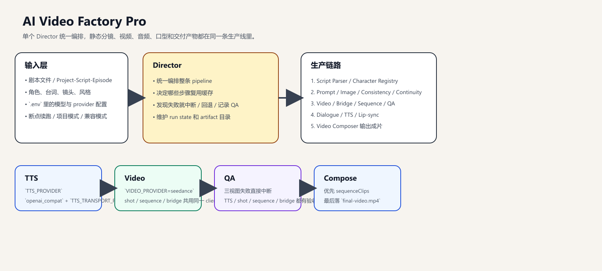

# AI漫剧自动化生成系统

输入剧本文件，或按 `project / script / episode` 定位已有项目数据，自动生成可发布到抖音、视频号、快手、小红书的竖屏漫剧短视频。



## 一眼看懂

- `Director` 是唯一调度中心。
- 生产链路大致是：预生产 -> 视频 -> 音频/口型 -> 合成。
- `TTS_PROVIDER` 负责 TTS 上层合同，`TTS_TRANSPORT_PROVIDER` 负责具体供应商切换。
- 视频链路按三层理解：`VIDEO_PROVIDER` 表示业务模型意图，`VIDEO_TRANSPORT_PROVIDER` 表示真实提交通道，`VIDEO_MODEL_*` 表示各子链实际模型。
- 后续接入新模型或中转站，优先复用通用 `provider + transport + model + path` 架构，不再为站点名单独创造新的顶层 provider。
- 现在多了一套只读 `Workbench`，用于查看 run、QA 和 artifact，不直接改写主生产链路。

## 文档入口

- Agent 设计与输入输出：[docs/agents/README.md](docs/agents/README.md)
- 运行目录、成果物、断点续跑：[docs/runtime/README.md](docs/runtime/README.md)
- 排障、验收、接手流程：[docs/sop/README.md](docs/sop/README.md)
- 测试与 QA 验收：[docs/sop/qa-acceptance.md](docs/sop/qa-acceptance.md)
- 用户使用指南：[docs/user-guide.md](docs/user-guide.md)
- 部署说明：[docs/deployment.md](docs/deployment.md)
- 已知限制：[docs/limitations-v1.md](docs/limitations-v1.md)
- 版本变更记录：[CHANGELOG.md](CHANGELOG.md)
- 角色身份统一规范：[docs/superpowers/specs/2026-04-17-identity-resolution-regression-spec.md](docs/superpowers/specs/2026-04-17-identity-resolution-regression-spec.md)
- 角色资产生产级闭环：[docs/agents/production-loop-governance.md](docs/agents/production-loop-governance.md)

## 运行模式

- 兼容模式：直接传入单个 `.txt` 剧本，CLI 会自动桥接成临时 `project / script / episode`
- 项目模式：显式指定 `projectId + scriptId + episodeId`，适合多项目、多剧集并行管理

当前核心层级：

```text
project
└── script
    └── episode
        └── shot plan
```

## 当前系统主流程

主流程可以理解成 5 段：

1. `Director`
   负责整条生产线编排、缓存、断点续跑、QA 汇总和最终交付决策。
2. `Script Parser`
   负责把原始剧本拆成 `project / script / episode / shots` 这套可运行结构。
3. `Character Registry`
   负责把剧本角色、分集角色、角色圣经合成统一角色视图，并给后续模块提供稳定身份锚点。
4. `Prompt Engineer`
   负责把角色、场景、镜头意图转成可执行的图像 prompt。
5. `Image Generator`
   负责批量出分镜图和重生成。
6. `Character Ref Sheet Generator`
   负责先为每个角色生成三视图参考纸，给后续角色一致性提供硬参考。
7. `Consistency Checker`
   负责按“角色优先级 × 镜头复杂度”做双轴一致性 QA，输出 `pass / warn / block`、硬失败原因、软风险标签，以及推荐的重生成策略。
8. `Continuity Checker`
   负责检查镜头之间的连贯性，并标记高风险 cut。
9. `Motion Planner`
   负责给每个镜头规划镜头类型、时长、运镜和动态目标。
10. `Performance Planner`
   负责给每个镜头补表演模板、动作节拍和生成层级。
11. `Video Router`
   负责把镜头打包成视频生成请求，并把参考图、连续性约束、provider hint 组织好。
12. `Seedance Video Agent`
   负责真正调用视频 provider 生成单镜头视频。
13. `Bridge Shot Planner / Router / Clip Generator / QA`
   负责只在高风险 cut 上补桥，并决定 bridge 是否真的可用。
14. `Action Sequence Planner / Router / Clip Generator / QA`
   负责识别连续动作段、整段生成 sequence clip，并决定是否覆盖原始 shot timeline。
15. `Dialogue Normalizer`
   负责对白标准化、分句和时长预算。
16. `TTS Agent`
   负责给说话角色绑定 voice cast / voice preset，并生成对白音频。
17. `Lip-sync Agent`
   负责为需要张嘴表演的镜头生成口型片段。
18. `Video Composer`
   负责按 `sequence > video > bridge > lipsync > animation > image` 的优先级装配最终成片。

Prompt Engineer 的双语字段约定（用于 UI 展示与模型执行解耦）：

- `image_prompt_en` / `negative_prompt_en`：模型与 provider 执行字段（Image/Video 调用应优先使用它们）。
- `display_prompt_zh` / `display_negative_prompt_zh`：UI、QA、成果物浏览字段。
- `image_prompt` / `negative_prompt`：迁移期兼容别名，当前与对应的 English execution 字段保持一致。

更细的职责说明见 [docs/agents/README.md](docs/agents/README.md)。

当前身份绑定总规则：

- 一律 `ID-first`
- `id / episodeCharacterId / mainCharacterTemplateId / characterBibleId` 才是绑定键
- `name` 只能用于展示、日志、prompt 文本、兼容老数据
- 角色图、三视图、voice cast、视频参考图都不应再按 `name` 作为主关联键

当前 compose 视觉优先级：

1. `sequenceClips`
2. `videoResults`
3. `bridgeClips`
4. `lipsyncResults`
5. `animationClips`
6. `imageResults`

当前一致性 QA 策略：

- 不再是“单一分数阈值”。
- 规则是 `角色优先级 × 镜头复杂度` 双轴判定：
  - `lead + anchor` 最严格
  - `support + complex` 适度放宽
- 分数只负责提示风险，真正放行由规则决定。
- 统一输出三段式结果：
  - `pass`：放行
  - `warn`：允许继续，但建议 `prompt_tighten`
  - `block`：判为硬失败，建议 `reanchor_regenerate`
- `Director` 会按 `regenStrategy` 分流：
  - `prompt_tighten`：在原 prompt 上收紧身份约束
  - `reanchor_regenerate`：优先带角色参考图 / 三视图 / 当前最佳图回锚重生
- `--stop-before-video` 仍然不会自动执行这些补图动作，只会把问题保留下来给人看。

Phase 4 的最小增量位置固定为：

- `Shot QA Agent`
- `Bridge Shot Planner -> Bridge Shot Router -> Bridge Clip Generator -> Bridge QA Agent`
- `Action Sequence Planner -> Action Sequence Router -> Sequence Clip Generator -> Sequence QA Agent`
- `Video Composer`

当前 MVP 只解决“连续动作段优先吃整段 sequence clip”这件事，还不包含：

- 多人群战自动编排闭环
- 语音驱动动作节拍闭环
- 商用品质级复杂表演保证

关于视频模型路线：

- 当前默认业务模型意图仍是 `VIDEO_PROVIDER=seedance`
- `VIDEO_PROVIDER` 是全链路主视频模型意图：`shot / bridge / sequence` 都应保持同一个 provider，不会自动降级到另一个视频模型
- 当前主口径是 `seedance / veo / sora / happyhorse`
- 兼容别名 `sora2 / fallback_video` 当前仍会归一到 `sora` 这条历史兼容链路，不代表第二条独立视频系统
- `VIDEO_TRANSPORT_PROVIDER` 才表示真实请求怎么发：当前可走 `official / relay_openai / relay_media_task / relay_seedance_v2 / dashscope_async / vercel_ai_gateway`
- `VIDEO_MODEL_SHOT / VIDEO_MODEL_SEQUENCE / VIDEO_MODEL_BRIDGE` 用来区分单镜头、连续动作段、bridge 的实际模型
- 新接入站点优先落在 `VIDEO_TRANSPORT_*` 和 `VIDEO_MODEL_*` 上，不要把 `zdai88`、`lingkeai` 这类站点名抬升为新的顶层 provider

## Video Provider / Transport / Model 三层语义

推荐把视频配置理解成 3 层：

1. `VIDEO_PROVIDER`
   业务意图层，表达这轮希望使用哪类视频模型能力。当前建议使用：
   - `seedance`
   - `veo`
   - `sora`
   - `happyhorse`
2. `VIDEO_TRANSPORT_PROVIDER`
   提交通道层，表达请求发往哪里、走什么协议。当前实现里常见值：
   - `official`
   - `relay_openai`
   - `relay_media_task`
   - `relay_seedance_v2`
   - `dashscope_async`
   - `vercel_ai_gateway`
3. `VIDEO_MODEL_SHOT / VIDEO_MODEL_SEQUENCE / VIDEO_MODEL_BRIDGE`
   实际模型层，分别控制 `shot / sequence / bridge` 三条子链用哪个模型。

推荐原则：

- 换模型：优先改 `VIDEO_MODEL_*`
- 换中转站：优先改 `VIDEO_TRANSPORT_PROVIDER + VIDEO_TRANSPORT_BASE_URL + VIDEO_TRANSPORT_*_PATH`
- 换业务能力：才改 `VIDEO_PROVIDER`
- 不要因为中转站域名变化，就新增 `VIDEO_PROVIDER=zdai88` 这类站点语义

当前仓库里的归一逻辑：

- `VIDEO_PROVIDER=sora2` 会按兼容别名归一到 `sora`
- `VIDEO_PROVIDER=fallback_video` 会按兼容别名归一到 `sora`
也就是说，站点和模型的变化应尽量收敛在 transport / model 配置，不要把用户侧 provider 继续做散。

## Sora / 通用 Relay 接入说明

`sora` 这条链路现在优先通过通用视频路由接入，而不是做站点定制 provider。

当前已支持的主路径：

- `VIDEO_PROVIDER=sora`
- `VIDEO_TRANSPORT_PROVIDER=relay_media_task`
- `VIDEO_MODEL_*` 指向真实模型，例如 `sora-2`

如果 `VIDEO_TRANSPORT_BASE_URL` 指向以下域名之一，系统也会自动推断 `relay_media_task`：

- `zdai88.com`
- `api.lingkeai.ai`
- `api.lk888.ai`
- `api.lk666.ai`

但生产环境仍建议显式配置 `VIDEO_TRANSPORT_PROVIDER=relay_media_task`，避免环境变量历史值造成误判。

一个典型示例：

```bash
VIDEO_PROVIDER=sora
VIDEO_TRANSPORT_PROVIDER=relay_media_task
VIDEO_TRANSPORT_BASE_URL=https://zdai88.com
VIDEO_TRANSPORT_API_KEY=你的中转站Key
VIDEO_TRANSPORT_SUBMIT_PATH=/v1/media/generate
VIDEO_TRANSPORT_POLL_PATH=/v1/media/status
VIDEO_MODEL_SHOT=sora-2
VIDEO_MODEL_SEQUENCE=sora-2
VIDEO_MODEL_BRIDGE=sora-2
```

如果 relay 只接受一张参考图，当前链路会自动做以下处理：

- 优先直接使用可访问的 HTTP URL
- 没有公网 URL 时，把本地参考图转成 `data URL / base64`
- 参考图多于 1 张时，自动合成单张 composite 图后再提交

这套策略同样走通用适配层，不需要为某个站点再额外写一套独立 provider。

## HappyHorse / 百炼接入说明

HappyHorse 走同一套 unified video provider 架构，不需要在业务 agent 旁边单独调用百炼。配置时把业务能力写成 `happyhorse`，真实提交协议写成 `dashscope_async`：

```bash
VIDEO_PROVIDER=happyhorse
VIDEO_TRANSPORT_PROVIDER=dashscope_async
VIDEO_TRANSPORT_BASE_URL=https://dashscope.aliyuncs.com
VIDEO_TRANSPORT_API_KEY=你的百炼APIKey
VIDEO_MODEL_SHOT=happyhorse-1.0-r2v
VIDEO_MODEL_SEQUENCE=happyhorse-1.0-r2v
VIDEO_MODEL_BRIDGE=happyhorse-1.0-r2v
HAPPYHORSE_RESOLUTION=720P
HAPPYHORSE_RATIO=9:16
HAPPYHORSE_WATERMARK=false
HAPPYHORSE_ALLOW_DATA_URL_REFERENCES=true
```

也可以用兼容变量 `DASHSCOPE_API_KEY / DASHSCOPE_BASE_URL / HAPPYHORSE_MODEL_ID`。百炼要求模型、Endpoint URL 和 API Key 属于同一地域；北京地域默认 Endpoint 是 `https://dashscope.aliyuncs.com`，提交路径为 `/api/v1/services/aigc/video-generation/video-synthesis`，轮询路径为 `/api/v1/tasks/{task_id}`。

HappyHorse 官方支持 base64/data URL 入参，因此默认 `HAPPYHORSE_ALLOW_DATA_URL_REFERENCES=true`，本地参考图会自动转成 data URL；如你的目标环境只允许公网/OSS URL，可显式设为 `false`。

## Prompt 翻译层

视频 prompt 进入 provider 前，会先走 `ensureEnglishPrompt(...)`：

- 纯英文 prompt 直接透传
- 检测到中文时，自动先翻译成英文再提交给视频 provider
- 默认 provider 是 `llm`
- 当配置了 `PROMPT_TRANSLATION_BASE_URL` 时，会自动按 `libretranslate` 兼容接口调用 `${BASE_URL}/translate`
- 非 LLM 翻译失败时，会自动回退到 LLM 翻译

当前可用环境变量：

```bash
PROMPT_TRANSLATION_PROVIDER=llm
PROMPT_TRANSLATION_BASE_URL=
PROMPT_TRANSLATION_API_KEY=
PROMPT_TRANSLATION_SOURCE_LANG=auto
PROMPT_TRANSLATION_TARGET_LANG=en
```

兼容旧变量名：

- `SORA2_TRANSLATION_PROVIDER`
- `SORA2_TRANSLATION_BASE_URL`
- `SORA2_TRANSLATION_API_KEY`

如果你准备把 `sora` 链路挂到第三方 relay，建议同时把翻译层独立配置好，不要把“翻译”和“视频中转站”绑死在同一套 provider 语义里。

## Sora 参考图策略

当前 `sora` 链路对参考图不再是“有图就随便传”，而是有固定优先级：

1. 当前镜头 keyframe / first frame
2. 角色一致性参考图（默认最多取 2 张）
3. 其他非相邻补充参考图
4. 相邻镜头参考图兜底

同时 `Director` 会先把角色卡参考图和当前镜头出图结果固化进 `promptList.referenceImages`，后续视频路由统一消费，不再依赖下游临时猜测。

## 快速开始

### 1. 安装依赖

```bash
npm install
```

安装根目录依赖即可。

### 1.5 快速运行只读 Workbench API

```bash
npm run workbench
```

启动后常用入口：

- Workbench API：`http://127.0.0.1:4180/api/workbench`
- Workbench 根地址：`http://127.0.0.1:4180/`

### 2. 配置环境变量

复制：

```bash
cp .env.example .env
```

当前默认主链路至少需要：

- `QWEN_API_KEY`
- `LAOZHANG_API_KEY`
- `MINIMAX_API_KEY`

如果要启用动态镜头主路径，还需要：

- `LAOZHANG_API_KEY`

跑默认 `Seedance 2.0` 主路径时，还需要：

- `ARK_API_KEY` 或 `SEEDANCE_API_KEY`

如果要把图像 / 视频请求统一收口到 `Vercel AI Gateway` 适配层，再补这些：

- `VIDEO_TRANSPORT_PROVIDER=vercel_ai_gateway`
- `IMAGE_TRANSPORT_PROVIDER=vercel_ai_gateway`
- `VERCEL_AI_GATEWAY_API_KEY` 或 `AI_GATEWAY_API_KEY`
- `VIDEO_MODEL_SHOT` / `VIDEO_MODEL_SEQUENCE` / `VIDEO_MODEL_BRIDGE`

如果要把 `sora` 挂到通用 relay / 中转站，再补这些：

- `VIDEO_PROVIDER=sora`
- `VIDEO_TRANSPORT_PROVIDER=relay_media_task`
- `VIDEO_TRANSPORT_BASE_URL`
- `VIDEO_TRANSPORT_API_KEY`
- `VIDEO_TRANSPORT_SUBMIT_PATH`
- `VIDEO_TRANSPORT_POLL_PATH`
- `VIDEO_TRANSPORT_DOWNLOAD_PATH`（按站点需要选填）
- `VIDEO_MODEL_SHOT` / `VIDEO_MODEL_SEQUENCE` / `VIDEO_MODEL_BRIDGE`

如果 `sora` prompt 需要先翻译，再补这些：

- `PROMPT_TRANSLATION_PROVIDER`
- `PROMPT_TRANSLATION_BASE_URL`
- `PROMPT_TRANSLATION_API_KEY`
- `PROMPT_TRANSLATION_SOURCE_LANG`
- `PROMPT_TRANSLATION_TARGET_LANG`

说明：

- `TTS_PROVIDER` 当前默认是 `minimax`，也可以切到 `openai_compat` 作为统一合同入口
- `TTS_TRANSPORT_PROVIDER` 用来指定 `openai_compat` 下真正落地的供应商，当前可先填 `minimax`
- MiniMax 官方 HTTP TTS 常见配置是 `MINIMAX_API_KEY + MINIMAX_GROUP_ID + /v1/t2a_v2`
- 默认男女声音色可先用 `MINIMAX_TTS_VOICE_FEMALE=Warm_Girl`、`MINIMAX_TTS_VOICE_MALE=Reliable_Executive`
- `ARK_API_KEY / SEEDANCE_API_KEY` 对应当前默认的火山方舟 `Seedance` provider
- `VIDEO_FALLBACK_API_KEY + VIDEO_FALLBACK_*` 是沿用的历史变量名，本质上仍是在配置同一个主视频 relay / provider；若 `VIDEO_FALLBACK_BASE_URL` 指向 `laozhang`，也可继续复用 `LAOZHANG_API_KEY`
- `VIDEO_TRANSPORT_PROVIDER` 是“底层提交通道”，与 `VIDEO_PROVIDER` 这个业务语义口径分离；例如可保持 `VIDEO_PROVIDER=seedance`，但把 transport 切到 `vercel_ai_gateway`
- `VIDEO_TRANSPORT_BASE_URL` 是中转站基础地址的优先配置入口；以后换 relay，优先改这里，而不是新造站点名 provider
- `VIDEO_TRANSPORT_SUBMIT_PATH / VIDEO_TRANSPORT_POLL_PATH / VIDEO_TRANSPORT_DOWNLOAD_PATH` 用来适配站点 API 细节；优先通过 path 配置做兼容，不要继续分叉 provider
- `relay_media_task` 当前默认路径是 `/v1/media/generate` 和 `/v1/media/status`
- `VIDEO_PROVIDER=sora2 / fallback_video` 当前会被归一到 `sora`；推荐新配置直接写 `VIDEO_PROVIDER=sora`
- `IMAGE_TRANSPORT_PROVIDER` 只影响图像请求怎么提交，不改变 `REALISTIC_IMAGE_MODEL / THREED_IMAGE_MODEL / IMAGE_EDIT_MODEL` 的模型路由语义
- 当前仓库里的 `VERCEL_AI_GATEWAY_VIDEO_SUBMIT_PATH` / `VERCEL_AI_GATEWAY_IMAGE_SUBMIT_PATH` 是本项目适配层约定，主要用于后续接正式 SDK 或服务端代理前的过渡集成
- `VIDEO_FALLBACK_SEQUENCE_*` 只作用于连续动作段 sequence 子链，不影响普通单镜头视频请求
- `VIDEO_FALLBACK_SIZE` 现在是可选覆盖项；默认优先按 `VIDEO_WIDTH / VIDEO_HEIGHT` 自动推断，不用手填
- `PROMPT_TRANSLATION_BASE_URL` 一旦配置，翻译层会按 `libretranslate` 兼容接口工作；没配时默认走 LLM 翻译
- `SORA2_TRANSLATION_*` 仍可兼容，但推荐迁移到 `PROMPT_TRANSLATION_*`
- 推荐配置项见 [`.env.example`](.env.example)

推荐默认值见 [`.env.example`](.env.example)。

### 3. 安装 FFmpeg

```bash
winget install Gyan.FFmpeg
```

校验：

```bash
ffmpeg -version
ffprobe -version
```

### 4. 运行

先初始化项目模式样例：

```bash
node scripts/init-sample-project.js
```

这个命令会把 `samples/project-example/` 复制到 `temp/projects/project-example/`，方便直接跑项目模式。

兼容模式：

```bash
node scripts/run.js samples/寒烬宫变-pro.txt --style=realistic
```

CLI 默认把输入当作 `professional-script`：适合已经写成分集、场景、`【画面N】`、台词、SFX、字幕的专业短剧 / 漫剧剧本。上面的命令等价于：

```bash
node scripts/run.js samples/寒烬宫变-pro.txt --style=realistic --input-format=professional-script
```

如果输入是野生小说文本、散文章节或故事大纲，需要显式启用改编模式：

```bash
node scripts/run.js samples/source.txt --style=realistic --input-format=raw-novel
```

不确定输入结构时可以用自动检测；只有包含 `【画面N】` 的文本会走专业剧本解析，否则按原始小说改编：

```bash
node scripts/run.js samples/source.txt --style=realistic --input-format=auto
```

项目模式：

```bash
node scripts/run.js --project=project-example --script=pilot --episode=episode-1 --style=realistic
```

抽样跑前 N 个分镜，适合先验证 prompt、出图和视频链路是否通：

```bash
node scripts/run.js samples/双生囚笼.txt --style=realistic --max-shots=2 --stop-before-video
```

说明：

- `--max-shots=<number>` 只处理前 N 个分镜，适合真实样本小流量验证
- `--stop-before-video` 会停在视频生成前，保留一致性 / 连贯性 / prompt / 图片结果给人复核
- 两个参数一起用，适合先做低成本冒烟

跳过一致性检查：

```bash
node scripts/run.js samples/寒烬宫变-pro.txt --skip-consistency
```

## 运行与恢复命令

完整 production pipeline：

```bash
node scripts/run.js samples/寒烬宫变-pro.txt --style=realistic
```

默认 Seedance 主视频 provider：

```bash
$env:ARK_API_KEY="你的火山方舟Key"
node scripts/run.js samples/寒烬宫变-pro.txt --style=realistic
```

默认 MiniMax TTS 主链：

```bash
$env:TTS_PROVIDER="minimax"
$env:TTS_TRANSPORT_PROVIDER="minimax"
$env:MINIMAX_API_KEY="你的MiniMaxKey"
$env:MINIMAX_GROUP_ID="你的GroupId"
node scripts/run.js samples/寒烬宫变-pro.txt --style=realistic
```

试听样本批量生成：

```bash
npm run tts:preview -- samples/tts-eval-lines.txt temp/tts-eval-samples
```

走 Vercel AI Gateway transport，但业务上仍按 `seedance` 理解：

```bash
$env:VIDEO_PROVIDER="seedance"
$env:VIDEO_TRANSPORT_PROVIDER="vercel_ai_gateway"
$env:IMAGE_TRANSPORT_PROVIDER="vercel_ai_gateway"
$env:VERCEL_AI_GATEWAY_API_KEY="你的GatewayKey"
$env:VIDEO_MODEL_SHOT="bytedance/seedance-v1.5-pro"
$env:VIDEO_MODEL_SEQUENCE="bytedance/seedance-v1.5-pro"
$env:VIDEO_MODEL_BRIDGE="bytedance/seedance-v1.5-pro"
node scripts/run.js samples/寒烬宫变-pro.txt --style=realistic
```

走通用 `sora` relay，例如 `zdai88` 这一类 `media_task` 站点：

```bash
$env:VIDEO_PROVIDER="sora"
$env:VIDEO_TRANSPORT_PROVIDER="relay_media_task"
$env:VIDEO_TRANSPORT_BASE_URL="https://zdai88.com"
$env:VIDEO_TRANSPORT_API_KEY="你的RelayKey"
$env:VIDEO_TRANSPORT_SUBMIT_PATH="/v1/media/generate"
$env:VIDEO_TRANSPORT_POLL_PATH="/v1/media/status"
$env:VIDEO_MODEL_SHOT="sora-2"
$env:VIDEO_MODEL_SEQUENCE="sora-2"
$env:VIDEO_MODEL_BRIDGE="sora-2"
node scripts/run.js samples/双生囚笼.txt --style=realistic
```

如果 `sora` prompt 主要是中文，建议同时显式打开翻译层：

```bash
$env:PROMPT_TRANSLATION_PROVIDER="llm"
node scripts/run.js samples/双生囚笼.txt --style=realistic
```

如果你有独立的翻译中转站，也可以这样配：

```bash
$env:PROMPT_TRANSLATION_BASE_URL="https://your-translate-relay.example.com"
$env:PROMPT_TRANSLATION_API_KEY="你的TranslateKey"
node scripts/run.js samples/双生囚笼.txt --style=realistic
```

仍要复用旧变量名 / 旧 relay 时：

```bash
$env:VIDEO_PROVIDER="seedance"
$env:VIDEO_FALLBACK_API_KEY="你的视频Key"
$env:VIDEO_FALLBACK_BASE_URL="https://api.laozhang.ai/v1"
$env:VIDEO_FALLBACK_MODEL="veo-3.0-fast-generate-001"
node scripts/run.js samples/寒烬宫变-pro.txt --style=realistic
```

如果你只是沿用旧环境变量名，不需要把 `VIDEO_PROVIDER` 改成 `fallback_video`；保留 `seedance` 更符合当前主链口径。

如果你已经决定长期走通用 relay，建议尽快切到 `VIDEO_TRANSPORT_*` 这一组新口径，避免业务 provider、站点地址、具体模型三件事继续缠在一起。

如果是 sequence 真实样本调优，推荐再补这两个可选项：

```bash
$env:VIDEO_FALLBACK_SEQUENCE_MODEL_CANDIDATES="grok-video-3"
$env:VIDEO_FALLBACK_SEQUENCE_RETRY_ATTEMPTS="2"
```

说明：

- `VIDEO_FALLBACK_SEQUENCE_MODEL_CANDIDATES`
  只给 sequence 子链追加候选模型，按逗号分隔；主模型仍以 `VIDEO_FALLBACK_MODEL` 为首选
- `VIDEO_FALLBACK_SEQUENCE_RETRY_ATTEMPTS`
  只控制 sequence 子链对同一请求的有限重试次数，默认 `2`
- `VIDEO_FALLBACK_SEQUENCE_SECONDS`
  可选；只在你想强制 sequence 固定请求秒数时填写。不填时，sequence 默认按自身 `durationTargetSec` 申请，不继承 `VIDEO_FALLBACK_SECONDS=4`

统一断点续跑：

```bash
node scripts/resume-from-step.js --step=lipsync samples/寒烬宫变-pro.txt --dry-run --style=realistic
node scripts/resume-from-step.js --step=lipsync samples/寒烬宫变-pro.txt --style=realistic
node scripts/resume-from-step.js --step=video samples/寒烬宫变-pro.txt --style=realistic --confirm-paid-video
```

`video` 续跑现在有显式付费保护：

- `--step=video` 默认不会清缓存，也不会真的提交视频生成
- 必须显式加 `--confirm-paid-video` 才会执行
- 建议先跑一次 `--dry-run` 看恢复计划，再正式提交

例如：

```bash
node scripts/resume-from-step.js --step=video samples/寒烬宫变-pro.txt --dry-run --style=realistic
node scripts/resume-from-step.js --step=video samples/寒烬宫变-pro.txt --style=realistic --confirm-paid-video
```

按指定历史 run 严格绑定续跑：

```bash
node scripts/resume-from-step.js --step=video samples/寒烬宫变-pro.txt --run-id=run_xxx --dry-run --style=realistic
node scripts/resume-from-step.js --step=video samples/寒烬宫变-pro.txt --run-id=run_xxx --style=realistic --confirm-paid-video
```

`--run-id` 当前不是“尽量参考这次 run”，而是“严格绑定这次 run”：

- 前置状态以该 run 的 `state.snapshot.json` 为准
- 从 `video` 及后续步骤恢复时，参考图必须来自该 run
- 缺图、缺前置状态、或图片路径越界时会直接失败，不再静默回退到别的 run 或当前最新缓存
- `--dry-run` 会额外打印恢复模式、绑定 `run-id` 和复用参考图数，先看一眼再正式执行更稳

如果你是在做真实样本复盘，想验证 `run_id1` 的图生视频，就一定带上 `--run-id=run_id1`，否则默认仍是“继续当前最新可恢复状态”。

项目模式下交互选择 `project / script / episode`：

```bash
node scripts/resume-from-step.js --step=audio --style=realistic
```

## Workbench

当前仓库只保留本地只读 Workbench API，用来浏览项目、run、QA 和 artifact。

启动：

```bash
npm run workbench
```

默认地址：

- Workbench API：`http://127.0.0.1:4180/api/workbench`
- 根地址：`http://127.0.0.1:4180/`

当前 Workbench 边界：

- 只读展示本地 `temp/projects/...` 下的运行产物
- 可查看项目、分集、run、QA 概览、artifact 摘要
- 不直接触发生成、不直接改写状态、不替代 `run.js` / `resume-from-step.js`

当前已落地的工作台页面：

- `/projects`
- `/project/:id`
- `/drama/:id`
- `/review/:runId`
- `/editor`
- `/drama/:id/characters`
- `/drama/:id/scenes`
- `/drama/:id/voices`

更完整的操作说明见 [docs/user-guide.md](docs/user-guide.md)。

## 后处理闭环

当前后处理链路已经进入主流程：

1. `storyboardContextAgent`
2. `crossVideoConsistencyAgent`
3. `avPackagingAgent`
4. `postComposeReviewAgent`

关键产物：

- `storyboard-context-memory.json`
- `cross-video-consistency-report.*`
- `av-packaging-plan.*`
- `post-compose-review.json`
- `edit-task-pack.json`
- `human-review-queue.json`

当前后处理 fixtures 位于：

- `tests/fixtures/post-processing/`

相关自动化回归见：

- `tests/pipeline.acceptance.test.js`
- `tests/postProcessingLoop.e2e.test.js`
- `tests/resumeFromStep.test.js`
- `tests/workbench/workbenchServer.test.js`

## 部署与交付

如果你要在新机器上拉起当前系统，优先看：

- [docs/deployment.md](docs/deployment.md)

如果你要了解当前仍未纳入发布承诺的边界，优先看：

- [docs/limitations-v1.md](docs/limitations-v1.md)

Seedance 替换旧兼容视频路径的后续实现计划：

- [docs/superpowers/plans/2026-04-05-seedance-primary-video-engine-replacement-implementation.md](docs/superpowers/plans/2026-04-05-seedance-primary-video-engine-replacement-implementation.md)

## 测试与 QA

README 里只保留最常用入口；完整验收标准、排障步骤和交接口径见：

- [docs/sop/qa-acceptance.md](docs/sop/qa-acceptance.md)
- [docs/sop/runbook.md](docs/sop/runbook.md)
- [docs/sop/change-checklist.md](docs/sop/change-checklist.md)

### 单 Agent 生产向测试

```bash
npm run test:lipsync-agent:prod
npm run test:video-composer:prod
npm run test:director:prod
```

### 保留测试成果物

```bash
npm run test:video-composer:prod:keep-artifacts
npm run test:director:prod:keep-artifacts
```

### 串行验证主要 Agent

```bash
npm run test:agents:prod
```

### 动态镜头与 Bridge Shot 回归

```bash
node --test tests/bridgeShotPlanner.test.js tests/bridgeShotRouter.test.js tests/bridgeClipGenerator.test.js tests/bridgeQaAgent.test.js tests/director.bridge.integration.test.js tests/videoComposer.bridge.test.js tests/resumeFromStep.test.js tests/runArtifacts.test.js tests/pipeline.acceptance.test.js
```

### Phase 4 Action Sequence 收口验收

```bash
node --test tests/actionSequencePlanner.test.js tests/actionSequenceRouter.test.js tests/sequenceClipGenerator.test.js tests/sequenceQaAgent.test.js tests/videoComposer.sequence.test.js tests/director.sequence.integration.test.js tests/resumeFromStep.test.js tests/runArtifacts.test.js tests/pipeline.acceptance.test.js
```

### Phase 4 可解释性与覆盖摘要回归

```bash
node --test tests/actionSequenceRouter.test.js tests/seedanceVideoApi.test.js tests/sequenceQaAgent.test.js tests/director.sequence.integration.test.js tests/pipeline.acceptance.test.js
```

### QA 快速查看口

- 优先看 run 根目录的 `qa-overview.md`
- `qa-overview.md` 里的 `Run Debug Signals` 会直接告诉你卡在哪一步、哪些步骤是缓存、哪些被跳过、哪些需要人工复核
- 看最终 `delivery-summary.md` 判断整轮是否通过、哪些 sequence 回退
- 做真实样本调优时，配合 [Sequence 调优 Checklist](docs/sop/2026-04-06-phase4-sequence-tuning-checklist.md)

## 目录总览

```text
src/
  agents/      Agent 主链路
  apis/        Provider Router 与外部服务接入
  domain/      Project / Asset / Character 等模型
  utils/       state、run-job、qa-summary、artifact 工具
  workbench/   Workbench 的数据源、路由与视图模型
scripts/
  run.js
  resume-from-step.js
  init-sample-project.js
  workbench-server.js
docs/
  agents/
  runtime/
  sop/
temp/
  运行缓存、状态、run 包、单 agent 测试成果物
output/
  最终成片与 delivery summary
```

## 文档导航

### Agent

- [Agent 总览](docs/agents/README.md)
- [Agent 输入输出地图](docs/agents/agent-io-map.md)
- [运行包目录示例](docs/agents/run-package-example.md)

### Runtime

- [运行时目录总览](docs/runtime/README.md)
- [temp 目录说明](docs/runtime/temp-structure.md)
- [output 目录说明](docs/runtime/output-structure.md)
- [断点续跑说明](docs/runtime/resume-from-step.md)
- [Phase 1 验收报告](docs/superpowers/plans/2026-04-04-dynamic-shortdrama-phase1-acceptance.md)
- [Phase 2 设计文档](docs/superpowers/specs/2026-04-04-dynamic-shortdrama-phase2-design.md)
- [Phase 2 实施计划](docs/superpowers/plans/2026-04-04-dynamic-shortdrama-phase2-implementation.md)
- [Phase 3 Bridge Shot 设计文档](docs/superpowers/specs/2026-04-05-dynamic-shortdrama-phase3-bridge-shot-design.md)
- [Phase 3 Bridge Shot 实施计划](docs/superpowers/plans/2026-04-05-dynamic-shortdrama-phase3-bridge-shot-implementation.md)
- [Phase 4 Action Sequence 设计文档](docs/superpowers/specs/2026-04-05-dynamic-shortdrama-phase4-action-sequence-design.md)
- [Phase 4 Action Sequence 实施计划](docs/superpowers/plans/2026-04-05-dynamic-shortdrama-phase4-action-sequence-implementation.md)
- [Phase 4 收口后高价值任务计划](docs/superpowers/plans/2026-04-06-dynamic-shortdrama-phase4-high-value-followups-implementation.md)

### SOP

- [SOP 总览](docs/sop/README.md)
- [运行排障 Runbook](docs/sop/runbook.md)
- [QA 验收 SOP](docs/sop/qa-acceptance.md)
- [变更检查清单](docs/sop/change-checklist.md)

## 成果物规则

- 整体 production pipeline：落到 `temp/projects/<project>/scripts/<script>/episodes/<episode>/runs/...`
- 单独跑某个 Agent 并保留成果物：落到 `temp/<agentName>/...`
- 最终交付：落到 `output/<projectName>__<projectId>/第xx集__<episodeId>/`

如果你只想先判断“这一轮过没过、卡在哪”，优先看 run 根目录的 `qa-overview.md`。

## 动态镜头 / Bridge Shot 主链

当前成片主视觉优先级保持为：

1. `sequenceClips`
2. `videoResults`
3. `bridgeClips`
4. `lipsyncResults`
5. `animationClips`
6. `imageResults`

但 `videoResults` 的内部生成链路已经升级为：

```text
motionPlan
-> performancePlan
-> shotPackages
-> rawVideoResults
-> enhancedVideoResults
-> shotQaReportV2
-> videoResults
-> composer
```

也就是说：

- `shot / sequence / bridge` 共用同一套视频路由语义：`VIDEO_PROVIDER + VIDEO_TRANSPORT_PROVIDER + VIDEO_MODEL_*`
- 即使你沿用 `VIDEO_FALLBACK_*` 这组旧变量名，也仍然是在维护同一个主视频 relay，只是配置口径更老
- 若 `VIDEO_PROVIDER=sora2 / fallback_video`，当前会归一到 `sora` 兼容分支，不代表你需要再单独维护第二套视频链路
- 具体 provider 名称不会再自动归一到其他模型；接新模型时要补 adapter / transport / harness 测试，而不是靠别名偷跑老模型
- `videoComposer` 不直接理解 `rawVideoResults / enhancedVideoResults`，而是消费 `Director` 桥接后的 `videoResults + bridgeClips`
- 没有视频结果或 QA 不通过时，系统会显式回退到旧的静图/口型/动画路径
- `sora` 路径提交前会先做 prompt 英文化，并按“keyframe -> 角色参考图 -> 其他补充图 -> 相邻镜头兜底”的顺序选参考图

对应 run package 目录：

- `09a-motion-planner`
- `09b-performance-planner`
- `09c-video-router`
- `09d-sora2-video-agent`
- `09e-motion-enhancer`
- `09f-shot-qa`
- `10-video-composer`

在此基础上，系统还会按需触发一条 bridge shot 子链：

```text
continuityFlaggedTransitions
-> bridgeShotPlan
-> bridgeShotPackages
-> bridgeClipResults
-> bridgeQaReport
-> bridgeClips
-> composer timeline
```

对应 Phase 3 run package 目录：

- `09g-bridge-shot-planner`
- `09h-bridge-shot-router`
- `09i-bridge-clip-generator`
- `09j-bridge-qa`

当前 bridge shot 规则是：

- 只对高风险 cut 点触发，不会给所有镜头默认插桥
- 只有 `bridgeQaReport.entries[].finalDecision === "pass"` 的 bridge clip 才会进入 compose timeline
- `fallback_to_direct_cut / fallback_to_transition_stub / manual_review` 都不会破坏主链成片

当前 sequence 子链新增了 4 个最常用排查口：

- `09l-action-sequence-router/2-metrics/action-sequence-routing-metrics.json`
  看 `skipReasonBreakdown`，判断是缺图、缺视频、缺 bridge，还是素材混合不足
- `09n-sequence-qa/2-metrics/sequence-qa-metrics.json`
  看 `topFailureCategory / topRecommendedAction / fallbackSequenceIds / manualReviewSequenceIds`
- `10-video-composer/2-metrics/video-metrics.json`
  看 `sequence_coverage_shot_count / applied_sequence_ids / fallback_shot_ids`
- 最终 `delivery-summary.md`
  看整轮 `sequence_coverage_sequence_count / applied_sequence_ids / fallback_sequence_ids`

如果你要拿真实样本做调优，建议直接配合：

- [Sequence 调优 Checklist](docs/sop/2026-04-06-phase4-sequence-tuning-checklist.md)
