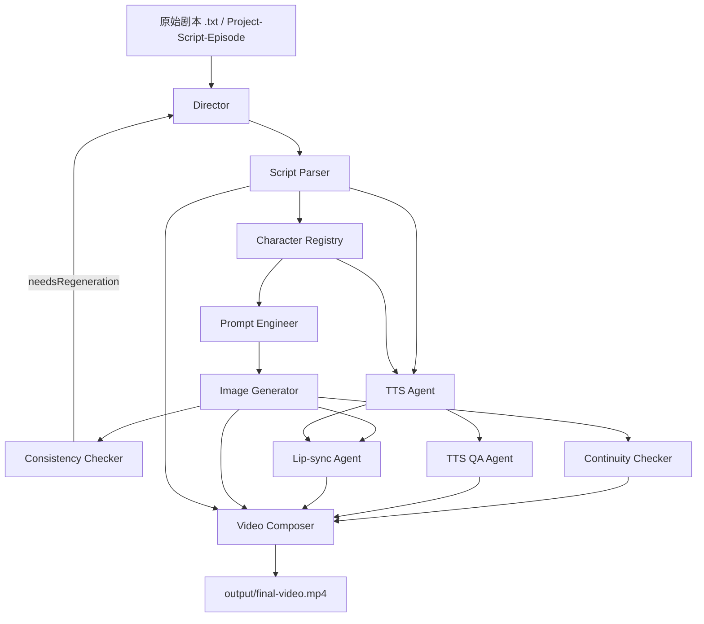

# Agent 间输入输出关系图

本文档把当前工作流里 `11` 个 agent 的输入、输出、落盘位置和下游消费者串起来看，重点服务两个目的：

1. 快速理解整条 pipeline 到底怎么流转。
2. 快速检查“每个 agent 有没有留下可审计成果物”和“小白 QA 摘要”。

## 总览图



## 分层关系

```text
输入层
- 原始剧本文件
- 已持久化的 project / script / episode 数据
- .env 平台配置
- VoicePreset / VoiceCast / PronunciationLexicon

编排层
- Director

内容生成层
- Script Parser
- Character Registry
- Prompt Engineer

资产生成层
- Image Generator
- TTS Agent
- Lip-sync Agent

质检层
- Consistency Checker
- Continuity Checker
- TTS QA Agent
- Run QA Overview（Director 聚合）

交付层
- Video Composer
- output/
```

## 单 Agent 输入输出表

| Agent | 主要输入 | 主要输出 | 主要落盘位置 | 下游消费者 |
|------|------|------|------|------|
| Director | `scriptFilePath` 或 `projectId/scriptId/episodeId` | `outputPath`、`RunJob`、`AgentTaskRun`、`qa-overview` | `temp/<jobId>/state.json`、`temp/projects/.../run-jobs/`、`runs/<runId>/` | 全局编排 |
| Script Parser | `scriptText` | `title / characters / shots` | `01-script-parser/` | Character Registry、TTS、Video Composer |
| Character Registry | `characters + scriptContext + style` | `characterRegistry` | `02-character-registry/` | Prompt Engineer、Consistency Checker、TTS |
| Prompt Engineer | `shots + characterRegistry + style` | `prompts` | `03-prompt-engineer/` | Image Generator |
| Image Generator | `prompts + style + provider route` | `imageResults / KeyframeAsset refs` | `04-image-generator/` | Consistency Checker、Continuity Checker、Lip-sync、Video Composer |
| Consistency Checker | `characterRegistry + imageResults` | `reports + needsRegeneration` | `05-consistency-checker/` | Director |
| Continuity Checker | `shots + imageResults` | `reports + flaggedTransitions` | `06-continuity-checker/` | Director、Video Composer |
| TTS Agent | `shots + characterRegistry + voice presets` | `audioResults + voiceResolution` | `07-tts-agent/` | TTS QA、Lip-sync、Video Composer |
| TTS QA Agent | `shots + audioResults + voiceResolution` | `tts-qa report + ASR report + manual review sample` | `08-tts-qa/` | Director、人工 QA |
| Lip-sync Agent | `shots + imageResults + audioResults` | `lipsync clips + lipsync report` | `08b-lipsync-agent/` | Video Composer、人工 QA |
| Video Composer | `shots + imageResults + audioResults + lipsyncClips` | `final video`、compose artifacts | `09-video-composer/`、`output/` | 最终交付 |

## QA 摘要层

从当前版本开始，主要 agent 在写出核心成果物后，还会额外写两份“给人直接看”的 QA 摘要：

- `1-outputs/qa-summary.md`
- `2-metrics/qa-summary.json`

Director 会在 run 根目录再汇总一层：

- `qa-overview.md`
- `qa-overview.json`

建议阅读顺序：

1. 先看 run 根目录 `qa-overview.md`
2. 再看对应 agent 的 `qa-summary.md`
3. 最后再下钻 `manifest.json / 1-outputs / 3-errors`

这样研发、产品、QA 都能先看懂“这轮到底过没过、风险在哪”，再决定是否继续看原始证据。

## 单 Agent 测试成果物

除了完整 production pipeline 的 `temp/projects/...` 运行包之外，现在还支持把单个 agent 的测试成果物单独落到：

- `temp/script-parser/`
- `temp/character-registry/`
- `temp/prompt-engineer/`
- `temp/image-generator/`
- `temp/consistency-checker/`
- `temp/continuity-checker/`
- `temp/tts-agent/`
- `temp/tts-qa/`
- `temp/lipsync-agent/`
- `temp/video-composer/`
- `temp/director/`

注意：

1. 这只是最外层根目录变化
2. 目录内部仍尽量保持 `projects/.../runs/...` 结构
3. 所以单 agent 测试也能用和正式 run 接近的方式复盘产物

## 详细流转

### 1. Director

输入：

- 原始剧本文件，或 `projectId + scriptId + episodeId`
- 运行选项，例如 `style`、`skipConsistencyCheck`

输出：

- 编排后的最终 `outputPath`
- `RunJob / AgentTaskRun`
- 一次分集运行对应的 auditable run package
- run 根目录 `qa-overview.md / qa-overview.json`

关键落盘：

- 兼容模式缓存：`temp/<jobId>/state.json`
- 分集运行记录：`temp/projects/<projectId>/scripts/<scriptId>/episodes/<episodeId>/run-jobs/`
- 审计运行包：`temp/projects/<projectName>__<projectId>/scripts/<scriptTitle>__<scriptId>/episodes/<episodeDir>/runs/<runDir>/`

### 2. Script Parser

输入：

- `scriptText`

输出：

- `title`
- `characters`
- `shots`

关键落盘：

- `01-script-parser/0-inputs/source-script.txt`
- `01-script-parser/1-outputs/shots.flat.json`
- `01-script-parser/1-outputs/shots.table.md`
- `01-script-parser/1-outputs/qa-summary.md`
- `01-script-parser/2-metrics/qa-summary.json`

### 3. Character Registry

输入：

- `characters`
- `scriptContext`
- `style`

输出：

- 统一角色档案数组
- `resolveShotParticipants / resolveShotSpeaker` 所需身份视图

关键落盘：

- `02-character-registry/1-outputs/character-registry.json`
- `02-character-registry/1-outputs/character-name-mapping.json`
- `02-character-registry/1-outputs/qa-summary.md`
- `02-character-registry/2-metrics/character-metrics.json`
- `02-character-registry/2-metrics/qa-summary.json`

### 4. Prompt Engineer

输入：

- `shots`
- `characterRegistry`
- `style`

输出：

- `prompts`
- `promptSources`

关键落盘：

- `03-prompt-engineer/1-outputs/prompts.json`
- `03-prompt-engineer/1-outputs/prompt-sources.json`
- `03-prompt-engineer/1-outputs/prompts.table.md`
- `03-prompt-engineer/1-outputs/qa-summary.md`
- `03-prompt-engineer/2-metrics/qa-summary.json`
- `03-prompt-engineer/3-errors/<shotId>-fallback-error.json`

### 5. Image Generator

输入：

- `prompts`
- `style`
- provider route

输出：

- `imageResults`
- `KeyframeAsset` 风格结果对象

关键落盘：

- `04-image-generator/0-inputs/provider-config.json`
- `04-image-generator/1-outputs/images.index.json`
- `04-image-generator/1-outputs/qa-summary.md`
- `04-image-generator/2-metrics/image-metrics.json`
- `04-image-generator/2-metrics/qa-summary.json`
- `04-image-generator/3-errors/retry-log.json`

### 6. Consistency Checker

输入：

- `characterRegistry`
- `imageResults`

输出：

- `reports`
- `needsRegeneration`

关键落盘：

- `05-consistency-checker/1-outputs/consistency-report.json`
- `05-consistency-checker/1-outputs/flagged-shots.json`
- `05-consistency-checker/1-outputs/qa-summary.md`
- `05-consistency-checker/2-metrics/consistency-metrics.json`
- `05-consistency-checker/2-metrics/qa-summary.json`
- `05-consistency-checker/3-errors/<character>-batch-<n>-error.json`

说明：

- 当前这层只负责“角色外观一致性”
- 不负责完整时序连贯性

### 7. Continuity Checker

输入：

- `shots`
- `imageResults`

输出：

- `reports`
- `flaggedTransitions`

关键落盘：

- `06-continuity-checker/1-outputs/continuity-report.json`
- `06-continuity-checker/1-outputs/flagged-transitions.json`
- `06-continuity-checker/1-outputs/continuity-report.md`
- `06-continuity-checker/1-outputs/qa-summary.md`
- `06-continuity-checker/2-metrics/continuity-metrics.json`
- `06-continuity-checker/2-metrics/qa-summary.json`

### 8. TTS Agent

输入：

- `shots`
- `characterRegistry`
- `voicePresetLoader / voiceCast / pronunciationLexicon`

输出：

- `audioResults`
- `voiceResolution`

关键落盘：

- `07-tts-agent/0-inputs/voice-resolution.json`
- `07-tts-agent/1-outputs/audio.index.json`
- `07-tts-agent/1-outputs/dialogue-table.md`
- `07-tts-agent/1-outputs/qa-summary.md`
- `07-tts-agent/2-metrics/tts-metrics.json`
- `07-tts-agent/2-metrics/qa-summary.json`
- `07-tts-agent/3-errors/<shotId>-error.json`

### 9. TTS QA Agent

输入：

- `shots`
- `audioResults`
- `voiceResolution`

输出：

- `tts-qa.json`
- `asr-report.json`
- `voice-cast-report.md`
- `manual-review-sample.md`

关键落盘：

- `08-tts-qa/1-outputs/voice-cast-report.md`
- `08-tts-qa/1-outputs/manual-review-sample.md`
- `08-tts-qa/1-outputs/qa-summary.md`
- `08-tts-qa/2-metrics/tts-qa.json`
- `08-tts-qa/2-metrics/asr-report.json`
- `08-tts-qa/2-metrics/qa-summary.json`

### 10. Lip-sync Agent

输入：

- `shots`
- `imageResults`
- `audioResults`

输出：

- `lipsync clips`
- `lipsync report`
- fallback 和人工复核建议

关键落盘：

- `08b-lipsync-agent/1-outputs/lipsync.index.json`
- `08b-lipsync-agent/1-outputs/lipsync-report.md`
- `08b-lipsync-agent/1-outputs/qa-summary.md`
- `08b-lipsync-agent/2-metrics/lipsync-report.json`
- `08b-lipsync-agent/2-metrics/qa-summary.json`
- `08b-lipsync-agent/3-errors/<shotId>-lipsync-error.json`

### 11. Video Composer

输入：

- `shots`
- `imageResults`
- `audioResults`
- `lipsyncClips`

输出：

- `final-video.mp4`
- 合成计划与 FFmpeg 证据

关键落盘：

- `09-video-composer/1-outputs/compose-plan.json`
- `09-video-composer/1-outputs/segment-index.json`
- `09-video-composer/1-outputs/qa-summary.md`
- `09-video-composer/2-metrics/video-metrics.json`
- `09-video-composer/2-metrics/qa-summary.json`
- `09-video-composer/3-errors/ffmpeg-command.txt`
- `09-video-composer/3-errors/ffmpeg-stderr.txt`
- `output/<...>/final-video.mp4`

## 审计检查清单

如果要判断一次运行是否“每个 agent 都有成果物”，最小检查可以看：

```text
runs/<runDir>/
  manifest.json
  timeline.json
  qa-overview.md
  qa-overview.json
  01-script-parser/manifest.json
  02-character-registry/manifest.json
  03-prompt-engineer/manifest.json
  04-image-generator/manifest.json
  05-consistency-checker/manifest.json
  06-continuity-checker/manifest.json
  07-tts-agent/manifest.json
  08-tts-qa/manifest.json
  08b-lipsync-agent/manifest.json
  09-video-composer/manifest.json
```

再进一步看每层的核心产物是否存在：

- 分镜表：`shots.table.md`
- 角色档案：`character-registry.json`
- Prompt 表：`prompts.table.md`
- 生图索引：`images.index.json`
- 一致性报告：`consistency-report.json`
- 连贯性报告：`continuity-report.md`
- 声线解析：`voice-resolution.json`
- TTS QA 样本：`manual-review-sample.md`
- Lip-sync 报告：`lipsync-report.md`
- 合成计划：`compose-plan.json`

## 当前最关键的边界

为了避免职责混乱，当前建议把几个概念分开看：

- `Consistency Checker`
  - 角色外观一致性
- `Continuity Checker`
  - 跨镜头连贯性
- `TTS QA Agent`
  - 配音最小自动验收
- `Lip-sync Agent`
  - 口型生成与轻量 QA
- `Director -> qa-overview`
  - 整轮 run 的小白总览

这样职责更清楚，也更容易定位到底是“内容生成问题”“质检问题”还是“最终交付问题”。

## 相关文档

- [Agent 文档总览](/d:/My-Project/AI-video-factory-pro/docs/agents/README.md)
- [配音链路说明](/d:/My-Project/AI-video-factory-pro/docs/agents/tts-agent.md)
- [运行包目录示例](/d:/My-Project/AI-video-factory-pro/docs/agents/run-package-example.md)
- [SOP 总览](/d:/My-Project/AI-video-factory-pro/docs/sop/README.md)
