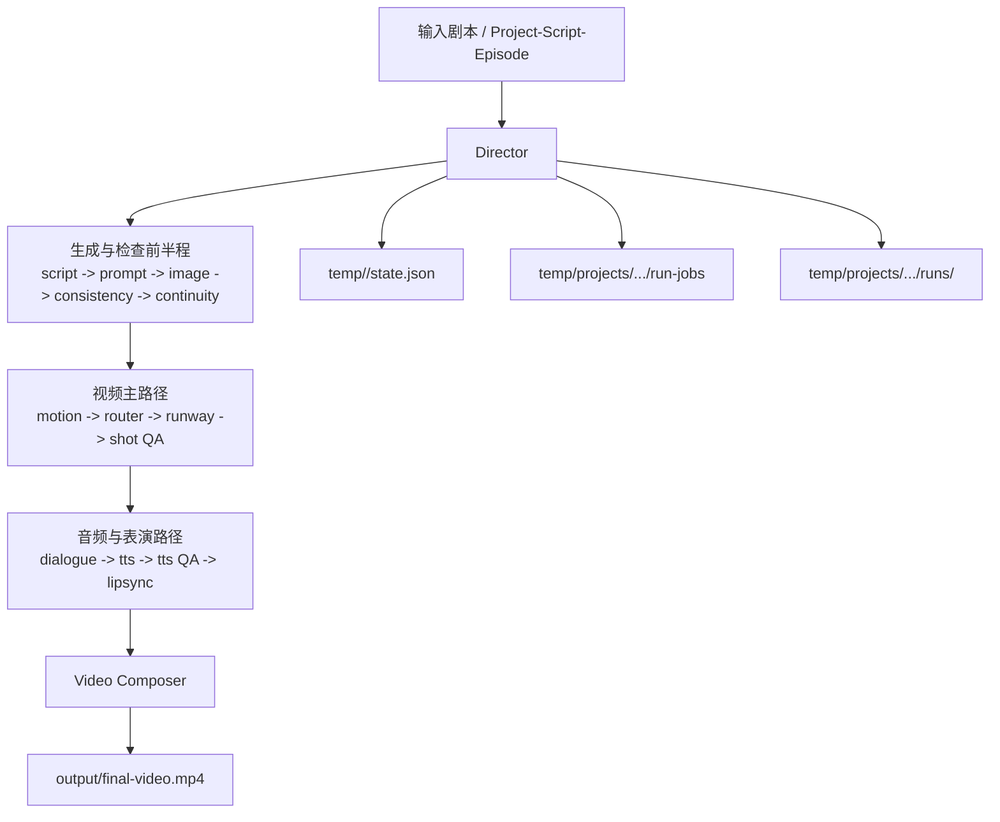
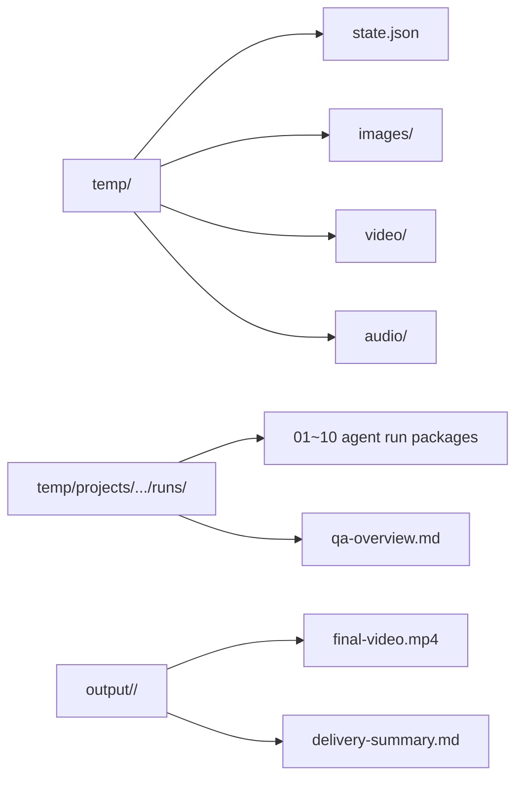

# 运行时目录文档

这组文档不解释单个 Agent，而是解释运行过程中磁盘上的目录组织方式。

适合回答这类问题：

- `temp/` 里每层目录是干嘛的
- `output/` 里什么才算最终交付
- 出错时应该先看哪个目录

## 入口

- [temp/ 目录说明](temp-structure.md)
- [output/ 目录说明](output-structure.md)
- [断点续跑说明](resume-from-step.md)

## 运行主流程图

## 目录与数据流关系

