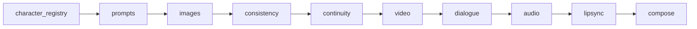
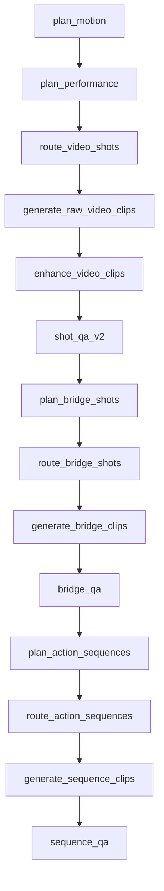
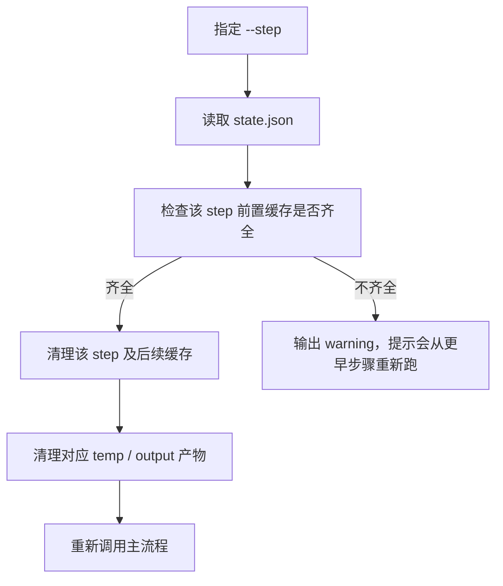
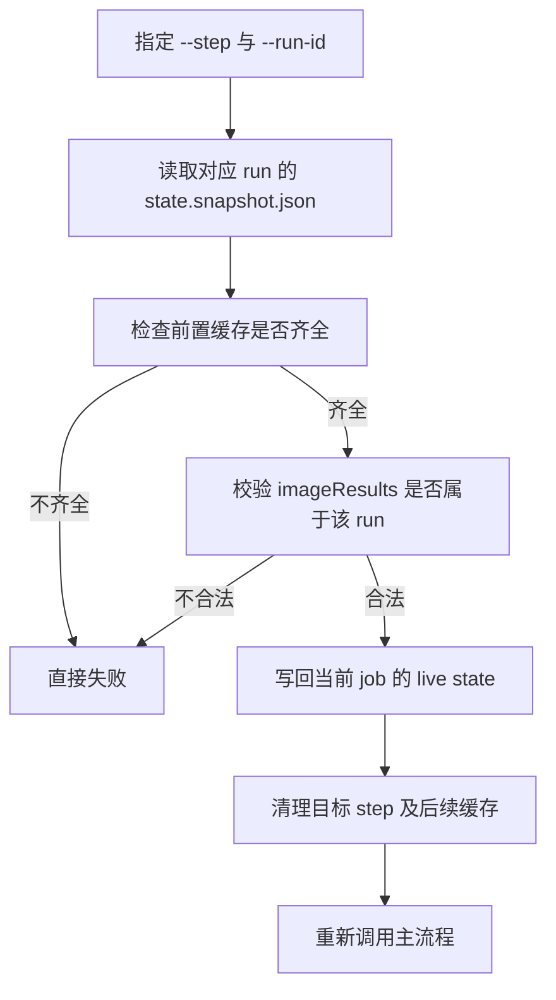

# 断点续跑

`resume-from-step.js` 用来统一处理“从某个步骤之后继续跑”。

它会自动做三件事：

1. 找到对应 `state.json`
2. 删除该步骤及后续步骤的缓存字段
3. 清理对应临时产物，然后重新调用主流程

小白话理解：

- 它不是“从某个函数行号接着跑”
- 而是“把这个步骤和它后面的缓存删掉，再让 Director 用前面还保留的成果物重新接上”
- 所以它现在仍然是 `step 级续跑`，不是更细的 `sequence 级` 或 `shot 级` CLI

## 适用场景

- `08b-lipsync-agent` 出错，想从 lipsync 之后继续
- `07-tts-agent` 出错，想从音频重新生成
- `10-video-composer` 出错，只想重做最终合成
- 不想再手工改 `state.json`

## 常用命令

### 先预演，不实际修改

```bash
node scripts/resume-from-step.js --step=lipsync samples/寒烬宫变-pro.txt --dry-run --style=realistic
```

`--dry-run` 只打印：

- 会删哪些 state 字段
- 会清哪些文件
- 当前缓存是否足够从目标步骤继续
- 如果带了 `--run-id`，还会打印恢复模式、绑定的 `run-id`、snapshot 路径、复用参考图数

### 正式执行

```bash
node scripts/resume-from-step.js --step=lipsync samples/寒烬宫变-pro.txt --style=realistic
```

### 严格绑定某次历史 run 继续跑

```bash
node scripts/resume-from-step.js --step=video samples/寒烬宫变-pro.txt --run-id=run_xxx --dry-run --style=realistic
node scripts/resume-from-step.js --step=video samples/寒烬宫变-pro.txt --run-id=run_xxx --style=realistic
```

当你显式传 `--run-id=<runJobId>` 时，这次恢复会进入“严格 run 绑定”模式：

- 前置状态以该 run 的 `state.snapshot.json` 为恢复基线
- live `state.json` 只是当前 job 的写入目标，不再作为前置输入来源
- 从 `video` 及后续步骤恢复时，参考图必须来自该 run
- 缺图、缺前置状态、或路径不属于该 run 时，命令会直接失败

这套语义是为了避免“我想验证 run_id1 的图生视频，实际却混进了 run_id2 的图”这种错配。

### 只重置，不自动开跑

```bash
node scripts/resume-from-step.js --step=audio samples/寒烬宫变-pro.txt --prepare-only
```

## 支持的 step

- `character_registry`
- `prompts`
- `images`
- `consistency`
- `continuity`
- `video`
- `dialogue`
- `audio`
- `lipsync`
- `compose`

常见别名也支持，例如：

- `lipsync-agent` -> `lipsync`
- `video-generation` / `video-router` / `seedance-video-agent` / `runway-video-agent` / `shot-qa` -> `video`
- `tts` / `tts-agent` -> `audio`
- `video-composer` -> `compose`

## 续跑阶段图



## `video` 阶段内部包含什么



## 两种运行模式

### 兼容模式

直接传剧本文件：

```bash
node scripts/resume-from-step.js --step=lipsync samples/寒烬宫变-pro.txt --style=realistic
```

### 项目模式

如果你不想手输 `project / script / episode`，可以直接让脚本交互选择：

```bash
node scripts/resume-from-step.js --step=audio --style=realistic
```

也可以半自动：

```bash
node scripts/resume-from-step.js --step=audio --project=demo-project --style=realistic
```

这时脚本只会继续让你选择剧本和分集。

## 脚本如何判断从哪继续

项目当前不是按“步骤号”恢复，而是按 `state.json` 里有没有缓存字段决定是否跳过。

这里要分两种情况理解：

- 没传 `--run-id`
  仍是兼容语义，优先继续当前最新可恢复状态
- 传了 `--run-id`
  就进入严格绑定语义，只允许使用该 run 的 snapshot 和可验证产物

例如：

- 从 `lipsync` 继续时，会清掉：
  - `lipsyncResults`
  - `lipsyncReport`
  - `composeResult`
  - `outputPath`
  - `deliverySummaryPath`
  - `completedAt`
  - `lastError`
  - `failedAt`

- 从 `audio` 继续时，会额外清掉：
  - `audioResults`
  - `audioVoiceResolution`
  - `audioProjectId`

- 从 `video` 继续时，会清掉：
  - `performancePlan`
  - `shotPackages`
  - `rawVideoResults`
  - `enhancedVideoResults`
  - `videoResults`
  - `shotQaReport`
  - `shotQaReportV2`
  - `bridgeShotPlan`
  - `bridgeShotPackages`
  - `bridgeClipResults`
  - `bridgeQaReport`
  - `actionSequencePlan`
  - `actionSequencePackages`
  - `sequenceClipResults`
  - `sequenceQaReport`
  - `normalizedShots`
  - `audioResults`
  - `audioVoiceResolution`
  - `audioProjectId`
  - `lipsyncResults`
  - `lipsyncReport`
  - `composeResult`
  - `outputPath`
  - `deliverySummaryPath`
  - `completedAt`
  - `lastError`
  - `failedAt`

- 从 `compose` 继续时：
  - 不会清掉 `performancePlan`
  - 不会清掉 `rawVideoResults`
  - 不会清掉 `enhancedVideoResults`
  - 不会清掉 `videoResults`
  - 不会清掉 `shotQaReport`
  - 不会清掉 `shotQaReportV2`
  - 不会清掉 `bridgeShotPlan`
  - 不会清掉 `bridgeShotPackages`
  - 不会清掉 `bridgeClipResults`
  - 不会清掉 `bridgeQaReport`
  - 不会清掉 `actionSequencePlan`
  - 不会清掉 `actionSequencePackages`
  - 不会清掉 `sequenceClipResults`
  - 不会清掉 `sequenceQaReport`
  - 只重做最终成片合成

## 续跑决策图



如果显式传了 `--run-id`，实际决策会变成：



## 为什么指定了 `lipsync`，却又从更早步骤开始

如果当前 `state.json` 里已经缺了前置缓存，例如：

- `imageResults`
- `normalizedShots`
- `audioResults`

那就算你指定 `--step=lipsync`，实际上也无法从 lipsync 继续，只能从更早步骤开始。

脚本会主动输出 warning，告诉你缺了哪些前置缓存。

如果你显式带了 `--run-id`，这里就不会再走 warning + 自动降级，而是直接失败。

## 推荐使用方式

建议总是先跑一次：

```bash
node scripts/resume-from-step.js --step=lipsync samples/寒烬宫变-pro.txt --dry-run
```

确认计划没问题，再去掉 `--dry-run` 正式执行。

如果你是在做历史 run 复盘，建议改成：

```bash
node scripts/resume-from-step.js --step=video samples/寒烬宫变-pro.txt --run-id=run_xxx --dry-run
```

然后重点确认 4 件事：

- 恢复模式是不是 `strict_run_binding`
- 绑定的 `run-id` 对不对
- snapshot 路径是不是你想要的那次 run
- 复用参考图数是否符合预期
