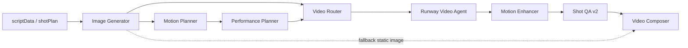

# 2026-04-04 动态短剧升级 Phase 2 设计

## 1. 目标

Phase 2 的目标不是继续扩张整条生产线，而是集中解决一个已经被 Phase 1 验收文档明确暴露的问题：

- 让单镜头默认不再像“静图拼接的 PPT”，而是更接近真实动态镜头

Phase 1 已经完成：

- `Director` 单一 orchestrator
- `videoResults` 进入成片默认主路径
- `Shot QA`、artifact、resume、测试、文档闭环

但当前主链仍然存在三个明显缺口：

- 缺少“人物动作 + 节奏点 + 运镜意图”的可执行表演协议
- 缺少视频生成后的镜头增强层
- `Shot QA` 只能证明工程可用，不能证明镜头具备基础动态感

因此，Phase 2 的核心目标固定为：

- 保留 Phase 1 的主链和编排体系
- 新增表演规划层
- 新增镜头增强层
- 升级 `Shot QA` 为“工程可用 + 动态可用”双层验收

## 2. 范围

### 2.1 本阶段要解决什么

Phase 2 MVP 只优先解决“单镜头真正动起来”。

默认策略固定为：

- provider 先生成基础动态镜头
- 后处理层对已有运动镜头做增强
- `Shot QA v2` 显式判定镜头是否只是“伪动态”

优先覆盖的镜头模板固定为：

- `dialogue_closeup_react`
- `dialogue_two_shot_tension`
- `emotion_push_in`
- `fight_exchange_medium`
- `fight_impact_insert`
- `ambient_transition_motion`

### 2.2 本阶段明确不做什么

Phase 2 MVP 明确不做：

- `bridge shot agent` 正式落地
- 多镜头级连续性重构
- 多角色 Act-Two 级复杂表演编排
- shot 级 CLI 续跑
- 多 provider 智能成本系统
- 视觉大模型评分体系
- 把后处理做成“万能兜底修复器”

## 3. 架构决策

### 3.1 继续保持单一调度中心

Phase 2 继续保留 `Director` 作为唯一 orchestrator，不引入第二个调度中心。

### 3.2 采用“生成 + 增强 + QA”混合路线

Phase 2 不走“纯 provider 生成”路线，也不走“纯后处理修补”路线，而是固定采用混合路线：

- `Performance Planner` 负责把镜头规划升级为可执行表演镜头计划
- `Runway Video Agent` 负责生成基础动态镜头
- `Motion Enhancer` 负责做时长修正、平滑、轻运镜和编码规范化
- `Shot QA v2` 负责双层验收与回退决策

新的高层数据流固定为：

```text
scriptData / shotPlan
  -> imageResults
  -> motionPlan
  -> performancePlan
  -> shotPackages
  -> rawVideoResults
  -> enhancedVideoResults
  -> videoResults
  -> shotQaReportV2
  -> videoComposer
```

对应结构图如下：



### 3.3 Composer 兼容策略

Phase 2 不要求 `videoComposer` 理解内部新增通道。

兼容策略固定为：

- `rawVideoResults` 记录 provider 原始结果
- `enhancedVideoResults` 记录增强后结果
- `videoResults` 只在 `Shot QA v2` 完成最终决策后，才写成“当前最终可供 composer 消费的结果”

因此，composer 继续按现有优先级工作：

1. `videoResults`
2. `lipsyncResults`
3. `animationClips`
4. `imageResults`

## 4. 新公共协议

### 4.1 performancePlan

新增 `performancePlan`，作为镜头级表演规划标准产物。

每个 shot 的最小字段固定为：

- `shotId`
- `order`
- `performanceTemplate`
- `subjectBlocking`
- `actionBeatList`
- `cameraMovePlan`
- `motionIntensity`
- `tempoCurve`
- `expressionCue`
- `providerPromptDirectives`
- `enhancementHints`
- `generationTier`
- `variantCount`

其中：

- `performanceTemplate` 用于固定镜头模板类别
- `actionBeatList` 用于表达镜头内动作节拍
- `cameraMovePlan` 用于表达推、拉、摇、移等运镜意图
- `generationTier` 用于区分 `base / enhanced / hero`
- `variantCount` 用于约束关键镜头候选生成数

### 4.2 shotPackage v2

Phase 2 在 Phase 1 `shotPackage` 的基础上扩展为更适合视频生成的标准件。

在保留原有字段的前提下，新增最小字段：

- `performanceTemplate`
- `actionBeatList`
- `cameraMovePlan`
- `generationTier`
- `variantCount`
- `candidateSelectionRule`
- `regenPolicy`
- `firstLastFramePolicy`
- `enhancementHints`

### 4.3 rawVideoResults

新增 `rawVideoResults`，用于记录 provider 直接生成的原始视频结果。

每个 shot 的最小字段固定为：

- `shotId`
- `provider`
- `model`
- `status`
- `videoPath`
- `outputUrl`
- `taskId`
- `targetDurationSec`
- `actualDurationSec`
- `variantIndex`
- `failureCategory`
- `error`

### 4.4 enhancedVideoResults

新增 `enhancedVideoResults`，用于记录增强后的视频结果。

每个 shot 的最小字段固定为：

- `shotId`
- `sourceVideoPath`
- `enhancementApplied`
- `enhancementProfile`
- `enhancementActions`
- `enhancedVideoPath`
- `durationAdjusted`
- `cameraMotionInjected`
- `interpolationApplied`
- `stabilizationApplied`
- `qualityDelta`
- `status`
- `error`

### 4.5 shotQaReportV2

新增 `shotQaReportV2`，用于镜头级双层验收。

最小字段固定为：

- `status`
- `entries`
- `plannedShotCount`
- `engineeringPassedCount`
- `motionPassedCount`
- `fallbackCount`
- `manualReviewCount`
- `warnings`
- `blockers`

`entries[]` 最小字段固定为：

- `shotId`
- `engineeringStatus`
- `motionStatus`
- `freezeDurationSec`
- `nearDuplicateRatio`
- `motionScore`
- `enhancementApplied`
- `enhancementProfile`
- `finalDecision`
- `decisionReason`
- `durationSec`
- `targetDurationSec`

## 5. 模块边界

### 5.1 Performance Planner Agent

输入：

- `scriptData`
- `shotPlan`
- `motionPlan`
- continuity 上下文

输出：

- `performancePlan.json`

边界：

- 只负责镜头级表演规划
- 不直接调用视频 provider
- Phase 2 MVP 先做规则驱动版本，不要求复杂导演式 LLM 创作
- 模板只覆盖本阶段约定的 6 类高频镜头

### 5.2 Video Router Agent

输入：

- `performancePlan + imageResults + promptList`

输出：

- `shotPackages.json`

边界：

- 继续负责组装标准化 provider request
- 不直接向 provider 发请求
- Phase 2 默认 provider 仍固定为 `Runway`
- 允许基于 `generationTier` 和 `variantCount` 做镜头分层路由

### 5.3 Runway Video Agent

输入：

- `shotPackage v2`

输出：

- `rawVideoResults`

边界：

- 继续负责异步任务提交、轮询、下载和错误分类
- 不承担后处理增强职责
- Phase 2 允许对关键镜头生成候选结果，但不引入复杂全局编排器

### 5.4 Motion Enhancer Agent

输入：

- `rawVideoResults`
- `shotPackage`
- `performancePlan`

输出：

- `enhancedVideoResults`
- 增强前后 probe 与增强证据

边界：

- 只增强“已生成成功但质量一般”的镜头
- 不负责把失败镜头强行修成可用镜头
- 默认增强手段以 `FFmpeg + 规则` 为主
- `FILM / Real-ESRGAN` 等重型增强能力仅作为未来可选插件，不纳入 Phase 2 MVP 主路径
- 不直接决定 composer 最终消费哪一路视频结果

Phase 2 MVP 的增强能力固定优先级为：

1. `timing normalizer`
2. `encoding normalization`
3. `motion smoothness enhancement`
4. `micro camera motion enhancement`

### 5.5 Shot QA v2

输入：

- `rawVideoResults`
- `enhancedVideoResults`
- 现有 `imageResults`

输出：

- `shotQaReportV2`
- 最终桥接后的 `videoResults`

边界：

- 继续做工程可用验收
- 新增动态可用验收
- 显式记录 `pass / enhance / fallback / manual_review`
- 不做昂贵视觉评分模型
- 不把“通过 QA”误当作“镜头表现力完全达标”
- 由 `Director` 基于 `shotQaReportV2` 统一回写最终 `videoResults`

## 6. QA 规则

### 6.1 工程可用验收

Phase 2 工程验收至少包含：

- 文件存在且非空
- `ffprobe` 可读
- 编码、fps、分辨率、像素格式在白名单
- 时长不为 0，且与目标时长偏差在阈值内
- provider 未返回空文件、黑屏文件或错误文件

### 6.2 动态可用验收

Phase 2 动态验收至少包含：

- `freeze ratio`
- `near-duplicate frame ratio`
- `motion intensity`
- `black / invalid segment`
- `signal sanity`

动态验收不允许使用全局统一阈值，必须按 `shotType / performanceTemplate` 分桶。

### 6.3 回退决策

Phase 2 的镜头级决策固定为：

- `pass`
- `pass_with_enhancement`
- `fallback_to_image`
- `manual_review`

## 7. Artifact 设计

Phase 2 的视频主路径 artifact 编号固定为：

- `09a-motion-planner`
- `09b-performance-planner`
- `09c-video-router`
- `09d-runway-video-agent`
- `09e-motion-enhancer`
- `09f-shot-qa`
- `10-video-composer`

该编号方案相对 Phase 1 属于显式顺延升级，而不是兼容旧编号映射。

迁移口径固定为：

- Phase 2 实现需要同步更新 `runArtifacts`、测试、README、agent 文档和 runtime 文档
- 历史 Phase 1 运行包不做回写迁移
- 新运行包统一按 Phase 2 编号生成

每个新 agent 都必须遵循既有 auditable artifact 规则：

- `0-inputs`
- `1-outputs`
- `2-metrics`
- `3-errors`

新增核心产物建议包括：

- `09b-performance-planner/1-outputs/performance-plan.json`
- `09d-runway-video-agent/1-outputs/raw-video-results.json`
- `09e-motion-enhancer/1-outputs/enhanced-video-results.json`
- `09f-shot-qa/2-metrics/shot-qa-report-v2.json`

`Director` 的 run summary 追加：

- `planned_performance_shot_count`
- `enhanced_video_shot_count`
- `raw_video_shot_count`
- `manual_review_shot_count`
- `video_generation_tier_breakdown`

## 8. State Cache 与续跑

Phase 2 最小新增缓存字段固定为：

- `performancePlan`
- `rawVideoResults`
- `enhancedVideoResults`
- `shotQaReportV2`

兼容约束固定为：

- `videoResults` 不废弃
- `videoResults` 始终指向最终可供 composer 消费的结果

续跑仍然保持 step 级，不升级为 shot 级 CLI。

续跑规则固定为：

- `resume-from-step --step=compose` 必须保留：
  - `performancePlan`
  - `rawVideoResults`
  - `enhancedVideoResults`
  - `videoResults`
  - `shotQaReportV2`
- `resume-from-step --step=video` 必须清理：
  - `performancePlan`
  - `shotPackages`
  - `rawVideoResults`
  - `enhancedVideoResults`
  - `videoResults`
  - `shotQaReport`
  - `shotQaReportV2`
  - 以及其后续 compose 结果

如果需要新增 step 别名，只允许增加映射，不新增新的用户心智阶段。

## 9. 测试策略与验收入口

Phase 2 MVP 的测试重点固定为三类：

1. 新协议进入主链
2. 增强后视频被正确桥接到 `videoResults`
3. resume / artifact / fallback 不被破坏

建议新增或扩展的测试包括：

- `tests/performancePlanner.test.js`
- `tests/motionEnhancer.test.js`
- `tests/shotQaAgent.test.js`
- `tests/videoComposer.test.js`
- `tests/resumeFromStep.test.js`
- `tests/director.project-run.test.js`
- `tests/director.artifacts.test.js`
- `tests/pipeline.acceptance.test.js`
- `tests/runArtifacts.test.js`

Phase 2 MVP 的建议验收命令固定为：

```bash
node --test tests/performancePlanner.test.js tests/videoRouter.test.js tests/runwayVideoAgent.test.js tests/motionEnhancer.test.js tests/shotQaAgent.test.js
```

```bash
node --test tests/videoComposer.test.js tests/resumeFromStep.test.js tests/director.project-run.test.js tests/director.artifacts.test.js tests/runArtifacts.test.js
```

```bash
node --test tests/pipeline.acceptance.test.js
```

一次性收口命令：

```bash
node --test tests/performancePlanner.test.js tests/videoRouter.test.js tests/runwayVideoAgent.test.js tests/motionEnhancer.test.js tests/shotQaAgent.test.js tests/videoComposer.test.js tests/resumeFromStep.test.js tests/director.project-run.test.js tests/director.artifacts.test.js tests/pipeline.acceptance.test.js tests/runArtifacts.test.js
```

## 10. 成功标准

满足以下条件即可视为 Phase 2 MVP 设计达标：

- `Director` 仍是唯一 orchestrator
- `performancePlan` 正式进入主链
- `Motion Enhancer` 成功接入，不破坏旧 fallback
- `videoResults` 最终稳定指向增强后可用视频结果
- `Shot QA` 从纯工程验收升级为双层验收
- `resume / artifact / tests / docs` 继续闭环
- Phase 1 到 Phase 2 的 artifact 编号迁移口径明确且已完成文档同步

## 11. 边界说明

Phase 2 的默认口径固定为：

- 它解决的是“单镜头动态感明显不足”的问题
- 它把视频从“能播”推进到“更像镜头”
- 它不等于多角色复杂打斗、桥接镜头和成熟商用品质已经完成
- 它不承诺兼容历史 Phase 1 运行包编号

也就是说，Phase 2 的定位是：

> 在不推翻 Phase 1 架构的前提下，完成单镜头动态质量的第一轮系统升级。
