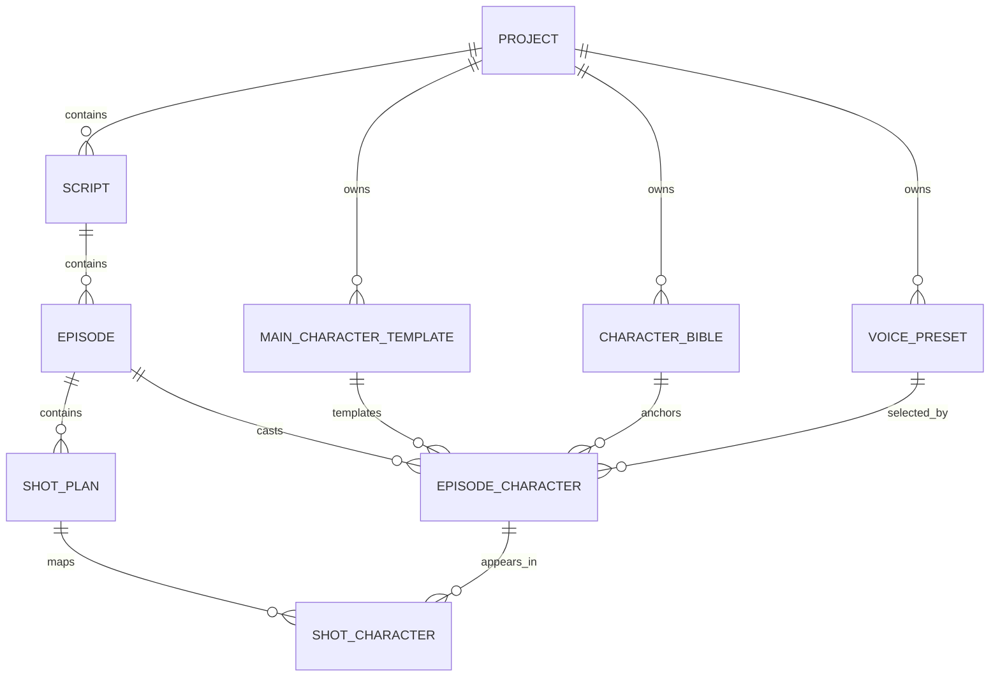
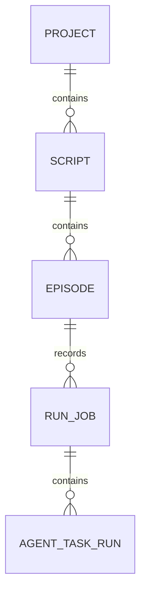
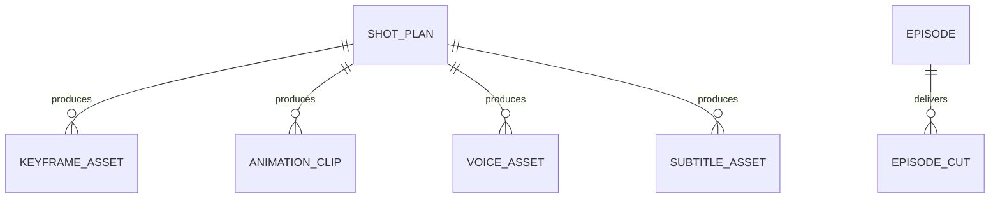

# AI Video Factory Pro Logical Database Design

## 说明

当前项目没有接入 MySQL、PostgreSQL、SQLite、Prisma 或 Drizzle 这类传统数据库。

现状是：

- 领域模型定义在 `src/domain/*.js`
- 持久化通过 `src/utils/*Store.js` + `fileHelper.js` 落盘为 JSON 文件
- 运行时观测数据通过 `run-jobs/*.json` 和 `runs/...` 审计目录保存

因此，这份文档描述的是当前项目的**逻辑数据库设计**，也就是：

1. 领域实体之间的关系
2. 当前文件数据库的落盘路径
3. 每个核心实体的 schema

如果后续要迁移到关系型数据库，这份文档可以直接作为建表蓝本。

## 存储拓扑

当前主数据根目录：

```text
temp/projects/<projectId>/
```

核心持久化文件：

```text
temp/projects/<projectId>/
├── project.json
├── voice-cast.json
├── pronunciation-lexicon.json
├── character-bibles/
│   └── <characterBibleId>.json
├── voice-presets/
│   └── <voicePresetId>.json
└── scripts/
    └── <scriptId>/
        ├── script.json
        └── episodes/
            └── <episodeId>/
                ├── episode.json
                └── run-jobs/
                    └── <runJobId>.json
```

## ER 关系图

### 1. 主内容实体



### 2. 运行与审计实体



### 3. 资产逻辑关系



说明：

- 第 3 组资产实体目前主要体现在运行过程和产物协议里，不一定都有独立 store
- 它们更接近“逻辑表”，适合后续上真实数据库时拆成单表

## Schema

下面字段名以当前代码真实实现为准。

所有通过 `createEntity(...)` 创建的实体都默认包含：

- `id: string`
- `status: string`，默认 `draft`
- `createdAt: ISO datetime`
- `updatedAt: ISO datetime`

通用字段中文注释：

| 字段 | 类型 | 中文注释 |
| --- | --- | --- |
| `id` | string | 实体唯一主键，用于在逻辑数据库或未来关系库中唯一标识一条记录 |
| `status` | string | 实体当前状态，通常用于标记 `draft / running / completed / failed` 等生命周期阶段 |
| `createdAt` | string | 记录创建时间，使用 ISO 8601 时间格式 |
| `updatedAt` | string | 记录最近更新时间，使用 ISO 8601 时间格式 |

## 1. Project

来源：

- [projectModel.js](d:/My-Project/AI-video-factory-pro/src/domain/projectModel.js)
- [projectStore.js](d:/My-Project/AI-video-factory-pro/src/utils/projectStore.js)

落盘：

- `temp/projects/<projectId>/project.json`

Schema：

| 字段 | 类型 | 必填 | 说明 |
| --- | --- | --- | --- |
| `id` | string | 是 | Project 主键 |
| `name` | string | 建议 | 项目名 |
| `code` | string | 可选 | 项目标识码 |
| `description` | string \| null | 否 | 项目描述 |
| `status` | string | 是 | 默认 `draft` |
| `createdAt` | string | 是 | ISO 时间 |
| `updatedAt` | string | 是 | ISO 时间 |

## 2. Script

来源：

- [projectModel.js](d:/My-Project/AI-video-factory-pro/src/domain/projectModel.js)
- [projectStore.js](d:/My-Project/AI-video-factory-pro/src/utils/projectStore.js)

落盘：

- `temp/projects/<projectId>/scripts/<scriptId>/script.json`

Schema：

| 字段 | 类型 | 必填 | 说明 |
| --- | --- | --- | --- |
| `id` | string | 是 | Script 主键 |
| `projectId` | string | 是 | 所属 Project |
| `title` | string | 建议 | 剧本标题 |
| `sourceText` | string | 是 | 原始剧本文本 |
| `genre` | string \| null | 否 | 类型 |
| `theme` | string \| null | 否 | 主题 |
| `targetEpisodeCount` | number \| null | 否 | 目标集数 |
| `status` | string | 是 | 默认 `draft` |
| `createdAt` | string | 是 | ISO 时间 |
| `updatedAt` | string | 是 | ISO 时间 |

## 3. Episode

来源：

- [projectModel.js](d:/My-Project/AI-video-factory-pro/src/domain/projectModel.js)
- [projectStore.js](d:/My-Project/AI-video-factory-pro/src/utils/projectStore.js)

落盘：

- `temp/projects/<projectId>/scripts/<scriptId>/episodes/<episodeId>/episode.json`

Schema：

| 字段 | 类型 | 必填 | 说明 |
| --- | --- | --- | --- |
| `id` | string | 是 | Episode 主键 |
| `projectId` | string | 是 | 所属 Project |
| `scriptId` | string | 是 | 所属 Script |
| `episodeNo` | number | 建议 | 集数 |
| `title` | string \| null | 否 | 分集标题 |
| `summary` | string \| null | 否 | 分集简介 |
| `targetDurationSec` | number | 是 | 自动 clamp 到 `90~180` |
| `status` | string | 是 | 默认 `draft` |
| `createdAt` | string | 是 | ISO 时间 |
| `updatedAt` | string | 是 | ISO 时间 |

## 4. ShotPlan

来源：

- [projectModel.js](d:/My-Project/AI-video-factory-pro/src/domain/projectModel.js)

当前状态：

- 已有领域模型
- 当前更多作为运行时/脚本解析产物使用
- 尚未看到独立 JSON store

Schema：

| 字段 | 类型 | 必填 | 说明 |
| --- | --- | --- | --- |
| `id` | string | 是 | ShotPlan 主键 |
| `projectId` | string | 建议 | 所属 Project |
| `scriptId` | string | 建议 | 所属 Script |
| `episodeId` | string | 建议 | 所属 Episode |
| `shotNo` | number | 建议 | 镜头序号 |
| `scene` | string \| null | 否 | 场景描述 |
| `goal` | string \| null | 否 | 镜头目标 |
| `action` | string \| null | 否 | 动作描述 |
| `dialogue` | string \| null | 否 | 台词 |
| `emotion` | string \| null | 否 | 情绪 |
| `cameraType` | string \| null | 否 | 镜头类型 |
| `cameraMovement` | string \| null | 否 | 运镜 |
| `durationSec` | number \| null | 否 | 规划时长 |
| `continuitySourceShotId` | string \| null | 否 | 连贯性来源镜头 |
| `continuityState` | object | 是 | 连贯性状态对象 |
| `status` | string | 是 | 默认 `draft` |
| `createdAt` | string | 是 | ISO 时间 |
| `updatedAt` | string | 是 | ISO 时间 |

`continuityState` 子结构：

| 字段 | 类型 | 说明 |
| --- | --- | --- |
| `carryOverFromShotId` | string \| null | 承接镜头 |
| `sceneLighting` | string \| null | 场景光线 |
| `cameraAxis` | string \| null | 镜头轴线 |
| `propStates` | array | 道具状态 |
| `emotionState` | object | 角色情绪状态 |
| `continuityRiskTags` | array | 连续性风险标签 |

## 5. MainCharacterTemplate

来源：

- [characterModel.js](d:/My-Project/AI-video-factory-pro/src/domain/characterModel.js)

当前状态：

- 已有领域模型
- 当前更接近项目级角色模板表

Schema：

| 字段 | 类型 | 必填 | 说明 |
| --- | --- | --- | --- |
| `id` | string | 是 | 模板主键 |
| `projectId` | string | 建议 | 所属 Project |
| `name` | string | 建议 | 角色名 |
| `age` | string \| number \| null | 否 | 年龄 |
| `personality` | string \| null | 否 | 性格 |
| `visualDescription` | string \| null | 否 | 视觉描述 |
| `basePromptTokens` | string \| null | 否 | 稳定角色提示词 |
| `defaultVoiceProfile` | object \| null | 否 | 默认声音配置 |
| `status` | string | 是 | 默认 `draft` |
| `createdAt` | string | 是 | ISO 时间 |
| `updatedAt` | string | 是 | ISO 时间 |

## 6. CharacterBible

来源：

- [characterBibleModel.js](d:/My-Project/AI-video-factory-pro/src/domain/characterBibleModel.js)
- [characterBibleStore.js](d:/My-Project/AI-video-factory-pro/src/utils/characterBibleStore.js)

落盘：

- `temp/projects/<projectId>/character-bibles/<characterBibleId>.json`

Schema：

| 字段 | 类型 | 必填 | 说明 |
| --- | --- | --- | --- |
| `id` | string | 是 | CharacterBible 主键 |
| `projectId` | string | 是 | 所属 Project |
| `name` | string | 建议 | 角色名 |
| `aliases` | string[] | 是 | 别名列表 |
| `referenceImages` | string[] | 是 | 参考图路径列表 |
| `coreTraits` | object | 是 | 核心特征 |
| `wardrobeAnchor` | object | 是 | 服装锚点 |
| `lightingAnchor` | object | 是 | 灯光锚点 |
| `basePromptTokens` | string \| null | 否 | 角色基础提示词 |
| `negativeDriftTokens` | string \| null | 否 | 反漂移提示词 |
| `notes` | string \| null | 否 | 备注 |
| `tier` | string | 是 | 默认 `supporting` |
| `status` | string | 是 | 默认 `draft` |
| `createdAt` | string | 是 | ISO 时间 |
| `updatedAt` | string | 是 | ISO 时间 |

## 7. EpisodeCharacter

来源：

- [characterModel.js](d:/My-Project/AI-video-factory-pro/src/domain/characterModel.js)

当前状态：

- 已有领域模型
- 是“某个分集里的角色实例”

Schema：

| 字段 | 类型 | 必填 | 说明 |
| --- | --- | --- | --- |
| `id` | string | 是 | EpisodeCharacter 主键 |
| `projectId` | string | 建议 | 所属 Project |
| `scriptId` | string | 建议 | 所属 Script |
| `episodeId` | string | 建议 | 所属 Episode |
| `name` | string | 建议 | 角色名 |
| `mainCharacterTemplateId` | string \| null | 否 | 角色模板引用 |
| `characterBibleId` | string \| null | 否 | CharacterBible 引用 |
| `roleType` | string \| null | 否 | 角色类型 |
| `age` | string \| number \| null | 否 | 年龄 |
| `personalityOverride` | string \| null | 否 | 性格覆写 |
| `visualOverride` | string \| null | 否 | 视觉覆写 |
| `lookOverride` | string \| null | 否 | 外观覆写 |
| `wardrobeOverride` | string \| null | 否 | 服装覆写 |
| `voiceOverrideProfile` | object \| null | 否 | 声音覆写 |
| `voicePresetId` | string \| null | 否 | VoicePreset 引用 |
| `status` | string | 是 | 默认 `draft` |
| `createdAt` | string | 是 | ISO 时间 |
| `updatedAt` | string | 是 | ISO 时间 |

## 8. ShotCharacter

来源：

- [characterModel.js](d:/My-Project/AI-video-factory-pro/src/domain/characterModel.js)

当前状态：

- 是 `ShotPlan` 和 `EpisodeCharacter` 的关系表

Schema：

| 字段 | 类型 | 必填 | 说明 |
| --- | --- | --- | --- |
| `id` | string | 是 | ShotCharacter 主键 |
| `shotId` | string | 是 | 所属 Shot |
| `episodeCharacterId` | string | 是 | 所属 EpisodeCharacter |
| `isSpeaker` | boolean | 是 | 是否说话者 |
| `isPrimary` | boolean | 是 | 是否主角色 |
| `sortOrder` | number | 是 | 排序 |
| `poseIntent` | string \| null | 否 | 姿态意图 |
| `relativePosition` | string \| null | 否 | 相对位置 |
| `facingDirection` | string \| null | 否 | 朝向 |
| `interactionTargetEpisodeCharacterId` | string \| null | 否 | 交互目标角色 |
| `status` | string | 是 | 默认 `draft` |
| `createdAt` | string | 是 | ISO 时间 |
| `updatedAt` | string | 是 | ISO 时间 |

## 9. VoicePreset

来源：

- [voicePresetModel.js](d:/My-Project/AI-video-factory-pro/src/domain/voicePresetModel.js)
- [voicePresetStore.js](d:/My-Project/AI-video-factory-pro/src/utils/voicePresetStore.js)

落盘：

- `temp/projects/<projectId>/voice-presets/<voicePresetId>.json`

Schema：

| 字段 | 类型 | 必填 | 说明 |
| --- | --- | --- | --- |
| `id` | string | 是 | VoicePreset 主键 |
| `projectId` | string | 是 | 所属 Project |
| `name` | string | 是 | 预设名 |
| `provider` | string | 是 | 默认 `xfyun` |
| `tags` | string[] | 是 | 标签 |
| `sampleAudioPath` | string \| null | 否 | 样音路径 |
| `status` | string | 是 | 默认 `draft` |
| `rate` | number \| null | 否 | 语速 |
| `pitch` | number \| null | 否 | 音调 |
| `volume` | number \| null | 否 | 音量 |
| `createdAt` | string | 是 | ISO 时间 |
| `updatedAt` | string | 是 | ISO 时间 |

关系说明：

- 一个 `VoicePreset` 可以被多个 `EpisodeCharacter` 复用
- `EpisodeCharacter.voicePresetId -> VoicePreset.id`

## 10. VoiceCast

来源：

- [voiceCastStore.js](d:/My-Project/AI-video-factory-pro/src/utils/voiceCastStore.js)
- [voiceCastStore.test.js](d:/My-Project/AI-video-factory-pro/tests/voiceCastStore.test.js)

落盘：

- `temp/projects/<projectId>/voice-cast.json`

当前形态：

- 不是单对象表，而是一个数组文件
- 本质上是 Project 级别的角色选声映射

推荐逻辑 schema：

| 字段 | 类型 | 必填 | 说明 |
| --- | --- | --- | --- |
| `characterId` | string | 是 | 角色实例 ID，通常对应 EpisodeCharacter |
| `displayName` | string | 否 | 展示名 |
| `voiceProfile` | object | 是 | 最终可执行声音配置 |

`voiceProfile` 常见字段：

| 字段 | 类型 | 中文注释 |
| --- | --- | --- |
| `provider` | string | TTS 服务提供商，例如讯飞或其他语音服务 |
| `voice` | string | 具体使用的音色或发音人标识 |
| `rate` | number \| null | 语速调节值，控制说话快慢 |
| `pitch` | number \| null | 音调调节值，控制声音高低 |
| `volume` | number \| null | 音量调节值，控制输出响度 |

## 11. PronunciationLexicon

来源：

- [pronunciationLexiconStore.js](d:/My-Project/AI-video-factory-pro/src/utils/pronunciationLexiconStore.js)

落盘：

- `temp/projects/<projectId>/pronunciation-lexicon.json`

当前形态：

- 项目级数组文件
- 用于 TTS 发音覆写

推荐逻辑 schema：

| 字段 | 类型 | 必填 | 说明 |
| --- | --- | --- | --- |
| `term` | string | 是 | 原始词 |
| `pronunciation` | string | 是 | 目标发音 |
| `locale` | string \| null | 否 | 语言/地区 |
| `notes` | string \| null | 否 | 备注 |

## 12. RunJob

来源：

- [jobStore.js](d:/My-Project/AI-video-factory-pro/src/utils/jobStore.js)

落盘：

- `temp/projects/<projectId>/scripts/<scriptId>/episodes/<episodeId>/run-jobs/<runJobId>.json`

Schema：

| 字段 | 类型 | 必填 | 说明 |
| --- | --- | --- | --- |
| `id` | string | 是 | RunJob 主键 |
| `projectId` | string | 是 | 所属 Project |
| `scriptId` | string | 是 | 所属 Script |
| `episodeId` | string | 是 | 所属 Episode |
| `jobId` | string | 是 | 逻辑任务 ID |
| `status` | string | 是 | 如 `running / completed / failed` |
| `style` | string \| null | 否 | 运行风格 |
| `scriptTitle` | string \| null | 否 | 剧本标题 |
| `episodeTitle` | string \| null | 否 | 分集标题 |
| `startedAt` | string | 是 | 开始时间 |
| `finishedAt` | string \| null | 否 | 结束时间 |
| `error` | string \| null | 否 | 失败信息 |
| `artifactRunDir` | string \| null | 否 | 审计运行目录 |
| `artifactManifestPath` | string \| null | 否 | manifest 路径 |
| `artifactTimelinePath` | string \| null | 否 | 时间线摘要路径 |
| `agentTaskRuns` | AgentTaskRun[] | 是 | step 级运行记录 |

## 13. AgentTaskRun

来源：

- [jobStore.js](d:/My-Project/AI-video-factory-pro/src/utils/jobStore.js)

当前形态：

- 内嵌在 `RunJob.agentTaskRuns[]`
- 如果迁移到关系库，建议拆成独立表

Schema：

| 字段 | 类型 | 必填 | 说明 |
| --- | --- | --- | --- |
| `id` | string | 是 | TaskRun 主键 |
| `step` | string | 是 | 流程步骤名 |
| `agent` | string \| null | 否 | Agent 名 |
| `status` | string | 是 | `completed / failed / running` 等 |
| `detail` | string \| null | 否 | 说明 |
| `startedAt` | string | 是 | 开始时间 |
| `finishedAt` | string | 是 | 结束时间 |
| `error` | string \| null | 否 | 错误信息 |

## 14. 资产逻辑表

这些实体当前主要是领域模型或运行时协议，尚未形成统一 store，但逻辑上已经足够稳定，适合后续上关系库时拆表。

### KeyframeAsset

来源：

- [assetModel.js](d:/My-Project/AI-video-factory-pro/src/domain/assetModel.js)

Schema：

| 字段 | 类型 | 中文注释 |
| --- | --- | --- |
| `id` | string | 关键帧资产主键 |
| `shotId` | string | 所属镜头 ID，用于关联 `ShotPlan` |
| `prompt` | string | 生成关键帧时使用的主提示词 |
| `negativePrompt` | string \| null | 生成关键帧时使用的负向提示词，用于约束不希望出现的内容 |
| `imagePath` | string | 关键帧图片在本地或产物目录中的存储路径 |
| `provider` | string \| null | 生成该关键帧的图像服务提供商 |
| `model` | string \| null | 生成该关键帧所使用的模型名称 |
| `status` | string | 关键帧资产当前状态，如草稿、已生成、失败等 |
| `createdAt` | string | 关键帧资产创建时间 |
| `updatedAt` | string | 关键帧资产最近更新时间 |

### AnimationClip

Schema：

| 字段 | 类型 | 中文注释 |
| --- | --- | --- |
| `id` | string | 动画片段主键 |
| `shotId` | string | 所属镜头 ID，用于关联 `ShotPlan` |
| `keyframeAssetId` | string | 所依赖的关键帧资产 ID |
| `videoPath` | string \| null | 动画片段视频文件路径 |
| `provider` | string \| null | 生成该动画片段的视频服务提供商 |
| `model` | string \| null | 生成该动画片段所使用的模型名称 |
| `durationSec` | number \| null | 动画片段时长，单位为秒 |
| `sourceMode` | string | 片段生成来源模式，如单关键帧、多关键帧或从前片段续写 |
| `status` | string | 动画片段当前状态 |
| `createdAt` | string | 动画片段创建时间 |
| `updatedAt` | string | 动画片段最近更新时间 |

### VoiceAsset

Schema：

| 字段 | 类型 | 中文注释 |
| --- | --- | --- |
| `id` | string | 配音音频资产主键 |
| `shotId` | string | 所属镜头 ID |
| `episodeCharacterId` | string | 对应说话角色的分集角色实例 ID |
| `audioPath` | string \| null | 生成后的音频文件路径 |
| `voice` | string \| null | 使用的音色或发音人标识 |
| `rate` | number \| null | 配音语速参数 |
| `pitch` | number \| null | 配音音调参数 |
| `volume` | number \| null | 配音音量参数 |
| `provider` | string \| null | 语音合成服务提供商 |
| `status` | string | 配音资产当前状态 |
| `createdAt` | string | 配音资产创建时间 |
| `updatedAt` | string | 配音资产最近更新时间 |

### SubtitleAsset

Schema：

| 字段 | 类型 | 中文注释 |
| --- | --- | --- |
| `id` | string | 字幕资产主键 |
| `shotId` | string | 所属镜头 ID |
| `text` | string | 字幕正文内容 |
| `startTime` | number \| null | 字幕开始时间点，通常相对整条时间线或镜头时间线 |
| `endTime` | number \| null | 字幕结束时间点 |
| `style` | string \| null | 字幕样式标识，如字体样式、位置模板或皮肤名称 |
| `status` | string | 字幕资产当前状态 |
| `createdAt` | string | 字幕资产创建时间 |
| `updatedAt` | string | 字幕资产最近更新时间 |

### EpisodeCut

Schema：

| 字段 | 类型 | 中文注释 |
| --- | --- | --- |
| `id` | string | 成片主键 |
| `episodeId` | string | 所属分集 ID |
| `outputPath` | string | 最终导出视频路径 |
| `resolution` | string \| null | 输出分辨率，例如 `1080x1920` |
| `fps` | number \| null | 输出视频帧率 |
| `totalDurationSec` | number \| null | 成片总时长，单位为秒 |
| `publishedPlatform` | string \| null | 发布平台，如抖音、快手、视频号等 |
| `publishedAt` | string \| null | 发布时间，通常为 ISO 时间格式 |
| `status` | string | 成片当前状态，如已生成、已发布、发布失败等 |
| `createdAt` | string | 成片记录创建时间 |
| `updatedAt` | string | 成片记录最近更新时间 |

## 建议的关系库迁移顺序

如果后续要把当前文件数据库迁移到真正的关系库，建议按这个顺序落表：

1. `projects`
2. `scripts`
3. `episodes`
4. `shot_plans`
5. `main_character_templates`
6. `character_bibles`
7. `episode_characters`
8. `shot_characters`
9. `voice_presets`
10. `run_jobs`
11. `agent_task_runs`
12. 资产表和审计表

## 结论

当前项目的“数据库”可以概括为两层：

1. **主数据层**
   - `Project -> Script -> Episode`
   - 角色体系
   - 声音体系
2. **运行审计层**
   - `RunJob -> AgentTaskRun`
   - `runs/...` 审计目录

它本质上是一个**文件数据库驱动的 AI 生产系统**，而不是缺少设计的“临时 JSON 拼装”。结构已经相当清晰，只是还没有迁移到传统 RDBMS。
