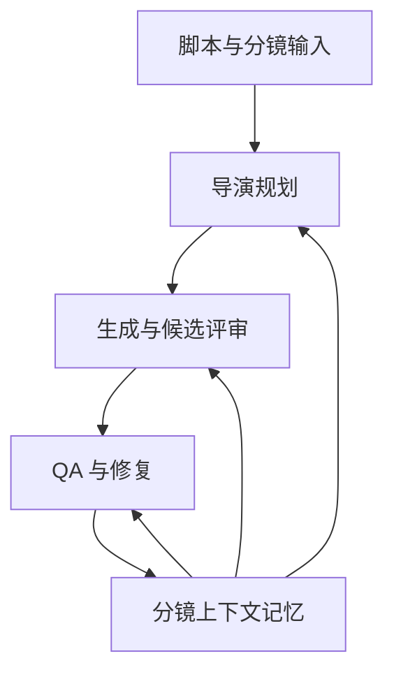
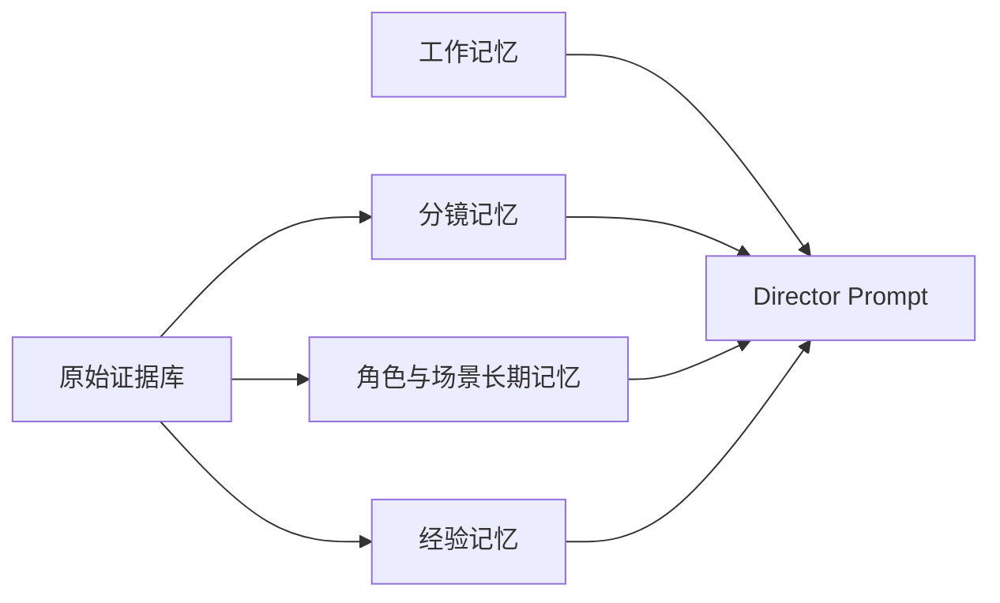
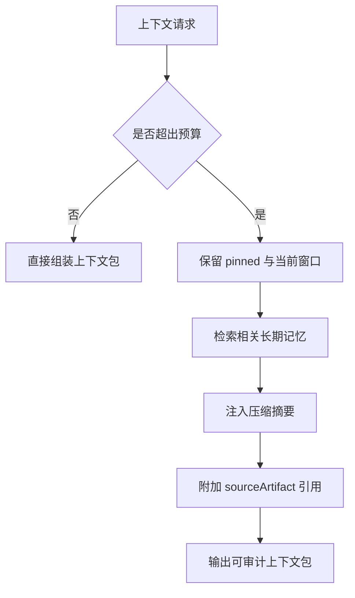
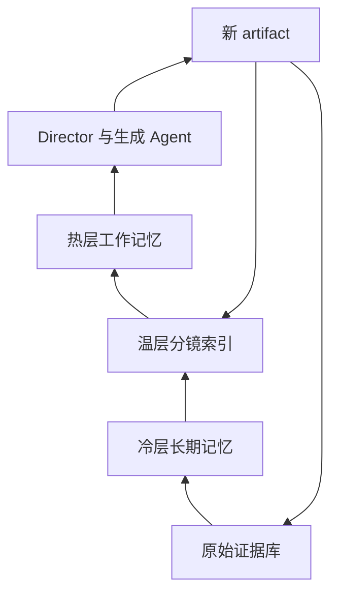
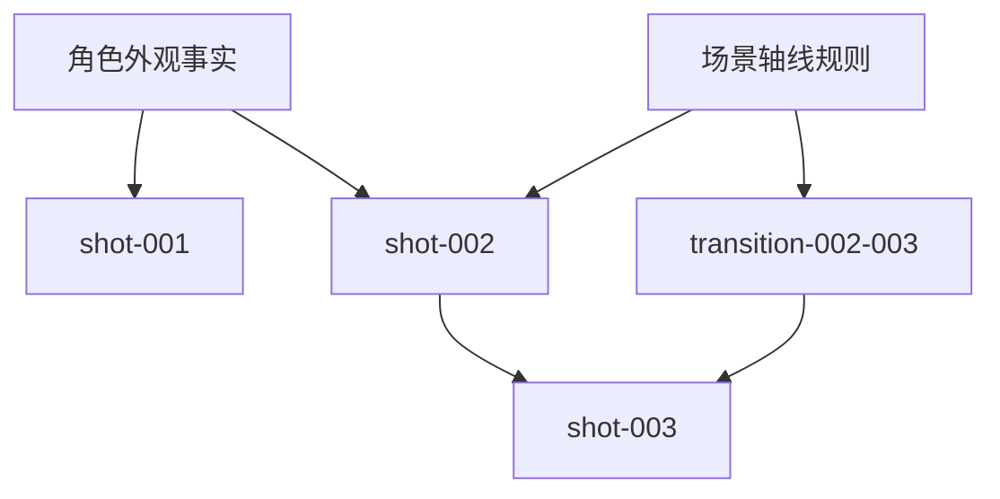
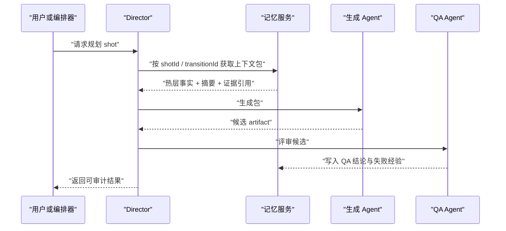

# 分镜上下文记忆 Spec

## 1. 小白总结

“分镜上下文记忆”要解决的问题是：AI 视频生产不是一次性问答，而是一个多阶段、多镜头、多资产反复生成和修复的工程流程。系统不能只把前面所有内容塞进大模型 prompt 里，期待模型一直记得人物、场景、道具、情绪、镜头承接和失败经验。

即使大模型支持 100 万 token，也不能把它当作可靠记忆系统，原因有四类：

- 成本高：每次把全项目上下文塞回去，会放大请求成本和延迟。
- 注意力不稳定：长上下文里模型可能读到但不真正使用关键细节。
- 证据不可审计：prompt 被截断、摘要或重排后，很难追踪某个决策来自哪份原始产物。
- 工程不可控：一旦超出上下文，系统会被迫截断、摘要、检索或分层压缩，行为必须显式设计。

本 spec 的核心方案是：把“记忆”从模型隐式上下文里拿出来，变成可索引、可压缩、可追溯、可冲突检测的 artifact。第一版用 JSON artifact + `shotId` / `transitionId` 索引落地；第二版再接入 Qdrant、Chroma、Milvus、FAISS 或 Mem0 这类向量/记忆组件。

## 2. 背景与问题

当前 AI-video-factory-pro 的工作流已经有脚本、分镜、导演层、生成包、候选结果、QA 和审计 artifact。随着一条片子从几十个镜头扩展到上百个镜头，系统会遇到以下问题：

1. 上一镜的 exit state 没有稳定传给下一镜。
2. 角色服装、道具、伤痕、情绪、站位在长流程里漂移。
3. 场景空间和轴线规则被局部 prompt 改写冲掉。
4. 修复一次失败镜头时，系统不知道哪些后续镜头依赖它。
5. 同一事实在脚本、分镜、图片评审、视频评审、人工备注里产生冲突。
6. 经验教训只停留在日志里，下一次生成没有复用。

不能简单依赖“更长上下文”解决。长上下文只是输入容量，不等于可靠记忆。真正需要的是一套外部化记忆层：把每个镜头、转场、角色、场景、资产、经验、证据都变成可查询、可压缩、可引用、可失效的结构化数据。



## 3. 目标

本专题目标是设计一套渐进式上下文记忆能力，让 Director 和相关 agent 在生成、评审、修复分镜时，可以稳定读取必要上下文，而不是依赖当前 prompt 是否塞得下。

具体目标：

- 为每个 `shotId` 保存可复用的工作状态、视觉事实、生成输入、候选结果、QA 结论和修复记录。
- 为每个 `transitionId` 保存跨镜头承接关系，例如动作承接、视线、轴线、空间、情绪、道具状态和音画关系。
- 支持工作记忆、分镜记忆、角色/场景长期记忆、经验记忆、原始证据库五类记忆。
- 在上下文超限时，提供截断、摘要、检索、分层记忆和证据回链策略。
- 提供压缩策略、保留/删除评分、`pinned`、引用计数、反向依赖图、冷热分层和 `sourceArtifact` 追踪。
- 支持冲突检测，识别同一角色、场景、道具或镜头状态的互斥事实。
- 第一版先用 JSON artifact 完成确定性落盘和索引。
- 第二版再接入向量库和成熟记忆组件。

## 4. 非目标

本 spec 不要求第一阶段实现以下能力：

- 不做完整世界模型或全季级记忆系统。
- 不替代现有脚本、导演、continuity checker、QA agent。
- 不把所有日志永久保留为热数据。
- 不要求第一版接入向量数据库。
- 不要求第一版实现自动图数据库，只要求输出可构建反向依赖图的数据。
- 不要求模型从记忆里自动推理所有事实，关键约束仍要由 Director 显式注入。

## 5. 核心概念

系统把上下文分成五类记忆。

| 类型 | 生命周期 | 主要内容 | 典型用途 |
| --- | --- | --- | --- |
| 工作记忆 | 单次运行内 | 当前 scene、当前 shot、上一镜 exit、当前修复目标 | 降低 prompt 噪声，服务当前决策 |
| 分镜记忆 | 单个项目内 | 每个 `shotId` 的状态、prompt、候选、QA、修复 | 保持镜头级连续性 |
| 角色/场景长期记忆 | 跨 scene 或跨项目 | 角色外观、服装、性格、空间布局、固定道具 | 防止人物和场景漂移 |
| 经验记忆 | 跨运行 | 失败模式、有效改写、供应商偏好、评分结果 | 让下一轮生成少踩坑 |
| 原始证据库 | 长期冷存 | 原始脚本、图片、视频、QA 报告、人工备注、运行日志 | 审计、回溯、冲突裁决 |



每条记忆记录必须区分：

- `fact`：系统认为可复用的事实。
- `summary`：为压缩而生成的摘要。
- `evidence`：支持事实的原始 artifact 引用。
- `decision`：Director 或 QA 做出的选择。
- `constraint`：后续生成必须遵守的约束。
- `warning`：可疑但未阻断的风险。

## 6. 上下文超限处理

当项目上下文超过模型可承载范围时，系统必须按优先级处理，而不是任意截断。

处理顺序：

1. **固定保留 pinned 记忆**：人工锁定、Director 锁定、关键角色/场景锁定、当前修复链路锁定。
2. **读取当前局部窗口**：当前 `shotId`、前后 N 个镜头、相关 `transitionId`。
3. **检索长期事实**：角色、场景、道具、视觉 motif、失败经验。
4. **注入压缩摘要**：scene summary、sequence summary、角色状态摘要。
5. **必要时回链证据**：只把证据路径和关键片段放进 prompt，完整证据留在 artifact。
6. **删除低价值热上下文**：候选废稿、重复日志、低置信度摘要、无引用中间产物。



截断规则：

- 不截断 `pinned=true` 的事实。
- 不截断当前 shot 和相邻 transition 的硬约束。
- 可以截断低分候选、重复 prompt、供应商原始响应全文。
- 被截断内容必须仍能通过 `sourceArtifact` 找回。

摘要规则：

- 摘要必须保留实体、状态、时间点、镜头编号和冲突标记。
- 摘要不能覆盖原始证据，只能作为热上下文替代品。
- 摘要要记录 `summaryOf`、`sourceArtifact`、`generatedAt`、`confidence`。

检索规则：

- 第一版按 `shotId`、`transitionId`、`sceneId`、`characterId`、`locationId`、`artifactType` 做结构化检索。
- 第二版增加语义检索，用向量匹配相似失败、视觉风格、角色状态、场景布局。

## 7. 记忆分层架构

整体架构分为热层、温层、冷层和原始证据层。

| 层级 | 形式 | 读取频率 | 内容 | 存储建议 |
| --- | --- | --- | --- | --- |
| 热层 | Director context pack | 每个镜头 | 当前窗口、pinned 事实、硬约束 | 内存 + 当前 run JSON |
| 温层 | Shot memory index | 每个 scene | 镜头摘要、转场摘要、角色/场景状态 | JSON artifact |
| 冷层 | Long-term memory | 跨项目或低频 | 角色设定、场景设定、经验模式 | JSON + 向量库 |
| 证据层 | Raw artifact store | 审计时 | 原图、视频、日志、报告、人工批注 | 文件系统 artifact |



反向依赖图用于回答“改了这个事实，会影响哪些镜头”。每条记忆记录都要能声明自己被哪些对象引用。



## 8. 记忆写入与压缩策略

写入原则：

- 每次 agent 产出关键 artifact 后，都可以提交候选记忆，但不能默认全部进入热层。
- 记忆写入必须带 `sourceArtifact`，避免“无来源事实”污染后续生成。
- 同一实体的事实更新必须触发冲突检测。
- 低置信度记忆可以进入观察区，不直接进入 Director 约束。

压缩策略：

| 策略 | 触发条件 | 输出 |
| --- | --- | --- |
| 去重压缩 | 多个 artifact 重复描述同一事实 | 合并 facts，保留多个证据引用 |
| 时间线压缩 | 同一角色/道具跨多个镜头变化 | 形成状态时间线 |
| 局部摘要 | scene 或 sequence 结束 | 生成 scene summary |
| 失败模式抽取 | QA 或人工反复指出同类问题 | 写入经验记忆 |
| 冷却归档 | 长时间未引用且非 pinned | 移到冷层，只保留索引 |

保留/删除评分建议：

```text
retentionScore =
  0.30 * recencyScore
  + 0.25 * referenceScore
  + 0.20 * continuityImpactScore
  + 0.15 * confidenceScore
  + 0.10 * humanPinScore
  - 0.20 * duplicationPenalty
  - 0.20 * conflictPenalty
```

字段含义：

- `recencyScore`：最近是否被使用。
- `referenceScore`：引用计数越高越应保留。
- `continuityImpactScore`：影响角色、场景、轴线、关键道具的权重更高。
- `confidenceScore`：来自确定性 schema 或人工确认的权重更高。
- `humanPinScore`：人工或 Director 标记 `pinned`。
- `duplicationPenalty`：重复内容惩罚。
- `conflictPenalty`：存在未解决冲突时降低自动注入优先级。

删除边界：

- 删除只表示从热层/温层移出，不删除原始证据。
- `pinned=true`、`refCount>0` 且被当前 run 引用、或位于反向依赖图关键路径上的记录不能删除。
- 删除动作要写入 compaction log。

## 9. 关键机制

### pinned

`pinned` 表示该记忆在压缩、冷热迁移和 prompt 预算紧张时优先保留。来源包括人工锁定、Director 自动锁定、QA 阻断项、关键角色/场景设定。

### 引用计数

`refCount` 记录该记忆被多少 `shotId`、`transitionId`、scene summary 或生成包引用。引用计数用于保留评分和依赖分析。

### 反向依赖图

`reverseDependencies` 记录“谁依赖我”。当某条角色外观、场景布局或镜头 exit state 被修改，系统可以找出受影响的下游镜头和转场。

### 冷热分层

记忆状态分为：

- `hot`：直接进入当前上下文包。
- `warm`：可快速结构化检索。
- `cold`：只保留索引，需要时从原始证据或向量库恢复。
- `archived`：只供审计，不参与自动生成。

### sourceArtifact

`sourceArtifact` 是所有记忆的证据锚点，至少包含 artifact 路径、类型、生成 agent、时间、hash 或版本号。没有 `sourceArtifact` 的记忆不能成为硬约束。

### 冲突检测

冲突检测至少覆盖：

- 同一角色服装、发型、伤痕、年龄、身份冲突。
- 同一场景空间布局、光源方向、时间段冲突。
- 同一道具持有人、损坏状态、位置冲突。
- 相邻镜头 entry / exit 动作冲突。
- transition 的屏幕方向、轴线、视线关系冲突。

冲突处理：

1. 标记 `conflictGroupId`。
2. 按证据优先级排序：人工确认 > QA 阻断 > 结构化 director pack > 模型摘要。
3. 低优先级事实降级为 warning，不直接注入。
4. 需要人工裁决时输出到 review artifact。

## 10. Artifact Schema

第一版产物建议为一个项目级 JSON artifact，例如：

`output/<runId>/memory/storyboard-context-memory.json`

核心结构：

```json
{
  "schemaVersion": "1.0.0",
  "projectId": "project-demo",
  "runId": "run-2026-06-10-001",
  "createdAt": "2026-06-10T00:00:00.000Z",
  "updatedAt": "2026-06-10T00:00:00.000Z",
  "indexes": {
    "byShotId": {
      "shot-001": ["mem-shot-001-state", "mem-character-a-costume"]
    },
    "byTransitionId": {
      "transition-shot-001-shot-002": ["mem-transition-001-002"]
    },
    "byCharacterId": {
      "character-a": ["mem-character-a-costume"]
    },
    "bySceneId": {
      "scene-001": ["mem-scene-001-layout"]
    }
  },
  "memories": [
    {
      "memoryId": "mem-shot-001-state",
      "memoryType": "shot",
      "layer": "warm",
      "scope": {
        "sceneId": "scene-001",
        "shotId": "shot-001",
        "transitionId": null,
        "characterIds": ["character-a"],
        "locationId": "location-warehouse"
      },
      "kind": "fact",
      "content": {
        "entryState": "角色A站在仓库门口，右手握手电",
        "exitState": "角色A向画面右侧转身，手电光扫向货架",
        "continuityLocks": ["手电在右手", "光源来自画面左后方"]
      },
      "sourceArtifact": {
        "path": "output/run-2026-06-10-001/director/shot-001.json",
        "artifactType": "director-pack",
        "agent": "director",
        "hash": "sha256-placeholder"
      },
      "pinned": false,
      "refCount": 2,
      "reverseDependencies": ["transition-shot-001-shot-002", "shot-002"],
      "retentionScore": 0.82,
      "confidence": 0.9,
      "conflictGroupId": null,
      "status": "active"
    }
  ],
  "compactionLog": [],
  "conflicts": []
}
```

必填字段：

- `schemaVersion`
- `projectId`
- `runId`
- `indexes.byShotId`
- `indexes.byTransitionId`
- `memories[].memoryId`
- `memories[].memoryType`
- `memories[].layer`
- `memories[].scope`
- `memories[].kind`
- `memories[].content`
- `memories[].sourceArtifact`
- `memories[].pinned`
- `memories[].refCount`
- `memories[].reverseDependencies`
- `memories[].retentionScore`
- `memories[].confidence`
- `memories[].status`

`memoryType` 枚举：

- `working`
- `shot`
- `transition`
- `character`
- `location`
- `prop`
- `experience`
- `evidence`
- `summary`

`status` 枚举：

- `active`
- `shadow`
- `conflicted`
- `deprecated`
- `archived`

## 11. Director 接入点

Director 不应该直接读一堆原始日志，而是通过 memory service 获得上下文包。

接入点：

1. **Scene planning 前**
   - 读取角色/场景长期记忆。
   - 读取历史经验记忆。
   - 注入全局禁忌和稳定设定。

2. **Shot planning 前**
   - 按 `shotId` 读取当前镜头目标、角色状态、场景状态。
   - 按 `transitionId` 读取上一镜 exit 和下一镜 entry 约束。
   - 读取反向依赖图，避免随意修改已被后续镜头依赖的状态。

3. **Prompt generation 前**
   - 只注入热层上下文和必要 warm 摘要。
   - 把证据引用作为 `sourceArtifact` 附带，不把全文都塞进 prompt。

4. **Candidate review 后**
   - 写入候选视觉事实、QA 结论、失败原因。
   - 更新 `refCount`、`retentionScore`、冷热层级。

5. **Repair planning 前**
   - 查询当前失败镜头的依赖上下游。
   - 找出被影响的 transition 和后续镜头。
   - 决定局部重跑、连续段重跑或仅更新摘要。



Director 上下文包建议结构：

```json
{
  "shotId": "shot-002",
  "transitionId": "transition-shot-001-shot-002",
  "tokenBudget": 12000,
  "hotFacts": [],
  "continuityLocks": [],
  "characterState": [],
  "locationState": [],
  "experienceHints": [],
  "sourceArtifacts": [],
  "warnings": [],
  "conflicts": []
}
```

## 12. 测试验收

验收目标是证明这套记忆不是“文档概念”，而是能稳定影响分镜生成和修复决策。

功能验收：

- 给定 3 个 scene、10 个 shot，系统能生成项目级 memory JSON。
- `byShotId` 能查到该镜头的状态、角色、场景和证据。
- `byTransitionId` 能查到相邻镜头承接关系。
- 修改角色外观事实后，反向依赖图能列出受影响 shot。
- 超出 token budget 时，系统保留 pinned、当前窗口和硬约束，并压缩低价值内容。
- 无 `sourceArtifact` 的事实不能作为硬约束进入 Director context pack。
- 冲突事实会进入 `conflicts`，并降低自动注入优先级。

压缩验收：

- 重复事实会合并，证据引用不会丢失。
- 低引用、低置信度、非 pinned 的旧候选进入 cold 或 archived。
- compaction log 能说明被压缩、迁移或删除热引用的原因。

Director 接入验收：

- Director planning 前能读取角色/场景长期记忆。
- Shot prompt 生成前能读取上一镜 exit state 和当前 transition lock。
- Repair planning 能识别下游依赖，避免只修当前镜头导致后续断裂。

回归测试建议：

- 单元测试：保留评分、冷热迁移、索引构建、冲突检测。
- 集成测试：从 mock director artifacts 构建 memory artifact。
- 回放测试：用固定 10 镜头样例验证上下文包稳定输出。
- 预算测试：模拟小 token budget，验证 pinned 和硬约束不会被压缩掉。

## 13. 风险与边界

主要风险：

- 记忆污染：错误事实被写入长期记忆后，会持续影响后续生成。
- 摘要失真：模型摘要可能删掉关键视觉状态。
- 过度检索：上下文包过大，反而让 Director 输出变散。
- 冲突误判：软风格差异被误认为硬冲突。
- 存储膨胀：原始证据、候选、日志长期积累导致 artifact 过大。
- 组件过早复杂化：第一版直接上向量库会增加部署和调试成本。

边界策略：

- 第一版只做 JSON artifact、结构化索引、压缩日志和冲突记录。
- 第一版必须支持 `shotId` / `transitionId` 精确索引，这是分镜记忆的主路径。
- 第二版再评估 Qdrant、Chroma、Milvus、FAISS、Mem0。
- 向量检索只能作为召回辅助，不能替代结构化硬约束。
- 任何硬约束必须能追溯到 `sourceArtifact`。
- 人工确认和 pinned 优先级高于模型摘要。

成熟开源组件对比：

| 组件 | 类型 | 优点 | 风险 | 建议阶段 |
| --- | --- | --- | --- | --- |
| Qdrant | 向量数据库 | 部署清晰、过滤能力强、适合 metadata + vector 检索 | 需要服务化运维 | 第二版优先评估 |
| Chroma | 向量数据库 | 上手快、适合本地原型 | 大规模和生产治理能力较弱 | 第二版原型 |
| Milvus | 向量数据库 | 大规模检索能力强 | 运维复杂度高 | 数据量明显增大后评估 |
| FAISS | 向量索引库 | 本地高性能、依赖少 | 缺少完整 metadata 管理 | 离线/嵌入式场景 |
| Mem0 | 记忆层框架 | 面向 agent memory，抽象更接近需求 | 需验证可审计性和 schema 控制 | 第二版实验 |

Tasks：

- [ ] 定义 `storyboard-context-memory.json` schema 和 TypeScript 类型。
- [ ] 实现从 director / continuity / QA artifact 抽取候选记忆。
- [ ] 实现 `shotId`、`transitionId`、`characterId`、`sceneId` 索引。
- [ ] 实现 `sourceArtifact` 校验，无来源事实不得进入硬约束。
- [ ] 实现保留/删除评分和冷热分层迁移。
- [ ] 实现 pinned、引用计数和反向依赖图更新。
- [ ] 实现基础冲突检测。
- [ ] 实现 Director context pack 读取接口。
- [ ] 增加 token budget 压缩测试。
- [ ] 增加 10 镜头 mock 回放测试。
- [ ] 第二版调研并选择 Qdrant / Chroma / Milvus / FAISS / Mem0 接入路径。
