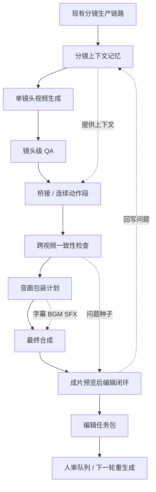
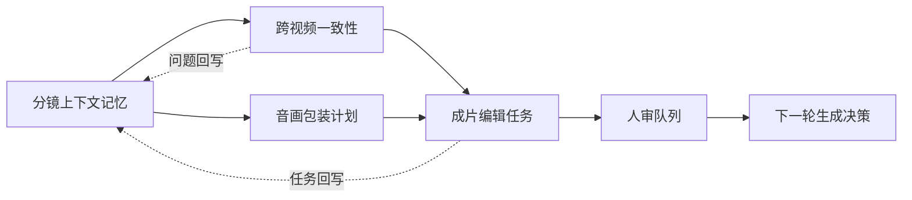

# 后处理闭环总览 Spec

## 1. 小白总结

这套后处理闭环是在现有 AI 视频工厂后面加四个岗位：

- 场记：分镜上下文记忆，记录角色、场景、动作、参考图和前后镜头关系。
- 质检员：跨视频一致性，检查视频之间有没有穿帮、断动作、漂角色。
- 后期包装师：音画包装层，规划字幕、BGM、音效和剪辑节奏。
- 审片导演：成片预览后编辑闭环，把问题整理成可执行的返工任务。

当前版先把“账本、报告、任务单”做稳，不自动修片，不引入向量库，不让 `cross-video` 或 `post-compose` 越权改写 canonical memory。后续版本再评估视觉算法、音频分析、任务队列和长流程编排。

## 2. 要解决的问题

当前项目已经能完成脚本解析、角色注册、图像生成、一致性检查、视频生成、桥接、连续动作段、TTS、口型和最终合成。但分镜视频生成后仍有四类缺口：

- 缺少可复用的分镜上下文记忆，模型容易只看当前镜头，忘记上一镜状态。
- 缺少跨视频层面的视觉一致性检查，图片一致不代表视频之间不穿帮。
- 缺少音画包装计划，合成只是把素材拼起来，不等于短剧成片包装。
- 缺少成片预览后的结构化编辑闭环，系统无法稳定告诉人“哪里该重做、怎么重做”。

## 3. 当前项目现状

现有主链路大致是：

- `director.js` 负责编排全流程和 state cache。
- `consistencyChecker.js` 负责图片阶段角色外观一致性。
- `continuityChecker.js` 负责镜头连贯性风险。
- `shotQaAgent.js`、`bridgeQaAgent.js`、`sequenceQaAgent.js` 负责不同视频片段 QA。
- `videoComposer.js` 负责 ASS 字幕、FFmpeg 合成和 compose artifact。
- `humanReviewQueue.js`、`costGovernance.js`、`characterAssetGovernance.js` 已有治理雏形。

新增能力应复用这些基础，不重写主流程，不把复杂判断继续塞进 `director.js`。

## 4. 技术架构图





## 5. 第一版方案

当前版目标是建立稳定闭环：

- 所有模块只新增 artifact、report、metrics、reviewItems，不自动重跑视频。
- 分镜上下文记忆用 JSON artifact 和 shot/transition 精确索引，并带 freshness / trust / promotion contract。
- 跨视频一致性先基于 metadata、QA report、context memory，只产出 project operational candidate patch。
- 音画包装先产出 packaging plan，支持本地 BGM/SFX 可选混入。
- 成片编辑闭环只产出 `edit-task-pack.json`，所有高风险任务进入 human review queue，不自动变成生成约束。

第一版新增建议：

```text
src/domain/storyboardContextMemory.js
src/agents/storyboardContextAgent.js
src/domain/crossVideoConsistency.js
src/agents/crossVideoConsistencyAgent.js
src/domain/avPackagingPlan.js
src/agents/avPackagingAgent.js
src/domain/postComposeReview.js
src/agents/postComposeReviewAgent.js
```

## 6. 边界与约束

- 业务记忆只覆盖项目内运行时裁决。
- `Codex` 全局记忆和 automation 记忆不进入 Director hard constraint 面。
- `crossVideoConsistency` 是业务记忆消费者/生产者，但不是 canonical memory owner。
- `postComposeReview` 是 review queue producer，不是 canonical memory owner。
- `cross-video-context-memory.json` 只允许写 project operational candidate。
- `edit-task-pack.json` 只允许进入 review queue；未人工批准前不得反向进入生成约束。

## 7. 后续演进方向

后续版本再评估提升智能化和自动化：

- 分镜上下文记忆接 Qdrant / Chroma / Milvus / FAISS / Mem0，支持跨集、跨项目检索。
- 跨视频一致性接 PySceneDetect 抽关键帧，CLIP/OpenCLIP 做视觉相似度，InsightFace/DeepFace 和 MediaPipe 做可选辅助。
- 音画包装接 Remotion 模板、librosa 节奏分析、Pedalboard 音频效果。
- 编辑闭环接 BullMQ 执行任务队列，复杂长流程再考虑 Temporal，复杂 agent 状态图再考虑 LangGraph。

这些演进不能跳过当前版，因为它们依赖稳定的 schema、artifact、reviewItems 和 clip index。

## 8. 当前版和后续版区别

| 模块 | 第一版 | 第二版 |
| --- | --- | --- |
| 分镜上下文记忆 | JSON artifact + freshness / trust / promotion contract | Qdrant / Chroma / Milvus / FAISS / Mem0 |
| 跨视频一致性 | metadata + QA report + candidate patch | PySceneDetect + CLIP/OpenCLIP |
| 角色脸部一致性 | 不做自动脸识别 | InsightFace / DeepFace |
| 动作/姿态一致性 | metadata 检查 | MediaPipe |
| 音画包装 | FFmpeg + packaging plan | Remotion + librosa + Pedalboard |
| 编辑任务执行 | 只生成 edit-task-pack | BullMQ |
| 长流程编排 | 继续 director/state | Temporal |
| Agent 状态图 | 不引入 | LangGraph 可选 |

当前版像建台账、定流程、设质检、出返工单。后续版才是引入自动检测仪、自动分拣机和高级后期工作站。

## 8. 成熟开源组件

| 能力 | 可选组件 | 建议 |
| --- | --- | --- |
| 记忆检索 | Qdrant、Chroma、Milvus、FAISS、Mem0 | 第一版不用，第二版优先 Qdrant 或 FAISS |
| 视频关键帧 | PySceneDetect、OpenCV | 第二版先接 PySceneDetect |
| 视觉相似度 | CLIP、OpenCLIP | 第二版用于角色/场景漂移辅助判断 |
| 脸部一致性 | InsightFace、DeepFace | 后置引入，需确认许可和误判成本 |
| 姿态动作 | MediaPipe | 第二版做姿态连续性辅助 |
| 视频包装 | FFmpeg、Remotion、MoviePy | 第一版继续 FFmpeg，第二版优先 Remotion |
| 音频分析 | librosa、Pedalboard、Pydub | 第二版按需求引入 |
| 任务队列 | BullMQ | 第二版自动执行 edit task 时引入 |
| 长流程 | Temporal | 只有跨天、可恢复、分布式执行时引入 |
| Agent 工作流 | LangGraph | 只有动态 agent 状态图复杂后再考虑 |

## 9. 数据结构 / Artifact Schema

统一 artifact 原则：

```text
1-outputs/*.json
1-outputs/*.md
2-metrics/*.json
manifest.json
qa-summary.json
```

统一 review item：

```js
{
  id,
  type,
  priority,
  targetType,
  targetIds,
  reason,
  suggestedAction,
  evidence,
  status: "open"
}
```

核心产物：

```text
storyboard-context-memory.json
shot-context-index.json
cross-video-consistency-report.json
av-packaging-plan.json
post-compose-review.json
edit-task-pack.json
```

关键 contract：

- `storyboard-context-memory.json` 是 canonical business memory owner。
- `cross-video-context-memory.json` 是 project operational candidate patch，不反写当前 shot fact。
- `post-compose-review.json` 是报告。
- `edit-task-pack.json` 是 review queue candidate，不自动执行，不自动写回 canonical fact。

## 10. Director 接入点

建议在 `director.js` 中新增四个非侵入式步骤：

1. `storyboard_context_memory`
   - 在 motion/performance/continuity/character asset 之后，视频生成前运行。
2. `cross_video_consistency`
   - 在 shot/bridge/sequence QA 后运行。
3. `av_packaging_plan`
   - 在 TTS QA 后、compose 前运行。
4. `post_compose_review`
   - 在 compose 成功后运行。

`director.js` 只负责编排和缓存，不包含复杂业务判断。

## 11. 测试与验收

文档和实现阶段的验收策略：

- 每个新增 domain 模块先写纯函数单测。
- 每个新增 agent 写 artifact 测试。
- Director 集成测试全部 mock，不调用真实 HappyHorse、TTS、lip-sync、FFmpeg。
- 验证新增模块不会改变 final video 输出路径。
- 验证高优先级 edit task 能进入 human review queue。

文档验收：

```powershell
rg -n "分镜上下文记忆|跨视频一致性|音画包装|成片预览后编辑闭环" docs/superpowers/specs
```

## 12. Tasks

- Task 1：写入四份专题 spec 和总览 spec。
- Task 2：实现 `storyboardContextMemory` domain/agent。
- Task 3：实现 `crossVideoConsistency` domain/agent。
- Task 4：实现 `avPackagingPlan` domain/agent。
- Task 5：实现 `postComposeReview` domain/agent。
- Task 6：扩展 `humanReviewQueue` 接收 post-compose review items。
- Task 7：在 `director.js` 接入四个步骤和 state cache。
- Task 8：补齐单测、artifact 测试、director 集成测试。
- Task 9：更新 README 或 docs/agents 索引。

当前状态：

- `storyboardContextMemory` 已落地 freshness 校验、失效重建、双评分、trust/stability 字段。
- `Director` 已在读取 context 前做 freshness 校验。
- `crossVideoConsistency` 已明确输出 `candidate_only` patch，禁止 canonical fact mutation。
- `postComposeReview` 已明确输出 `manual_only` task pack，禁止 final video / compose plan / canonical memory 自动变更。

## 13. 风险与边界

- 不要让 `director.js` 继续变胖。
- 不要第一版引入 Qdrant、Temporal、LangGraph 等复杂服务。
- 不要默认认为 HappyHorse 支持首尾帧强约束。
- 不要让音画包装阻断成片，除非配置明确要求。
- 不要让 post-compose review 自动重跑，第一版只生成任务。
- 所有人工任务统一进入 human review queue，避免各模块各写一套审核格式。
- 所有摘要必须保留 sourceArtifact，保证可追溯。

## 相关专题文档

- [分镜上下文记忆](./2026-06-10-分镜上下文记忆.md)
- [跨视频一致性](./2026-06-10-跨视频一致性.md)
- [音画包装层](./2026-06-10-音画包装层.md)
- [成片预览后编辑闭环](./2026-06-12-成片预览后编辑闭环交互方案.md)
