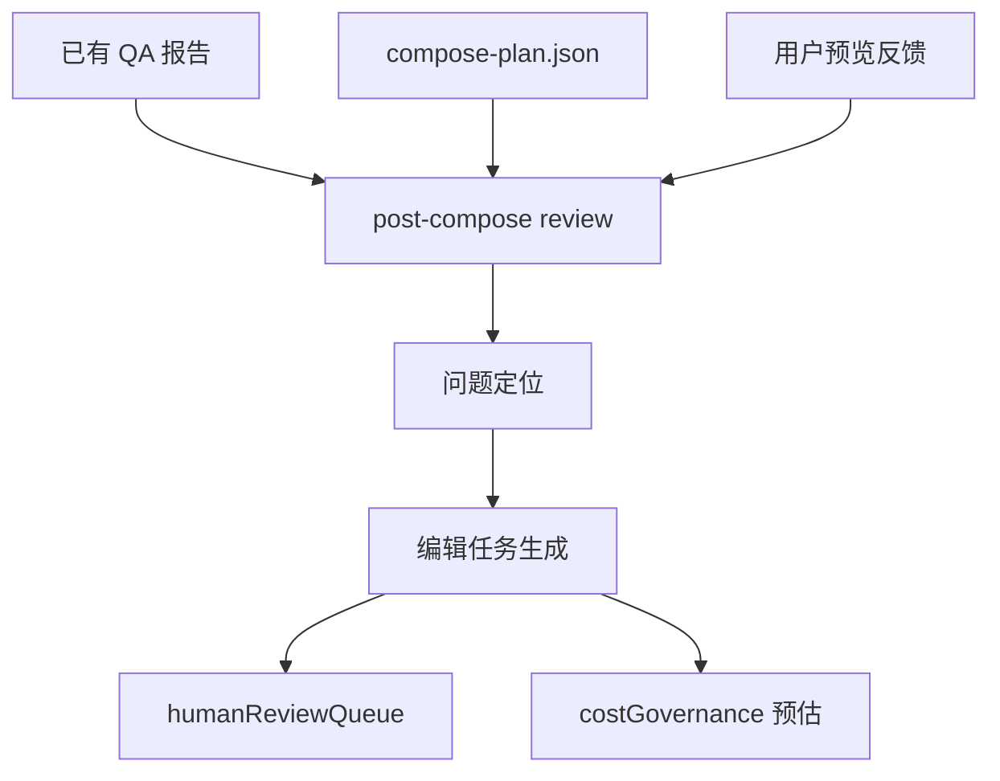
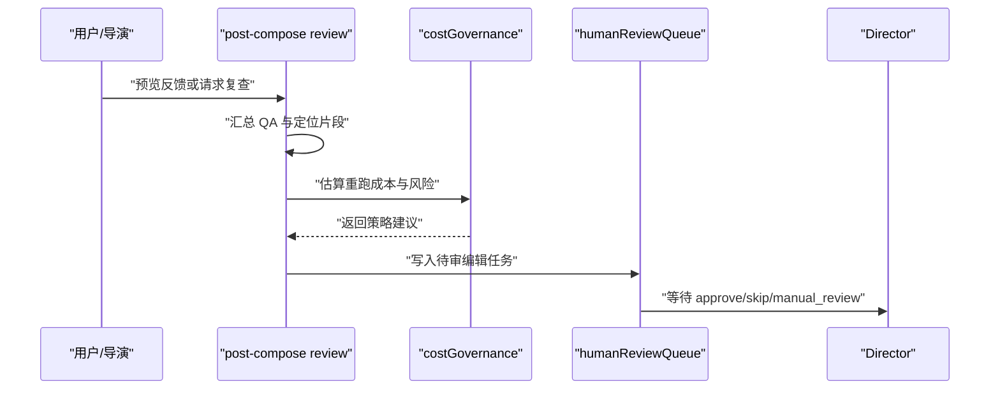
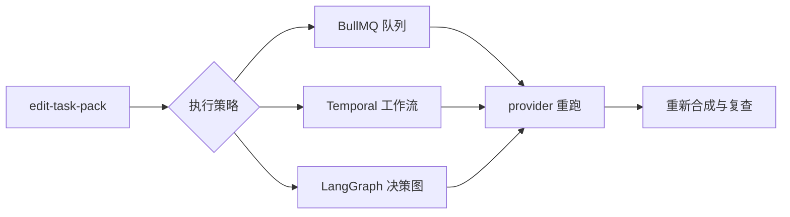

# 成片预览后编辑闭环 Spec

## 1. 小白总结

成片预览后编辑闭环要解决的是：视频已经合成出来以后，系统如何把“哪里不满意、该怎么改、谁来确认、下一步能不能重跑”整理成可执行的编辑任务，而不是只停留在一个最终 mp4 文件。

第一版不自动修片，只生成 `edit-task-pack`。原因是成片问题往往牵涉成本、素材版权、口型、桥接镜头、动作序列、配音包装和用户主观偏好。直接自动重跑容易把本来可接受的片段改坏，也会制造不可控成本。更稳妥的方式是先把问题结构化、定位到片段和来源 artifact，再进入人审队列，由 Director 或人工决定是否执行重生成。

第二版再接入 BullMQ、Temporal 或 LangGraph，把 `edit-task-pack` 中的任务变成可编排、可恢复、可追踪的自动修片工作流。

## 2. 问题背景

当前项目已经具备从分镜、生成、桥接、动作序列、口型到合成的多阶段产物，但“成片预览后”的闭环仍然薄弱。用户看完最终视频后，常见反馈包括：

- 某个片段画面质量差，需要重生成单镜头。
- 某段 action sequence 动作不连贯，需要整段重做。
- 桥接镜头接不上前后片段，需要重生成 bridge。
- 某个 clip 可以用备选素材替换，而不必重新生成。
- 音量、BGM、字幕、片尾、logo、水印等包装需要调整。
- QA 没有明确失败，但用户觉得不自然，需要人工复核。

这些反馈如果只写成自由文本，很难回到 pipeline。post-compose review 的价值是把预览反馈转成结构化任务，让项目可以在“看成片 -> 定位问题 -> 生成编辑任务 -> 人审确认 -> 后续执行”之间闭环。


## 3. 目标

本 spec 定义 `post-compose review` 的职责、输入输出、动作类型、Artifact Schema、Director 接入点和测试验收标准。

目标包括：

- 汇总已有 QA、合成计划和各类生成结果，形成成片级问题视图。
- 将问题定位到 shot、bridge、sequence、lipsync、audio packaging 或 final compose 区间。
- 生成可审计、可人工确认的 `edit-task-pack.json`。
- 将高风险、低置信度或高成本修改推入 `humanReviewQueue`。
- 保持第一版只产出编辑任务，不自动触发 provider 重跑或剪辑修改。
- 为第二版 BullMQ、Temporal、LangGraph 编排预留任务状态、依赖和幂等键。

## 4. 非目标

第一版不实现以下能力：

- 不自动重跑 `regenerate_shot`、`regenerate_sequence` 或 `regenerate_bridge`。
- 不直接改写最终视频文件、不覆盖合成产物、不删除素材。
- 不替代已有 shot QA、bridge QA、sequence QA、lipsync QA 或 continuity QA。
- 不训练自定义视觉质量模型。
- 不引入长期任务编排系统作为硬依赖。
- 不把用户主观反馈自动升级为硬失败，除非已有 QA 或规则证据支持。

第一版输出的是“编辑任务包”，不是“自动修片系统”。这是控制风险、成本和可解释性的边界。

## 5. 当前能力盘点

当前项目已有可复用的结构化产物：

| 产物或模块 | 当前职责 | post-compose review 复用方式 |
| --- | --- | --- |
| `compose-plan.json` | 描述最终合成使用的素材、时间线、字幕、音频和包装计划 | 作为最终时间轴和素材引用的主索引 |
| `videoResults` | 记录普通 shot 视频生成结果 | 定位单镜头质量、缺失、时长和 provider 输出问题 |
| `bridgeClipResults` | 记录 bridge clip 生成结果 | 判断转场片段是否需要重生成或替换 |
| `sequenceClipResults` | 记录 action sequence 生成结果 | 判断整段动作序列是否需要重做 |
| `lipsyncResults` | 记录口型同步结果 | 定位声画不同步、角色台词错配和口型失败 |
| `humanReviewQueue` | 管理人工复核项 | 接收需要人审确认的编辑任务 |
| `costGovernance` | 控制预算、重试、provider 成本和策略 | 评估编辑任务成本和是否允许进入自动执行 |

post-compose review 不重新发明这些能力，只把它们汇总到成片级闭环中。

## 6. Post-compose Review 职责边界

新增职责建议命名为 `postComposeReviewAgent` 或 `postComposeReviewer`。它的职责是：

- 汇总 QA：读取 shot、bridge、sequence、lipsync、continuity、compose 相关报告。
- 定位问题片段：把问题映射到 `compose-plan.json` 中的 timeline 区间和源 artifact。
- 生成编辑任务：把问题转成标准动作类型、优先级、证据、成本估算和依赖关系。
- 接入人审队列：把需要确认的任务写入 `humanReviewQueue`，等待 Director 或人工批准。

不属于它的职责：

- 不直接调用视频 provider。
- 不直接修改 `compose-plan.json`。
- 不自行决定高成本重跑。
- 不绕过 `costGovernance`。
- 不吞掉低置信度问题，应降级为 `manual_review`。



## 7. 动作类型

第一版支持以下动作类型，所有动作只进入 `edit-task-pack`，不自动执行：

| 动作类型 | 含义 | 典型来源 | 第一版处理 |
| --- | --- | --- | --- |
| `approve` | 当前成片或片段可接受 | QA 通过、人工确认 | 记录通过结论 |
| `regenerate_shot` | 重生成单个 shot | 单镜头质量失败、缺失、时长错误 | 生成待审批任务 |
| `regenerate_sequence` | 重生成整段 action sequence | sequence 连续性失败、入口出口不匹配 | 生成待审批任务 |
| `regenerate_bridge` | 重生成桥接片段 | bridge 未覆盖两端镜头、转场突兀 | 生成待审批任务 |
| `replace_clip` | 用备选 clip 替换当前片段 | 已有候选素材更优、当前 clip 轻微失败 | 生成替换建议 |
| `adjust_audio_packaging` | 调整音频包装 | 音量、BGM、字幕、片尾、logo、混音问题 | 生成包装修改任务 |
| `manual_review` | 需要人工判断 | 低置信度、主观质量、成本较高 | 写入人审队列 |
| `skip` | 明确跳过问题或暂不处理 | 低影响、预算不足、人工放弃 | 记录跳过原因 |

动作必须携带 `reason`、`evidenceRefs`、`targetRef`、`confidence` 和 `approvalRequired`，保证后续执行时可审计。

## 8. 第一版方案：只产出 Edit-task-pack

第一版流程：

1. 读取 `compose-plan.json`，建立最终成片 timeline index。
2. 读取 `videoResults`、`bridgeClipResults`、`sequenceClipResults`、`lipsyncResults` 和已有 QA 报告。
3. 将每个问题归一为 `reviewFinding`。
4. 根据规则把 `reviewFinding` 映射为动作类型。
5. 调用 `costGovernance` 做成本和风险预估，但不执行重跑。
6. 输出 `edit-task-pack.json` 和 Markdown 摘要。
7. 将 `approvalRequired=true` 或 `confidence < threshold` 的任务写入 `humanReviewQueue`。

第一版不自动修片的具体理由：

- 成片质量判断包含主观偏好，不能只靠规则自动覆盖。
- 重生成可能破坏已经通过 QA 的镜头连续性、角色一致性或口型同步。
- provider 成本不可忽略，自动重跑必须先经过预算策略。
- 同一个问题可能有多种修法，例如替换 clip、调音频包装或整段重做。
- 人审闭环先跑通后，才能积累任务类型、误判率和真实修片收益。



## 9. 第二版方案与成熟开源组件对比

第二版把 `edit-task-pack` 变成可执行工作流，但仍保留人工确认和成本治理。

候选编排方案：

| 方案 | 优点 | 缺点 | 适合阶段 |
| --- | --- | --- | --- |
| BullMQ | Node 生态友好、队列模型简单、适合重试和并发控制 | 复杂长事务、跨步骤补偿和可视化需要额外建设 | 第二版早期 |
| Temporal | 工作流状态持久、重试/补偿/定时器成熟、适合长任务 | 引入成本较高，需要独立服务和开发范式 | 自动修片规模化后 |
| LangGraph | 适合 agent 决策图、人工节点、条件分支和循环 | 工程队列、资源隔离和成本治理仍需外部系统配合 | agent-heavy 修片策略 |

成熟开源组件对比：

| 组件 | 可用于 | 第一版是否依赖 | 第二版价值 |
| --- | --- | --- | --- |
| FFmpeg / ffprobe | 时间轴、音轨、码率、时长、截图、静音检测 | 可选，只读检查 | 自动剪切、替换、音频重封装 |
| PySceneDetect | 场景切分、突变检测 | 不依赖 | 辅助定位异常转场 |
| OpenCV | 帧级检测、模糊、黑屏、相似度 | 不依赖 | 辅助质量评分和证据截图 |
| MediaPipe | 人体姿态、脸部、手部粗检 | 不依赖 | 辅助动作序列和口型问题定位 |
| Whisper / faster-whisper | 语音识别和字幕对齐 | 不依赖 | 辅助台词、字幕和音频包装复核 |
| librosa / pyloudnorm | 音量、响度、节奏分析 | 不依赖 | 自动判断混音和 BGM 问题 |

第一版可以只用已有 metadata 和 QA reports。开源组件作为第二版的证据增强层，不应阻塞第一版上线。



## 10. Artifact Schema

建议新增 artifact：`edit-task-pack.json`。

```json
{
  "schemaVersion": "1.0",
  "projectId": "happyhorse",
  "runId": "run_2026_06_10_001",
  "composePlanRef": "artifacts/compose-plan.json",
  "finalVideoRef": "outputs/final.mp4",
  "createdAt": "2026-06-10T00:00:00.000Z",
  "reviewSummary": {
    "status": "needs_review",
    "totalFindings": 3,
    "blockingFindings": 1,
    "estimatedRepairCost": {
      "currency": "USD",
      "min": 0.5,
      "max": 3.2
    }
  },
  "findings": [
    {
      "id": "finding_001",
      "severity": "blocker",
      "category": "bridge_continuity",
      "message": "桥接片段未自然覆盖前后镜头动作。",
      "targetRef": {
        "type": "bridge",
        "id": "bridge_003",
        "timelineStartMs": 42000,
        "timelineEndMs": 47000
      },
      "evidenceRefs": [
        "artifacts/bridge-qa-report.json#bridge_003",
        "artifacts/compose-plan.json#timeline.bridge_003"
      ],
      "confidence": 0.82
    }
  ],
  "tasks": [
    {
      "id": "edit_task_001",
      "action": "regenerate_bridge",
      "status": "pending_approval",
      "approvalRequired": true,
      "priority": "high",
      "targetRef": {
        "type": "bridge",
        "id": "bridge_003"
      },
      "reason": "bridge QA failed and final timeline uses this bridge clip.",
      "dependsOn": [],
      "idempotencyKey": "run_2026_06_10_001:regenerate_bridge:bridge_003",
      "costGovernanceRef": "artifacts/cost-governance-estimate.json#edit_task_001",
      "evidenceRefs": [
        "finding_001"
      ]
    }
  ],
  "humanReview": {
    "queueName": "post-compose-review",
    "items": [
      {
        "taskId": "edit_task_001",
        "reviewType": "approve_or_skip",
        "assignedRole": "director"
      }
    ]
  }
}
```

字段要求：

- `schemaVersion`：用于后续兼容 BullMQ、Temporal、LangGraph 执行状态。
- `composePlanRef`：必须指向本次成片使用的 `compose-plan.json`。
- `findings[].targetRef`：必须能映射回 shot、bridge、sequence、lipsync 或 packaging 区间。
- `tasks[].action`：必须是本 spec 第 7 节定义的动作类型。
- `tasks[].idempotencyKey`：第二版自动执行时用于避免重复重跑。
- `humanReview.items`：只记录需要人工处理的任务，不塞入无需确认的 `approve`。

## 11. Director 接入点

Director 应在成片合成完成后、交付最终结果前触发 post-compose review：

1. `composeVideo` 或等价合成步骤完成，写出 final video 和 `compose-plan.json`。
2. Director 收集 `videoResults`、`bridgeClipResults`、`sequenceClipResults`、`lipsyncResults` 和 QA reports。
3. Director 调用 `postComposeReviewAgent.run(input)`。
4. Agent 输出 `edit-task-pack.json`、Markdown 摘要和人审队列项。
5. Director 根据 `reviewSummary.status` 决定：
   - `approved`：允许交付。
   - `needs_review`：展示编辑任务并等待人审。
   - `blocked`：阻止交付，要求明确处理或跳过。

建议输入接口：

```ts
type PostComposeReviewInput = {
  projectId: string;
  runId: string;
  composePlanPath: string;
  finalVideoPath: string;
  videoResultsPath?: string;
  bridgeClipResultsPath?: string;
  sequenceClipResultsPath?: string;
  lipsyncResultsPath?: string;
  qaReportPaths: string[];
  userPreviewFeedback?: string;
};
```

建议输出接口：

```ts
type PostComposeReviewOutput = {
  editTaskPackPath: string;
  markdownSummaryPath: string;
  status: "approved" | "needs_review" | "blocked";
  humanReviewItemIds: string[];
};
```

## 12. 测试验收与 Tasks

测试验收：

- 给定全部 QA 通过的 `compose-plan.json` 和结果集，输出 `approve`，不写入人审队列。
- 给定 bridge QA 失败且成片 timeline 使用该 bridge，输出 `regenerate_bridge`，并写入 `humanReviewQueue`。
- 给定 sequence QA 失败，输出 `regenerate_sequence`，目标必须指向 sequence id 和 timeline 区间。
- 给定 lipsync 失败，输出 `manual_review` 或 `adjust_audio_packaging`，不能直接重跑视频。
- 给定已有备选 clip 且当前 clip 失败，输出 `replace_clip`，证据中包含当前 clip 和候选 clip。
- 给定预算不足或 `costGovernance` 返回禁止重跑，输出 `manual_review` 或 `skip`，不得生成自动执行状态。
- 所有任务必须包含 `idempotencyKey`、`evidenceRefs`、`targetRef`、`approvalRequired`。
- 第一版测试必须断言不会调用 provider、不会修改 final video、不会重写 `compose-plan.json`。

Tasks：

- [ ] 定义 `edit-task-pack.json` 的 TypeScript 类型和 JSON Schema。
- [ ] 实现 `compose-plan.json` timeline index 解析。
- [ ] 实现 `videoResults`、`bridgeClipResults`、`sequenceClipResults`、`lipsyncResults` 的只读归一化读取。
- [ ] 实现 QA finding 到动作类型的规则映射。
- [ ] 接入 `costGovernance` 成本预估，只读取建议不执行重跑。
- [ ] 接入 `humanReviewQueue`，写入需要人工确认的任务。
- [ ] 输出 Markdown review summary，供 Director UI 或日志展示。
- [ ] 增加单元测试覆盖 approve、regenerate、replace、manual_review、skip。
- [ ] 增加集成测试证明第一版只生成 `edit-task-pack`。
- [ ] 为第二版预留 BullMQ、Temporal、LangGraph 执行状态字段，但不启用执行器。

## 13. 风险与边界

主要风险：

- 误判风险：QA 报告可能不完整，用户主观反馈也可能模糊。低置信度必须进入 `manual_review`。
- 成本风险：重生成动作可能触发多 provider 成本。第一版只估算，不执行。
- 连续性风险：单独重跑一个 shot 可能破坏 sequence、bridge、lipsync 或角色一致性。
- 状态风险：如果 `compose-plan.json` 与结果集不一致，必须阻止自动建议，改为人工复核。
- 复杂度风险：过早引入 Temporal 或 LangGraph 会放大系统复杂度，应等任务包稳定后再接入。

边界原则：

- post-compose review 是成片级审查和任务生成层，不是 provider 执行层。
- `edit-task-pack` 是第一版唯一新增核心产物。
- 所有可能改变最终视频的动作都必须可审计、可撤销、可人工批准。
- `humanReviewQueue` 是低置信度、高成本和主观判断的默认出口。
- `costGovernance` 对自动执行拥有否决权，即使第二版启用编排也不能绕过。
