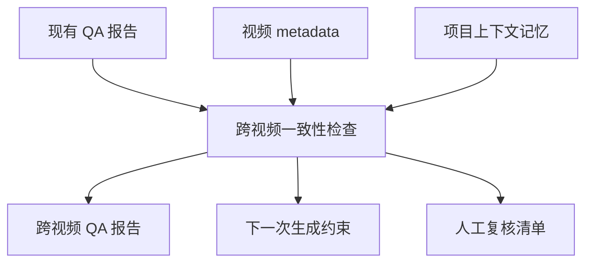
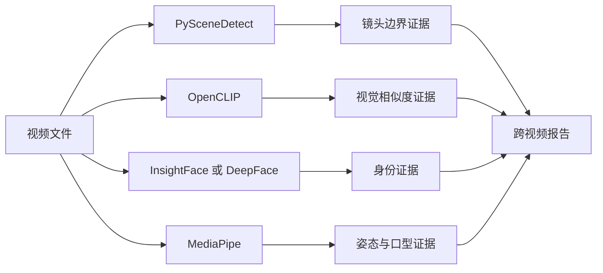
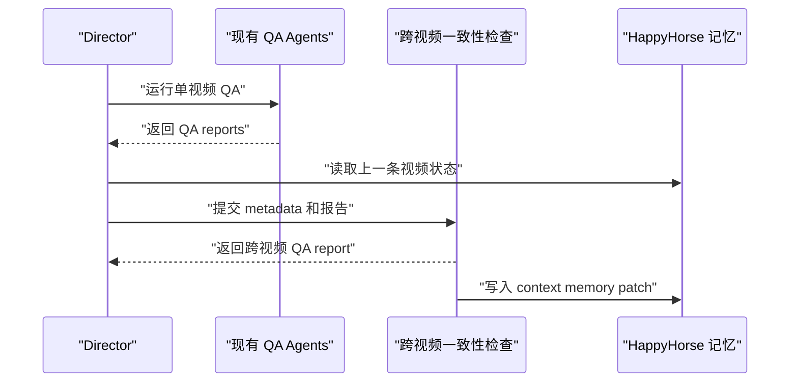

# 跨视频一致性 Spec

## 1. 小白总结

跨视频一致性要解决的不是“某一张图像像不像”，而是“同一项目里多条视频、多个片段、多个 sequence 之间，角色、场景、动作、参考资产、转场和口型是否持续像同一个世界”。

图片一致性主要看单帧：脸、服装、发型、场景元素是否符合设定。视频一致性还要看时间轴：角色从上一条视频到下一条视频是否保持身份，动作姿态是否自然承接，场景空间是否没有突然变形，reference 是否仍然匹配，sequence bridge 是否覆盖了两端镜头，lipsync 是否没有在桥接片段中断裂。

第一版不做重型视觉模型平台，先做可审计的 `metadata + QA report + context memory`。第二版再引入 PySceneDetect、CLIP/OpenCLIP、InsightFace/DeepFace、MediaPipe 等成熟开源组件，逐步把“人工描述检查”升级为“视觉证据检查”。

## 2. 问题背景

当前项目已有多层 QA：

- `consistencyChecker`：检查角色外观、身份和参考图约束。
- `continuityChecker`：检查同一视频内的镜头承接、道具、光照、动作和场景连续性。
- `shotQaAgent`：检查单镜头生成结果是否满足 shot 级要求。
- `bridgeQaAgent`：检查桥接镜头是否正确覆盖两端分镜。
- `sequenceQaAgent`：检查 action sequence 是否满足覆盖、时长、连续性、入口和出口约束。

这些能力主要围绕“单次 run 内的 shot / bridge / sequence”展开。跨视频一致性新增一层项目级横向检查：当 HappyHorse 项目持续生成多条视频时，需要判断这些视频是否仍然共用同一套角色、场景、动作语言、reference 资产和叙事状态。


## 3. 目标

本 spec 的目标是定义 `cross-video consistency` 的职责边界、输入输出、接入点和验收标准，让项目可以在不推翻现有 agent pipeline 的前提下，增加跨视频层面的质量闭环。

目标包括：

- 识别同一项目内多条视频之间的角色身份漂移。
- 识别场景、道具、光照语义、服装和关键 reference 的跨视频漂移。
- 检查动作姿态、entry/exit pose、sequence bridge 和 lipsync 的覆盖关系。
- 输出可审计的 `cross-video-consistency-report.json`、Markdown 摘要和 context memory。
- 保持 HappyHorse-only 约束，不扩展成通用多项目知识库。
- 第一版优先基于结构化 metadata 和已有 QA reports，第二版再引入视觉组件。

## 4. 非目标

本阶段不实现以下能力：

- 不训练自定义视频一致性模型。
- 不新增向量数据库、Milvus、长期全局人物库。
- 不替代 `consistencyChecker`、`continuityChecker`、`shotQaAgent`、`bridgeQaAgent`、`sequenceQaAgent`。
- 不做自动剪辑、重绘、调色、补帧或声画修复。
- 不把 HappyHorse 的记忆污染到其他项目。
- 不把低置信度视觉判断作为硬阻塞，第一版只允许输出 `warn`、`manual_review` 或 `block` 建议。

## 5. 当前能力盘点

当前能力可以按粒度分层：

| 层级 | 已有组件 | 主要职责 | 当前短板 |
| --- | --- | --- | --- |
| 角色外观 | `consistencyChecker` | 单 run 内角色外观、身份和 reference 检查 | 不负责多条视频之间的身份记忆 |
| 镜头连贯 | `continuityChecker` | 同一视频内相邻镜头承接 | 不负责跨视频 episode / clip 状态 |
| 单镜头结果 | `shotQaAgent` | 单 shot 输出有效性和 provider 输出质量 | 不知道前后视频的历史状态 |
| 桥接镜头 | `bridgeQaAgent` | bridge shot 对两端覆盖关系 | 覆盖范围通常局限在当前 bridge package |
| 动作序列 | `sequenceQaAgent` | sequence 覆盖、入口、出口、时长和连续性 | 不保存项目级动作姿态记忆 |

`cross-video consistency` 应复用这些报告，而不是重复做同样的检查。它的价值在于把多次 run 的证据汇总成项目级判断。

## 6. 职责边界

新增 `crossVideoConsistencyChecker` 的建议职责：

- 读取同一 HappyHorse 项目的多条视频 metadata、artifact index、QA reports 和 context memory。
- 将每条视频的角色、场景、动作姿态、reference、sequence bridge、lipsync 结果归一成可比较摘要。
- 生成跨视频一致性评分、风险列表、人工复核项和下一次生成的上下文提示。
- 只判断跨视频关系，不直接改写单条视频的生成结果。

不属于它的职责：

- 不重新执行 provider 生成。
- 不重新判定单镜头内部质量，除非已有 QA report 缺失。
- 不维护跨项目人物资产。
- 不替代 Director 的编排决策，只向 Director 提供 gate 和 memory。



## 7. 检查维度

跨视频一致性第一版必须覆盖以下维度：

| 维度 | 检查内容 | 数据来源 | 结果 |
| --- | --- | --- | --- |
| 角色 | 角色 ID、姓名、外观摘要、服装、发型、面部锚点 | character registry、consistency report、metadata | `character_drift` |
| 场景 | 场景 ID、地点、布景元素、光照语义、关键道具 | continuity report、shot metadata | `scene_drift` |
| 动作姿态 | entry pose、exit pose、动作目标、手部和身体方向 | sequence report、bridge report、metadata | `pose_mismatch` |
| reference | reference image / video id、版本、用途、覆盖镜头 | prompt package、generation metadata | `reference_gap` |
| sequence bridge | bridge 是否覆盖前后视频边界、entry/exit 是否对齐 | bridge QA、sequence QA | `bridge_coverage_gap` |
| lipsync | 台词片段、音频时间段、口型覆盖状态 | TTS metadata、video QA metadata | `lipsync_risk` |

覆盖关系要求：

- 角色检查必须能回答“这条视频里的 HappyHorse 是否还是上一条里的 HappyHorse”。
- 场景检查必须能回答“同一个马厩、赛道、房间或街景是否突然变成了另一个地点”。
- 动作姿态检查必须能回答“上一条视频的结束姿态是否被下一条视频的开始姿态继承或合理解释”。
- reference 检查必须能回答“关键 reference 是否被使用、是否过期、是否被错误角色复用”。
- sequence bridge 检查必须能回答“跨视频边界是否有 bridge 或 sequence 覆盖，覆盖是否连续”。
- lipsync 检查必须能回答“桥接或 sequence 片段中的台词是否有口型证据或降级说明”。

## 8. 第一版方案

第一版采用轻量、可审计、低侵入方案：`metadata + QA report + context memory`。

输入：

- 每条视频的 run artifact overview。
- `consistency-report.json`、`continuity-report.json`、`shot-qa-report.json`、`bridge-qa-report.json`、`sequence-qa-report.json`。
- Director 生成的 project / episode / clip metadata。
- HappyHorse 项目级 context memory。

输出：

- `cross-video-consistency-report.json`：机器可读报告。
- `cross-video-consistency-report.md`：人工审阅摘要。
- `cross-video-context-memory.json`：下一次生成要继承的项目级状态。
- `flagged-cross-video-links.json`：需要人工复核或阻塞的跨视频关系。

第一版判定方式：

- 用确定性字段比对处理角色 ID、场景 ID、reference ID、sequence coverage。
- 用已有 QA report 的 status、score、failureReason 做风险继承。
- 用人工可读摘要描述低置信度问题，不让 LLM 幻觉成为硬证据。
- 对缺失字段给出 `insufficient_evidence`，不默认通过。

## 9. 第二版方案

第二版在第一版稳定后加入成熟视觉组件，仍然保持可替换、可降级：

| 组件 | 用途 | 适合检查 | 注意事项 |
| --- | --- | --- | --- |
| PySceneDetect | 视频切分和场景边界检测 | 跨视频边界、镜头切换、片段覆盖 | 只做边界证据，不判断语义 |
| CLIP / OpenCLIP | 图文和图像相似度 | 场景、reference、服装、道具相似 | 需要阈值校准，不能单独判死 |
| InsightFace / DeepFace | 人脸 embedding | 角色脸部一致性 | HappyHorse 如果是非真人或动物角色，需要降级到 reference 相似度 |
| MediaPipe | 姿态、手势、面部关键点 | 动作姿态、entry/exit pose、lipsync 辅助 | 卡通、低清、遮挡时置信度会下降 |

成熟开源组件对比结论：

- PySceneDetect 成熟、轻量、适合先接入，用于建立视频边界和镜头证据。
- OpenCLIP 比纯文本规则更适合做跨视频 reference 和场景相似度，但需要项目内样本标定。
- InsightFace / DeepFace 对真人脸更强，对 HappyHorse-only 场景可能不是主路径。
- MediaPipe 对人体姿态和口型辅助有价值，但对拟人马、卡通风格、侧脸和遮挡要保守。



## 10. Artifact Schema

建议新增 artifact layout key：

- `crossVideoConsistencyChecker`: `10-cross-video-consistency`

建议报告结构：

```json
{
  "schemaVersion": 1,
  "projectKey": "HappyHorse",
  "scope": {
    "projectOnly": true,
    "videoIds": ["video-001", "video-002"]
  },
  "status": "pass | warn | manual_review | block",
  "score": 0.86,
  "checks": {
    "characters": [],
    "scenes": [],
    "poses": [],
    "references": [],
    "sequenceBridges": [],
    "lipsync": []
  },
  "flaggedLinks": [],
  "contextMemoryPatch": {},
  "evidence": {
    "sourceReports": [],
    "sourceArtifacts": []
  }
}
```

`contextMemoryPatch` 只允许写 HappyHorse 项目级状态，例如：

- 最新角色外观摘要。
- 最新场景状态。
- 上一条视频的 exit pose。
- 下一条视频必须继承的 reference。
- 已确认失败或需要人工复核的边界。

## 11. Director 接入点

Director 接入建议放在每条视频完成现有 QA 和 composition 之后、下一条视频开始规划之前。

流程：

1. Director 完成当前 run 的 `consistencyChecker`、`continuityChecker`、`shotQaAgent`、`bridgeQaAgent`、`sequenceQaAgent`。
2. Director 收集当前视频 artifact overview 和上一条 HappyHorse 视频的 context memory。
3. Director 调用 `crossVideoConsistencyChecker`。
4. 如果结果是 `pass`，写入新的 context memory。
5. 如果结果是 `warn`，继续主链路，但把约束注入下一次 prompt planning。
6. 如果结果是 `manual_review`，保留产物并提示人工复核。
7. 如果结果是 `block`，不删除已有产物，只阻止自动发布或自动进入下一集。



## 12. 测试验收与 Tasks

测试验收：

- 新增单元测试覆盖 report schema、status 聚合、缺失字段降级和 HappyHorse-only 拦截。
- 新增 fixture：两条 HappyHorse 视频 metadata，其中一条角色 reference 漂移，应输出 `warn` 或 `manual_review`。
- 新增 fixture：跨视频 sequence bridge 未覆盖边界，应输出 `bridge_coverage_gap`。
- 新增 fixture：非 HappyHorse projectKey，应拒绝写入 context memory。
- Director 集成测试确认现有 QA reports 可以被收集并传入 cross-video checker。
- artifact 测试确认 JSON、Markdown、flagged links、context memory patch 均落盘。

Tasks：

- [ ] 定义 `crossVideoConsistencyChecker` 输入输出 TypeScript / JSDoc contract。
- [ ] 在 `runArtifacts` 中预留 `10-cross-video-consistency` 布局。
- [ ] 实现第一版 metadata normalizer。
- [ ] 实现 QA report aggregator。
- [ ] 实现 HappyHorse-only guard。
- [ ] 实现 `cross-video-consistency-report.json` 和 Markdown 输出。
- [ ] 实现 `cross-video-context-memory.json` patch 生成。
- [ ] 在 Director 完成单视频 QA 后接入跨视频检查。
- [ ] 补充单元测试、artifact 测试和 Director 集成测试。
- [ ] 第二版评估 PySceneDetect、OpenCLIP、InsightFace/DeepFace、MediaPipe 的可选 adapter。

建议命令：

```bash
node --test tests/crossVideoConsistencyChecker.test.js tests/crossVideoConsistencyChecker.artifacts.test.js tests/director.crossVideoConsistency.test.js
```

## 13. 风险与边界

主要风险：

- metadata 不完整会导致误判，因此第一版必须把缺失证据标成 `insufficient_evidence`。
- 视觉相似度阈值很容易误伤卡通、动物、低清、遮挡和风格化画面。
- lipsync 在没有明确口型检测或音视频对齐证据时，只能作为风险提示，不能直接硬阻塞。
- 跨视频记忆如果没有 HappyHorse-only guard，会污染其他项目。
- 过强的 block 策略会让生成链路变脆，第一版默认以 `warn` 和 `manual_review` 为主。

边界原则：

- 第一版只相信结构化 metadata 和已有 QA reports。
- 第二版视觉组件只提供证据，不单独拥有最终裁决权。
- `cross-video consistency` 只检查项目级连续关系，不负责修片。
- 所有新增产物必须可审计、可复现、可降级。
- HappyHorse 是唯一允许写入 context memory 的项目范围。
