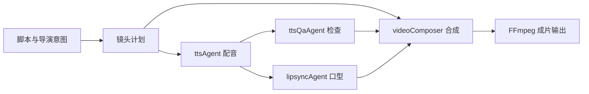
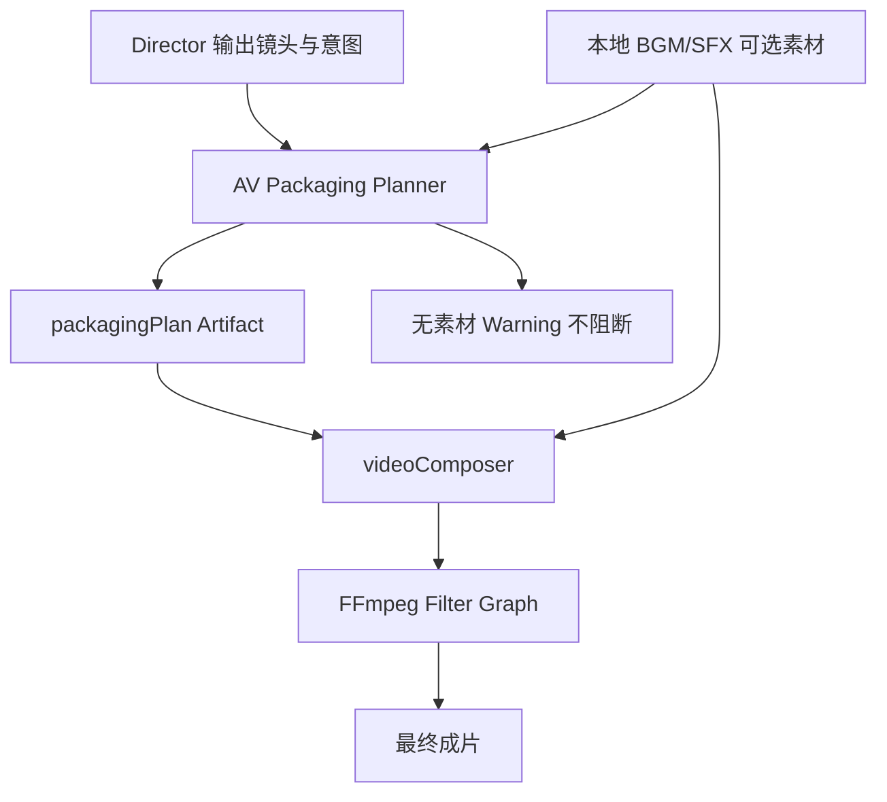
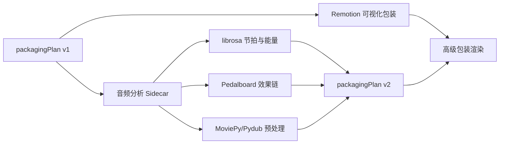
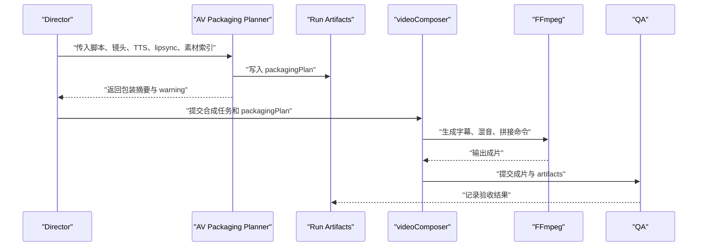

# 音画包装层 Spec

## 1. 小白总结

当前系统已经能把脚本、配音、口型、字幕和视频片段合成到一起，但“合成”不等于“成片包装”。合成解决的是素材能否拼起来，成片包装解决的是观众是否觉得它像一个完整短片：哪里进 BGM、哪里加转场音效、字幕是否统一、剪辑节奏是否跟剧情情绪对齐、sequence/bridge/lipsync 三类镜头在最终时间线上谁优先。

音画包装层 AV Packaging Layer 的目标，是在现有 `videoComposer` 和 FFmpeg 合成能力之上，增加一个可审计的 packaging plan。第一版不追求复杂音频工程，只输出明确的音乐、音效、字幕、节奏和优先级提示，并允许本地 BGM/SFX 文件可选混入。没有音频素材时只给 warning，不阻断主流程。

## 2. 背景与问题

现有项目已经具备多段视频生产和基础后期能力：

- `ttsAgent` 负责文本转语音，生成对白音频。
- `ttsQaAgent` 负责 TTS 质量检查，避免音频缺失、时长异常或文本不匹配。
- `lipsyncAgent` 负责口型同步，生成或修正对白镜头。
- `videoComposer` 负责把镜头、音频、字幕等产物组合成最终视频。
- ASS 字幕生成已经提供了比纯 SRT 更强的样式表达空间。
- FFmpeg 合成已经可以完成拼接、叠字幕、混音、转码等底层操作。

缺口在于这些能力目前偏“执行器”，缺少一个面向导演意图的包装计划层。结果是即使素材都在，最终视频也容易出现 BGM 进入突兀、音效缺位、字幕样式不统一、转场节奏平、对白口型镜头被桥接镜头挤掉等问题。

## 3. 目标与非目标

目标：

- 定义 AV packaging 的职责边界和 Artifact Schema。
- 在 Director 到 `videoComposer` 之间增加包装计划输入，让后期动作可解释、可测试、可回放。
- 第一版基于 FFmpeg 落地，兼容当前 ASS 字幕和视频合成管线。
- 支持本地 BGM/SFX 文件可选混入，无素材时 warning 不阻断。
- 为第二版 Remotion、librosa、Pedalboard、MoviePy/Pydub sidecar 留出接口。

非目标：

- 第一版不做自动作曲、自动拟音生成或商业级母带处理。
- 第一版不强依赖外部素材库、付费音乐服务或云端音频分析 API。
- 第一版不替换 `ttsAgent`、`ttsQaAgent`、`lipsyncAgent`、`videoComposer` 的核心职责。
- 第一版不要求所有视频都必须有 BGM 或 SFX。

## 4. 现有能力盘点

当前能力可以分为三层：

1. 生成层：脚本分析、镜头规划、视频生成、TTS、口型同步。
2. 合成层：`videoComposer`、ASS 字幕生成、FFmpeg 拼接与混音。
3. QA 层：TTS QA、连续性检查、镜头一致性检查、运行 artifacts。

音画包装层应该复用现有产物，而不是重新生成它们。它读取脚本结构、镜头列表、音频清单、字幕文本、lipsync 结果和 QA 输出，生成一个包装计划，再交给合成层执行。



## 5. 为什么合成不等于成片包装

合成关注“技术上能否输出一个文件”，典型问题是编码格式、时长对齐、轨道混合、字幕烧录、片段拼接。成片包装关注“观看体验是否成立”，典型问题是情绪曲线、声音层次、节奏落点、字幕可读性、转场连贯性、对白优先级。

两者的区别：

| 维度 | 合成 | 成片包装 |
| --- | --- | --- |
| 输入 | 视频、音频、字幕文件 | 导演意图、剧情节奏、镜头语义、素材清单 |
| 输出 | 可播放视频文件 | 可执行包装计划与最终成片 |
| 关注点 | 拼接、转码、混音、烧字幕 | BGM cue、SFX cue、字幕样式、节奏点、镜头优先级 |
| 失败处理 | 文件缺失通常失败 | 非关键素材缺失 warning，主流程可继续 |
| 可审计性 | FFmpeg 命令和日志 | packaging artifact、决策依据、降级原因 |

因此 AV packaging 不是替换合成，而是在合成前定义“怎么包装才像成片”。

## 6. AV Packaging 职责

新增 AV packaging layer 负责生成 `packagingPlan`，至少覆盖以下职责：

- BGM cue：为开场、情绪推进、高潮、收束设置音乐进入、淡入淡出、音量、循环或截断策略。
- SFX cue：为转场、动作、提示、冲击点、环境变化设置音效提示。
- 字幕样式：选择 ASS 样式模板，包括字体、字号、描边、阴影、位置、安全边距、说话人区分。
- 节奏点：标记 cut point、beat、pause、reveal、impact、transition，用于合成层调整剪辑和声音落点。
- sequence/bridge/lipsync 优先级提示：在时间线冲突时，明确动作连续镜头、桥接镜头、口型对白镜头的保留优先级。
- 降级策略：当 BGM/SFX 文件不存在、时长不足或格式不支持时，输出 warning 并继续无素材或部分素材包装。

优先级建议：

1. `lipsync`：对白口型镜头优先，不能被 BGM、SFX 或 bridge 破坏对白可懂度。
2. `sequence`：动作连续性优先，保证关键动作和剧情推进完整。
3. `bridge`：桥接镜头用于连贯和补洞，可在时长冲突时压缩、静音或替换。

## 7. 第一版方案：FFmpeg + Packaging Plan

第一版实现路线是增加计划，不大改执行器：

1. Director 或其后置步骤生成 `packagingPlan` artifact。
2. `videoComposer` 读取 plan，将 BGM、SFX、ASS 样式、节奏点转成 FFmpeg filter graph 或参数。
3. 本地 BGM/SFX 文件通过配置或项目素材目录传入，文件不存在时记录 warning。
4. 没有任何 BGM/SFX 时仍输出成片，只在 artifact 和日志中标记 `audio_assets_missing`。
5. FFmpeg 只执行确定性操作：音量、淡入淡出、延迟、裁剪、循环、混音、字幕烧录。

推荐第一版目录约定：

```text
assets/audio/bgm/
assets/audio/sfx/
outputs/<runId>/artifacts/packaging-plan.json
outputs/<runId>/artifacts/packaging-warnings.json
```

第一版音频混入规则：

- BGM 默认低于对白，建议 `-18dB` 到 `-24dB` 感知区间，具体由 `duckingHint` 表达。
- SFX 默认短促，不覆盖对白；与对白冲突时降低音量或跳过。
- BGM 可循环或裁剪到目标段落，必须淡入淡出，避免硬切。
- 所有素材混入都必须可追踪到 cue id。



## 8. 第二版演进

第二版把 AV packaging 从规则计划升级为半自动后期分析与渲染 sidecar：

- Remotion：用于更复杂的字幕动画、图文包装、片头片尾、动态 lower-third 和可预览时间线。
- librosa：用于 BGM 节拍检测、能量曲线分析、静音段识别、节奏点自动对齐。
- Pedalboard：用于音频效果链，例如压缩、EQ、响度归一、限制器、混响等。
- MoviePy/Pydub sidecar：用于 Python 侧轻量音频裁剪、拼接、响度预处理和素材探测，作为 FFmpeg 前处理或分析辅助。

第二版不要求替换 FFmpeg。更合理的形态是 sidecar 负责分析和生成更丰富的 plan，FFmpeg 或 Remotion 负责最终渲染。



## 9. 成熟开源组件对比

| 组件 | 主要用途 | 优点 | 风险/边界 | 建议阶段 |
| --- | --- | --- | --- | --- |
| FFmpeg | 拼接、混音、滤镜、字幕烧录、转码 | 稳定、成熟、部署广、当前项目已使用 | filter graph 复杂，调试体验一般 | 第一版核心 |
| ASS/libass | 高级字幕样式 | 样式强、兼容 FFmpeg | 动画能力有限，字体环境需管理 | 第一版核心 |
| Remotion | React 时间线渲染视频 | 可预览、组件化、适合包装动画 | 引入 Node 渲染链和性能成本 | 第二版 |
| librosa | 音频分析 | 节拍、频谱、能量分析成熟 | Python 依赖较重，不适合实时渲染 | 第二版 sidecar |
| Pedalboard | 音频效果处理 | Spotify 开源，效果链专业 | 需要音频工程参数约束 | 第二版 sidecar |
| MoviePy | 视频/音频剪辑脚本 | API 直观，适合快速 sidecar | 性能和复杂渲染不如 FFmpeg | 第二版辅助 |
| Pydub | 音频切分与格式处理 | 简单、适合素材探测和预处理 | 底层仍依赖 FFmpeg，精细控制有限 | 第二版辅助 |

## 10. Artifact Schema

`packagingPlan` 应作为 run artifact 保存，建议 schema：

```json
{
  "schemaVersion": "av-packaging-plan.v1",
  "runId": "string",
  "timeline": {
    "durationSec": 60.0,
    "fps": 24,
    "resolution": "1080x1920"
  },
  "subtitleStyle": {
    "format": "ass",
    "stylePreset": "short_drama_default",
    "fontFamily": "string",
    "fontSize": 52,
    "primaryColor": "&H00FFFFFF",
    "outlineColor": "&H00000000",
    "marginV": 96,
    "speakerMode": "single|multi"
  },
  "bgmCues": [
    {
      "id": "bgm_opening_001",
      "assetId": "local_bgm_001",
      "path": "assets/audio/bgm/opening.mp3",
      "startSec": 0,
      "endSec": 12,
      "fadeInSec": 1.2,
      "fadeOutSec": 1.5,
      "gainDb": -20,
      "duckingHint": "dialogue_priority"
    }
  ],
  "sfxCues": [
    {
      "id": "sfx_hit_001",
      "assetId": "impact_soft",
      "path": "assets/audio/sfx/impact.wav",
      "atSec": 8.4,
      "gainDb": -12,
      "priority": "skip_if_dialogue_conflict"
    }
  ],
  "rhythmPoints": [
    {
      "id": "beat_001",
      "timeSec": 8.4,
      "type": "cut|pause|reveal|impact|transition",
      "strength": 0.8,
      "source": "director|script|analysis"
    }
  ],
  "shotPriorityHints": [
    {
      "shotId": "shot_012",
      "kind": "lipsync|sequence|bridge",
      "priority": 100,
      "rule": "preserve_dialogue_mouth_sync"
    }
  ],
  "warnings": [
    {
      "code": "audio_assets_missing",
      "message": "No local BGM/SFX assets were available; continuing without optional audio packaging.",
      "blocking": false
    }
  ]
}
```

Schema 约束：

- `warnings[].blocking` 对 BGM/SFX 缺失必须为 `false`。
- cue 的 `path` 允许为空或缺失，但必须产生 warning。
- 所有时间字段以秒为单位。
- `shotPriorityHints.kind` 只能表达 `lipsync`、`sequence`、`bridge` 三类或后续兼容扩展。
- `schemaVersion` 必须写入 artifact，便于第二版迁移。

## 11. Director 接入点

建议接入位置：

1. Director 完成脚本分析、镜头规划、sequence/bridge/lipsync 意图后，调用 `avPackagingPlanner`。
2. `avPackagingPlanner` 汇总导演意图、镜头列表、字幕段落、TTS 时长、lipsync 结果和本地音频素材索引。
3. 输出 `packagingPlan` 到 run artifacts。
4. `videoComposer` 接收 `packagingPlan`，将其转译为 ASS 样式和 FFmpeg 命令。
5. QA 阶段检查 artifact 是否存在、warning 是否非阻断、最终输出是否可播放。



Director 提示词或结构化输出应新增字段：

- `audioMood`：音乐情绪，例如 suspense、warm、urgent、comic。
- `soundDesignNotes`：关键音效需求。
- `subtitleTone`：字幕风格，例如 clean、dramatic、social_short。
- `rhythmBeats`：希望强调的剧情节奏点。
- `shotPriorityPolicy`：对 sequence/bridge/lipsync 的保留策略。

## 12. 测试验收与 Tasks

测试验收：

- 当本地 BGM/SFX 都不存在时，流程继续完成，artifact 中包含非阻断 warning。
- 当提供本地 BGM 时，FFmpeg 命令包含淡入、淡出、音量控制和混音逻辑。
- 当提供本地 SFX 时，SFX cue 按 `atSec` 延迟进入，且 cue id 可在日志或 artifact 中追踪。
- ASS 字幕样式来自 `subtitleStyle`，不是硬编码散落在合成逻辑里。
- `lipsync` 镜头与对白音频冲突时优先保留口型同步。
- `sequence` 关键动作镜头不得被 bridge 镜头覆盖。
- bridge 镜头可在时长冲突时压缩或降级。
- `packagingPlan.schemaVersion` 存在，且 JSON 可被 schema 校验。
- 生成视频可播放，音频轨存在或明确记录无可选音频素材。

Tasks：

- 设计 `avPackagingPlanner` 输入输出类型。
- 新增 `packagingPlan` artifact 写入与读取工具。
- 增加本地 BGM/SFX 素材索引器，支持空目录和缺失目录 warning。
- 将 `subtitleStyle` 接入现有 ASS 字幕生成。
- 将 `bgmCues`、`sfxCues` 转译为 FFmpeg filter graph。
- 将 `rhythmPoints` 和 `shotPriorityHints` 接入 `videoComposer` 决策日志。
- 增加无音频素材、仅 BGM、仅 SFX、BGM+SFX 四类单元测试。
- 增加 Director 输出字段到 packaging plan 的集成测试。
- 补充文档示例和最小可运行 fixture。

## 13. 风险与边界

主要风险：

- 音频版权风险：本地素材目录只能引用用户明确提供或项目允许使用的文件，不能默认拉取未知版权素材。
- FFmpeg filter graph 复杂度上升：需要把包装计划转译代码保持小步、可测试、可日志化。
- 音量体验不稳定：第一版只能提供规则化 gain/ducking，不能保证专业响度一致。
- 字体和字幕渲染环境差异：ASS 字体需要有 fallback 和缺失 warning。
- 过度自动化风险：包装层只能给提示和计划，不能在没有导演意图时强行改写剧情节奏。
- 多 worker 并行风险：本 spec 只定义文档，不应在本任务中修改代码、配置或其他 worker 的文件。

边界原则：

- AV packaging 是“计划层 + 可选执行提示”，不是新的素材生成系统。
- BGM/SFX 缺失不阻断，TTS 主对白和 lipsync 失败仍应按现有关键路径处理。
- 第一版以 FFmpeg 和现有 ASS 能力为准，第二版组件必须通过 sidecar 或清晰接口渐进接入。
- 所有自动包装决策必须写入 artifact，便于回放、调试和人工复核。
