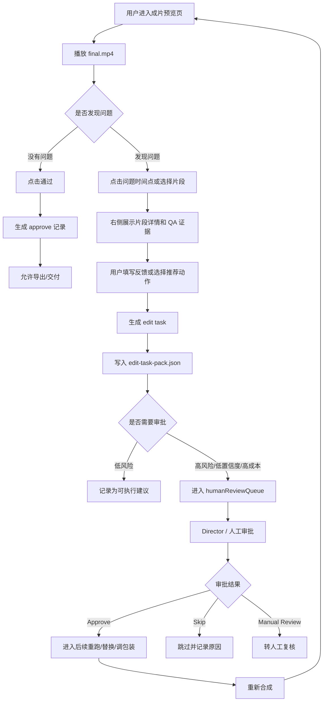
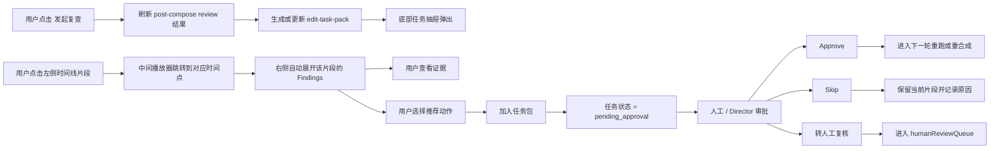
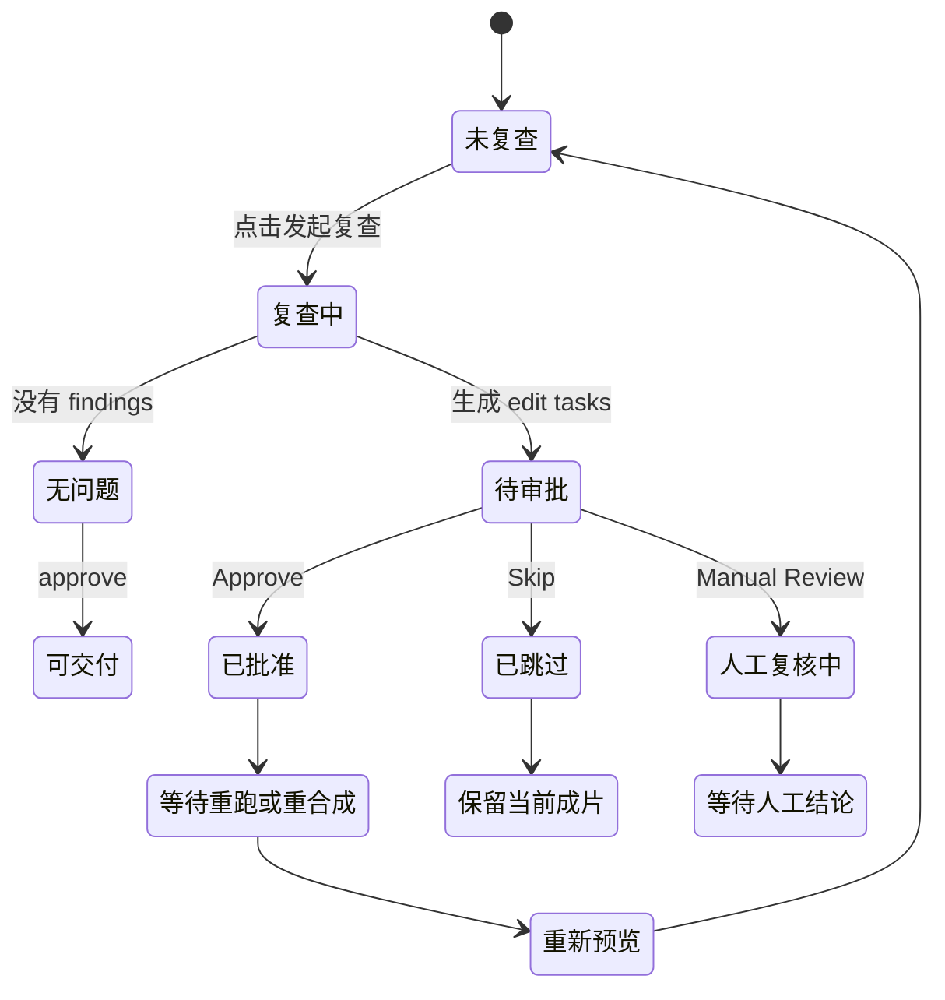

# 成片预览后编辑闭环交互方案

## 1. 方案目标

成片生成后，用户不只是拿到一个 `final.mp4`，而是进入一个“审片工作台”。

这个工作台要解决的问题是：把用户在成片预览中发现的“哪里不满意、为什么不满意、该怎么改、谁来确认、后续是否重跑”转成结构化、可追踪、可审批的编辑任务。

第一版的边界非常明确：

- 只生成编辑任务，不自动修片。
- 不自动调用视频 provider。
- 不自动修改 `compose-plan.json`。
- 不覆盖最终视频文件。
- 高风险、低置信度、高成本任务统一进入 `humanReviewQueue`。
- 所有编辑建议都落到 `edit-task-pack.json`，方便 Director、前端页面和人工审核继续处理。

## 2. 页面信息架构

页面建议采用“四块式工作台布局”：

```text
┌──────────────────────────────────────────────────────────────┐
│ 顶部工具栏：项目名 / Run 状态 / 发起复查 / 导出成片 / 查看 QA │
├───────────────┬──────────────────────────────┬───────────────┤
│ 左侧时间线     │ 中间成片播放器                 │ 右侧问题面板   │
│ Shot 列表      │ 播放 / 暂停 / 跳转 / 风险标记   │ Findings       │
│ Sequence 列表  │ 当前片段信息                   │ 推荐动作       │
│ Bridge 列表    │ 对比前后帧                     │ 证据 / 成本    │
│ 音画包装标记   │                                │ 审批提示       │
├───────────────┴──────────────────────────────┴───────────────┤
│ 底部任务抽屉：edit-task-pack 任务列表 / 状态 / 审批按钮       │
└──────────────────────────────────────────────────────────────┘
```

核心交互逻辑是：

- 左侧负责“定位片段”。
- 中间负责“看视频和判断问题”。
- 右侧负责“解释问题和推荐动作”。
- 底部负责“统一管理编辑任务”。

## 3. 用户主流程



## 4. 高保真 UI 结构图

```mermaid
flowchart TB
  subgraph Page["成片预览后编辑闭环 · 高保真预览页"]
    direction TB

    subgraph Topbar["顶部工具栏"]
      direction LR
      T1["返回项目"]
      T2["项目名 / 分集名 / Run ID"]
      T3["状态徽标<br/>已通过 / 待复核 / 已阻断"]
      T4["成本提示<br/>预计返工成本 / 已用预算"]
      T5["次要按钮<br/>查看 Artifact / QA 摘要"]
      T6["主要按钮<br/>发起复查"]
      T7["主要按钮<br/>导出成片"]
    end

    subgraph Body["主体三区布局"]
      direction LR

      subgraph Left["左侧：时间线与素材树"]
        direction TB
        L1["筛选条<br/>全部 / Shot / Sequence / Bridge / Lipsync / 音画包装"]
        L2["搜索框<br/>按 shotId / sequenceId / 问题词搜索"]
        L3["时间线总览条<br/>按风险颜色标出问题区间"]
        L4["片段列表"]
        L41["Shot 卡片<br/>缩略图 / 时长 / 状态 / 风险标签"]
        L42["Sequence 卡片<br/>覆盖镜头范围 / 连续性状态"]
        L43["Bridge 卡片<br/>转场类型 / 两端镜头"]
        L44["Audio Packaging 卡片<br/>字幕 / BGM / 音量 / 片尾"]
      end

      subgraph Center["中间：播放器与当前片段"]
        direction TB
        C1["主播放器<br/>成片预览 / 播放控制 / 倍速 / 全屏"]
        C2["播放尺<br/>当前时间点 / 风险标记 / 点击跳转"]
        C3["当前选中片段信息栏"]
        C31["片段类型<br/>Shot / Sequence / Bridge / Audio"]
        C32["时间区间<br/>Start - End"]
        C33["来源素材<br/>video / bridge / sequence / image fallback"]
        C34["快速操作<br/>加入任务 / 查看证据 / 对比前后帧"]
      end

      subgraph Right["右侧：问题分析与修复建议"]
        direction TB
        R1["问题摘要卡"]
        R11["本片问题数 / 阻断数 / 待审批数"]
        R12["复查结论<br/>approved / needs_review"]
        R2["当前片段 Finding 列表"]
        R21["问题项<br/>严重度 / 分类 / 描述"]
        R22["证据项<br/>QA report / compose-plan / user feedback"]
        R23["置信度 / 风险等级 / 是否需审批"]
        R3["推荐动作区"]
        R31["regenerate_shot"]
        R32["regenerate_sequence"]
        R33["regenerate_bridge"]
        R34["replace_clip"]
        R35["adjust_audio_packaging"]
        R36["manual_review / skip"]
        R4["成本与边界提示"]
        R41["预计成本"]
        R42["是否超预算"]
        R43["第一版限制<br/>不自动修片 / 不改 compose-plan"]
      end
    end

    subgraph Bottom["底部：编辑任务抽屉 Edit Task Drawer"]
      direction TB
      B1["任务抽屉头部<br/>任务总数 / 高优先级数 / 待审批数"]
      B2["任务列表"]
      B21["任务卡片<br/>动作类型 / 目标片段 / 原因 / 优先级"]
      B22["状态标签<br/>pending_approval / approved / skip"]
      B23["证据链接<br/>finding / report / artifact"]
      B24["依赖关系<br/>dependsOn / idempotencyKey"]
      B3["任务详情侧板"]
      B31["任务描述"]
      B32["目标片段定位"]
      B33["证据预览"]
      B34["审批动作按钮"]
      B341["Approve"]
      B342["Skip"]
      B343["转人工复核"]
    end
  end

  T6 --> R1
  T6 --> B1

  L3 --> C2
  L4 --> C3
  L41 --> C3
  L42 --> C3
  L43 --> C3
  L44 --> C3

  C2 --> R2
  C3 --> R2
  R2 --> R3
  R3 --> B2
  B2 --> B3
  B34 --> T3
```



## 5. 关键页面模块

### 5.1 顶部工具栏

顶部工具栏用于展示当前审片上下文和全局操作。

建议包含：

- 返回项目。
- 项目名、分集名、Run ID。
- 当前状态：`approved`、`needs_review`、`blocked`。
- 成本提示：预计返工成本、已用预算、是否超预算。
- 查看 QA 摘要。
- 查看 Artifact。
- 发起复查。
- 导出成片。

“发起复查”按钮触发 `postComposeReviewAgent`，重新汇总当前 run 的成片级问题。

### 5.2 左侧时间线与素材树

左侧用于快速定位问题片段。

筛选维度：

- 全部。
- Shot。
- Sequence。
- Bridge。
- Lipsync。
- Audio Packaging。
- Blocked。
- Warn。
- Needs Review。

每个片段卡片建议展示：

- `shotId`、`sequenceId` 或 `bridgeId`。
- 缩略图。
- 时长。
- 状态标签。
- 风险类型。
- 是否已有 edit task。

### 5.3 中间播放器

中间播放器是审片核心。

需要支持：

- 播放、暂停、全屏、倍速。
- 点击时间轴跳转。
- 风险区间标记。
- 当前时间点对应片段高亮。
- 当前片段信息展示。
- 对比前后帧。
- 查看当前片段来源素材。

当前片段信息示例：

```text
类型：bridge
ID：bridge_003
时间：00:42 - 00:47
来源：bridgeClipResults
状态：bridge QA failed
推荐动作：regenerate_bridge
```

### 5.4 右侧问题分析与修复建议

右侧用于解释“为什么要改”和“建议怎么改”。

每个 Finding 建议展示：

- 严重程度：`blocker`、`high`、`warn`、`info`。
- 问题分类：`shot_qa`、`bridge_qa`、`sequence_qa`、`lipsync`、`audio_packaging`、`cross_video_consistency`。
- 问题描述。
- 目标片段。
- 置信度。
- 证据引用。
- 推荐动作。
- 是否需要审批。

推荐动作包括：

- `regenerate_shot`
- `regenerate_sequence`
- `regenerate_bridge`
- `replace_clip`
- `adjust_audio_packaging`
- `manual_review`
- `skip`
- `approve`

### 5.5 底部编辑任务抽屉

底部统一管理 `edit-task-pack`。

任务卡片建议展示：

```text
任务 ID：edit_task_001
动作：regenerate_bridge
目标：bridge_003
优先级：high
状态：pending_approval
原因：bridge QA failed and final timeline uses this bridge clip.
证据：bridgeQaReport / compose-plan
```

任务操作：

- Approve。
- Skip。
- 转人工复核。
- 查看证据。
- 定位到视频片段。
- 查看成本影响。

## 6. 交互热点



## 7. 状态流转



## 8. 第一版与第二版区别

| 维度 | 第一版 | 第二版 |
| --- | --- | --- |
| 核心目标 | 生成编辑任务 | 自动执行部分编辑任务 |
| 核心产物 | `edit-task-pack.json` | 可执行任务队列和工作流状态 |
| 是否自动修片 | 否 | 可选 |
| 是否调用 provider | 否 | 审批后可调用 |
| 是否修改 `compose-plan.json` | 否 | 审批后可生成新版本 |
| 人审队列 | 必须接入 | 继续保留 |
| 成本治理 | 只做提示和阻断 | 执行前强校验 |
| 推荐技术 | 现有 artifact + React UI | BullMQ / Temporal / LangGraph |

## 9. MVP 落地范围

最小可落地版本建议只做以下能力：

- 成片播放器。
- 左侧片段列表。
- 右侧 Findings 面板。
- 底部 `EditTaskDrawer`。
- `Approve / Skip / Manual Review` 三个按钮。
- 从 `edit-task-pack.json` 和 `post-compose-review.json` 读取数据展示。
- 点击任务能跳到对应时间点。
- 审批结果写回 `humanReviewQueue` 或本地 artifact。

这版已经能跑通：

```text
看成片 -> 找问题 -> 生成任务 -> 人审确认 -> 进入下一轮处理
```

## 10. 建议组件拆分

建议前端组件拆为：

- `PreviewReviewPage`
- `PreviewTopbar`
- `TimelineNavigator`
- `PreviewPlayerPanel`
- `FindingInspector`
- `RepairActionPanel`
- `EditTaskDrawer`
- `TaskApprovalSheet`
- `EvidenceLinkList`
- `CostRiskBadge`

## 11. 小白总结

这个页面可以理解成一个“视频审片台”：

- 左边选片段。
- 中间看视频。
- 右边看问题和建议。
- 底部看所有待处理任务。
- 高风险任务先让人确认。
- 确认后再决定重跑、替换、调音画包装，或者跳过。

第一版不要急着自动修片。先让系统把问题讲清楚、定位清楚、任务生成清楚，这样后面的自动重跑才不会失控。
